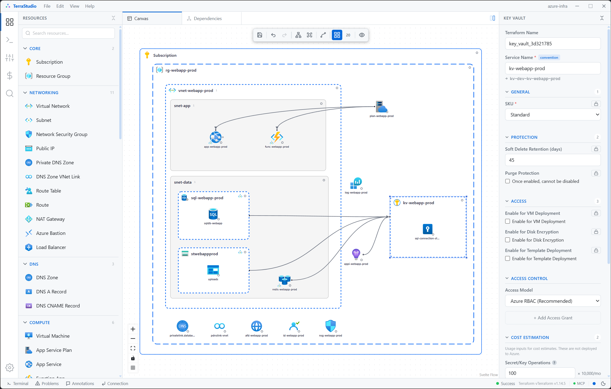

<h1 align="center">TerraStudio</h1>

<p align="center">
  <strong>Visual infrastructure designer that generates production-ready Terraform</strong>
</p>

<p align="center">
  <a href="#features">Features</a> &bull;
  <a href="#screenshot">Screenshot</a> &bull;
  <a href="#getting-started">Getting Started</a> &bull;
  <a href="#how-it-works">How It Works</a> &bull;
  <a href="#architecture">Architecture</a> &bull;
  <a href="#license">License</a>
</p>

---

TerraStudio is a desktop application for designing cloud infrastructure visually. Drag resources from the palette onto a canvas, connect them, configure properties in the sidebar, and generate valid Terraform HCL — ready to plan and apply. No manual `.tf` file editing required.

## Screenshot



## Features

### Visual Diagram Builder
- **Drag-and-drop** resources from a categorized palette onto an infinite canvas
- **Nested containers** — place Subnets inside VNets, databases inside servers, secrets inside Key Vaults
- **Connection edges** — draw relationships between resources (App Service Plan → Web App, outputs → Key Vault secrets)
- **Smart validation** — enforces containment rules, required properties, and connection constraints as you build

### Terraform Generation
- **One-click HCL export** — generates `main.tf`, `variables.tf`, `providers.tf`, `locals.tf`, and `terraform.tf`
- **Automatic references** — cross-resource references (`azurerm_resource_group.rg.name`, `.id`) are resolved from the diagram
- **Variable toggle** — switch any property between a literal value and a `var.xxx` Terraform variable
- **Private endpoints** — automatically generated for resources placed in subnets
- **Output bindings** — enable resource outputs (connection strings, keys) and wire them into Key Vault secrets with a single edge

### Modules & Templates
- **Group resources** into named modules with visual boundaries
- **Convert to template** — make a module reusable, then stamp out instances with per-instance variable overrides
- **Module HCL** — each module gets its own directory with `variables.tf`, `main.tf`, and auto-wired cross-module references

### Terraform Execution
- **Built-in Terraform CLI** — init, plan, apply, and destroy directly from the app (powered by Tauri/Rust backend)
- **Plan visualization** — see what Terraform will create, update, or destroy before applying
- **Deployment status** — green/grey dots on canvas nodes show which resources are deployed

### Additional Capabilities
- **Cost estimation** — breakdown by resource, module, and container
- **Architecture docs** — auto-generate Markdown documentation with resource inventory, network topology, and Mermaid dependency graphs
- **Image export** — export diagrams as PNG, SVG, or copy to clipboard
- **MCP server** — programmatic access to the diagram via Model Context Protocol (for AI-assisted infrastructure design)

## Supported Resources

### Azure (60+ resource types)

| Category | Resources |
|----------|-----------|
| **Core** | Subscription, Resource Group |
| **Networking** | VNet, Subnet, NSG, Public IP, Private Endpoint, Private DNS Zone, DNS Zone VNet Link, NAT Gateway, Load Balancer, Bastion Host, Route Table |
| **Compute** | Virtual Machine, VM Scale Set, App Service Plan, App Service, Function App, Availability Set |
| **Containers** | AKS Cluster, Node Pool, Container Registry, Container App Environment, Container App, Container Instances |
| **Database** | SQL Server, SQL Database, PostgreSQL Flexible Server, MySQL Flexible Server, Cosmos DB, Redis Cache |
| **Storage** | Storage Account, Blob Container, File Share, Queue, Table |
| **Security** | Key Vault, Key Vault Secret, Key Vault Key, Managed Identity, Role Assignment |
| **Messaging** | Service Bus (Namespace, Queue, Topic), Event Hub (Namespace, Hub) |
| **Web** | Front Door, CDN Profile, CDN Endpoint, Static Web App, SignalR Service |
| **Monitoring** | Log Analytics Workspace, Application Insights |
| **DNS** | DNS Zone, A Record, CNAME Record |

### AWS (preview)
Early support for AWS networking and compute resources.

## Getting Started

### Prerequisites
- [Node.js](https://nodejs.org/) 20+
- [pnpm](https://pnpm.io/) 9+
- [Rust](https://www.rust-lang.org/tools/install) (for Tauri backend)
- [Terraform CLI](https://developer.hashicorp.com/terraform/downloads) (optional, for plan/apply)

### Install & Run

```bash
git clone https://github.com/afroze9/terrastudio.git
cd terrastudio
pnpm install
pnpm build
pnpm tauri dev
```

## How It Works

```
┌──────────┐     ┌──────────┐     ┌──────────┐     ┌──────────┐     ┌──────────┐
│  Palette │ ──▸ │  Canvas  │ ──▸ │ Sidebar  │ ──▸ │   HCL    │ ──▸ │Terraform │
│  (drag)  │     │ (layout) │     │ (config) │     │Generator │     │   CLI    │
└──────────┘     └──────────┘     └──────────┘     └──────────┘     └──────────┘
```

1. **Drag** a resource from the palette onto the canvas
2. **Position** it inside containers (Resource Group → VNet → Subnet)
3. **Configure** properties in the sidebar (name, SKU, settings)
4. **Connect** resources with edges (plan → app, outputs → secrets)
5. **Generate** Terraform HCL with one click
6. **Deploy** with built-in init → plan → apply workflow

## Architecture

**Plugin-based** — The core engine is provider-agnostic. Cloud resources are contributed by plugin packages, making it straightforward to add new providers or resource types.

**Schema-driven** — Each resource type is defined by a single schema that drives the palette icon, canvas node rendering, sidebar form, HCL generation, and validation. Adding a new resource means adding one schema file to a plugin.

### Tech Stack

| Layer | Technology |
|-------|-----------|
| Desktop shell | Tauri 2 (Rust) |
| Frontend | Svelte 5 + SvelteKit + TypeScript |
| Diagram | Svelte Flow (@xyflow/svelte) |
| Styling | Tailwind CSS 4 + bits-ui |
| Build | Vite + pnpm workspaces + Turborepo |
| Output | Raw HCL strings → Terraform CLI |

### Monorepo Layout

```
packages/
  types/                          # Shared TypeScript interfaces
  core/                           # Diagram engine, HCL pipeline, Terraform bridge
  plugin-azure-networking/        # VNet, Subnet, NSG, Private Endpoint, ...
  plugin-azure-compute/           # Resource Group, VM, App Service, Function App, ...
  plugin-azure-database/          # SQL Server, PostgreSQL, Cosmos DB, Redis, ...
  plugin-azure-storage/           # Storage Account, Blob, File Share, ...
  plugin-azure-security/          # Key Vault, Managed Identity, Role Assignment
  plugin-azure-monitoring/        # Log Analytics, Application Insights
  plugin-aws-networking/          # AWS VPC, Subnet (preview)
  plugin-aws-compute/             # AWS EC2, ECS (preview)
apps/
  desktop/                        # Tauri 2 desktop app
```

## License

This project is licensed under the [GNU Affero General Public License v3.0](LICENSE).
