# Architecture Overview

## What This Is

A desktop application for visually designing Azure (and other cloud) infrastructure using drag-and-drop architectural diagrams. Behind the scenes, it generates Terraform configurations from the diagram, executes them, and shows deployment status directly on the diagram nodes.

## Tech Stack

| Layer | Technology | License | Why |
|---|---|---|---|
| Desktop shell | Tauri 2.x | MIT/Apache-2.0 | Small bundle (3-10MB), native CLI access for terraform, Rust backend for process management |
| Frontend framework | Svelte 5 | MIT | Compiled reactivity (no virtual DOM), ~8x faster rendering than React |
| Diagram engine | @xyflow/svelte 1.5+ (Svelte Flow) | MIT | Purpose-built for node-based editors, drag-drop, containers, custom nodes, viewport culling |
| Styling | Tailwind CSS 4.x | MIT | Utility-first, fast iteration |
| UI components | bits-ui | MIT | Headless Svelte components |
| Build tool | Vite 6.x | MIT | Fast HMR, native ESM |
| Language | TypeScript 5.x (frontend) / Rust (backend) | Apache-2.0 / MIT | Type safety throughout |
| Monorepo | pnpm workspaces + Turborepo | MIT | Fast dependency management, parallel builds |

## Core Design Principles

### 1. Plugin-Based Architecture

The application is split into a **provider-agnostic core** and **plugin packages** per cloud provider category. The core never references Azure, AWS, or GCP directly.

```
@terrastudio/types          <-- Shared interfaces (the contract)
@terrastudio/core           <-- Diagram engine, property sidebar, HCL pipeline, terraform runner
@terrastudio/plugin-azure-networking  <-- Azure VNet, Subnet, NSG, etc.
@terrastudio/plugin-azure-compute     <-- Azure VM, VMSS, App Service, etc.
@terrastudio/plugin-azure-storage     <-- Azure Storage Account, Blob, etc.
apps/desktop                <-- Tauri app that wires everything together
```

Adding a new cloud resource = adding one file to a plugin package. No core changes.

### 2. Schema-Driven Design

Each resource type is defined by a single schema that drives **everything**:
- The palette icon and category grouping
- The diagram node rendering and container rules
- The property sidebar form fields
- The HCL generation template
- Edge connection validation

One schema, many consumers. No drift between UI and generated code.

### 3. Provider Abstraction

The system supports multiple cloud providers simultaneously. A `ProviderConfig` interface abstracts provider-level Terraform configuration. An Azure plugin and an AWS plugin can coexist, each registering their own provider, resource types, and connection rules.

## Data Flow

```mermaid
flowchart TB
    PAL["Resource Palette<br/><i>from plugins</i>"]
    REG["Plugin Registry<br/><i>node types, schemas, icons</i>"]
    EDGE["Edge Validator<br/><i>connection rules from plugins</i>"]
    CANVAS["Diagram Canvas<br/><i>Svelte Flow</i>"]
    SIDE["Property Sidebar<br/><i>schema-driven or custom plugin editor</i>"]
    HCL["HCL Generator<br/><i>core pipeline + plugin generators</i>"]
    TF["Terraform Runner<br/><i>Rust backend: init / validate / plan / apply</i>"]
    STATE["State Mapper<br/><i>parse state → update node badges</i>"]

    PAL -->|"drag & drop"| CANVAS
    REG --> CANVAS
    EDGE --> CANVAS
    CANVAS -->|"click node"| SIDE
    SIDE -->|"update node data"| HCL
    HCL -->|".tf files written"| TF
    TF -->|"terraform show -json"| STATE
    STATE -->|"deployment status"| CANVAS
```



## UI Layout

```
+------------------------------------------------------------------------+
|  [File] [Edit] [View]          TerraStudio              [Gen] [Plan] [Run]  |
+----------+-----------------------------------------------------+------+
|          |                                                      |      |
| Resource |                                                      | Prop |
| Palette  |              Diagram Canvas                          | Side |
|          |              (Svelte Flow)                           | bar  |
| [Core]   |                                                      |      |
|  RG      |   +---Resource Group [G]-------------------+         | Name |
| [Network]|   |  +---VNet [G]----------------------+   |         | [___]|
|  VNet    |   |  |  +---Subnet [G]-----------+     |   |         | Loc  |
|  Subnet  |   |  |  |   VM [G]    NSG [G]    |     |   |         | [___]|
|  NSG     |   |  |  +------------------------+     |   |         |      |
| [Compute]|   |  +----------------------------------+   |         | Tags |
|  VM      |   +------------------------------------------+         | [___]|
|          |                                                      |      |
+----------+-----------------------------------------------------+------+
|  [Init] [Validate] [Plan] [Apply]  |  $ terraform plan -json          |
|  Status: Ready                     |  {"type":"planned_change",...}    |
+------------------------------------+----------------------------------+
```

### Panel Descriptions

- **Resource Palette** (left): Draggable resource icons grouped by category. Categories and resources come from plugins.
- **Diagram Canvas** (center): Svelte Flow canvas with zoom, pan, minimap. Nodes are custom Svelte components from plugins. Containers (Resource Group, VNet, Subnet) support nesting.
- **Property Sidebar** (right): Auto-generated form when a node is selected. Fields come from the resource schema. Any field can be toggled to become a Terraform variable.
- **Terraform Panel** (bottom): Action buttons (Init, Validate, Plan, Apply) and streaming terminal output from the Rust backend.

### Deployment Status Badges

Each node displays a status badge:
- **Grey dot** = not created (resource only exists in diagram)
- **Green dot** = deployed (resource exists in Terraform state)
- **Yellow dot** = modified (diagram differs from deployed state)
- **Red dot** = error (deployment failed)
- **Orange dot** = destroying

Status is determined by running `terraform show -json` after each apply and matching resource addresses to diagram nodes.

### Export + Documentation Generation

The app can export diagrams and auto-generate architecture documentation:


- **Image export**: PNG, SVG, clipboard copy for pasting into Slack/Teams/docs
- **Doc generation**: Walks the diagram to produce a Markdown architecture document with resource inventory, network topology, Mermaid dependency graphs, and variable reference
- **Plugin-extensible**: Plugins can contribute doc sections (e.g., networking plugin adds a subnet CIDR table)

## Architectural Decisions

| Decision | Choice | Rationale |
|---|---|---|
| Desktop vs Web | Tauri (desktop) | Terraform CLI must run locally, needs filesystem access, no server required |
| React vs Svelte | Svelte 5 | Better performance, compiled reactivity, user preference to avoid React |
| Diagram library | Svelte Flow | MIT licensed, same team as React Flow, v1.5 feature parity, native Svelte |
| HCL output format | Raw HCL strings | Simple, generators write plain text, `terraform fmt` normalizes formatting |
| CDKTF | Not used | Archived by HashiCorp Dec 2025, no longer maintained |
| Plugin loading | Static imports | Vite must compile Svelte at build time; dynamic import of .svelte files is problematic |
| Node type key | Full ResourceTypeId | e.g., `"azurerm/networking/virtual_network"` - avoids collisions across providers |
| State parsing | `terraform show -json` | Official stable API; never parse .tfstate directly (internal format) |
| NSG association | Property-based reference (not edges) | Toggle + dropdown on Subnet/VM is more intuitive than edge connections; reduces visual clutter; HCL emits association resources automatically |

## Related Docs

- [Plugin System](plugin-system.md) - How plugins work, how to create one
- [Type Interfaces](type-interfaces.md) - All TypeScript interfaces
- [HCL Generation](hcl-generation.md) - How diagrams become Terraform
- [Project Structure](project-structure.md) - Monorepo directory layout
- [Implementation Roadmap](implementation-roadmap.md) - Phased build plan
