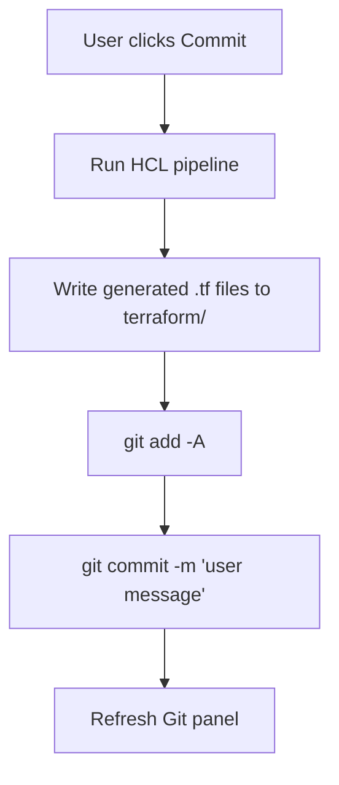
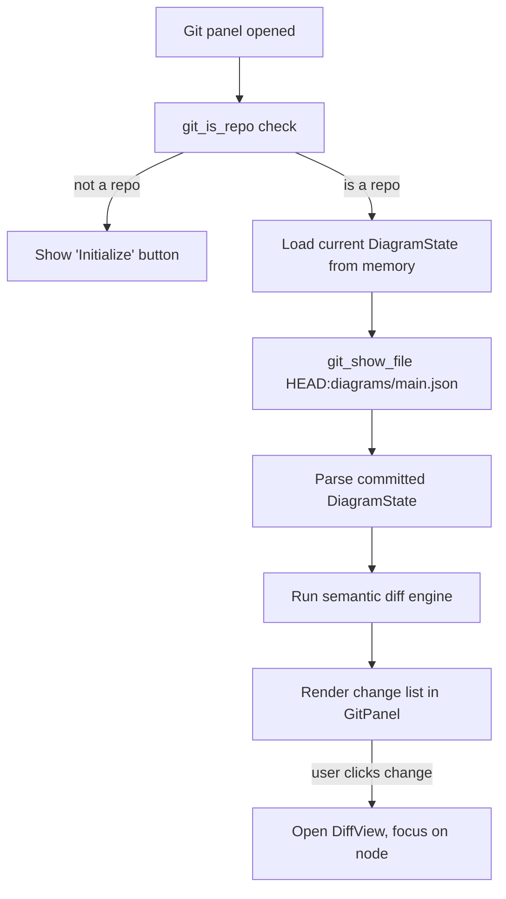
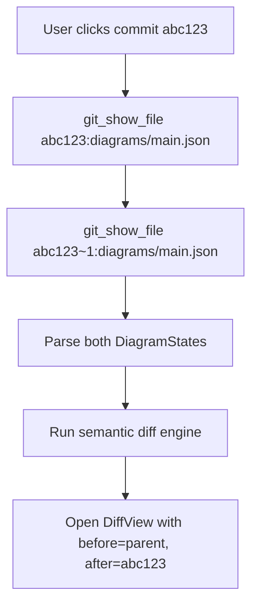

# Git Integration

> **Status**: Planning — not yet started (as of 2026-04-08)
>
> This document specifies a built-in Git panel for TerraStudio that lets users
> version-control their infrastructure diagrams with infrastructure-aware diffs
> rather than raw JSON diffs.

---

## Motivation

TerraStudio projects are saved as JSON files (`.tstudio` metadata + `diagrams/main.json`).
When tracked in Git, these files produce diffs that are nearly unreadable — hundreds of
lines of coordinate changes, UUIDs, and nested objects with no visual meaning.

Users need to understand **what changed in their infrastructure**, not what changed in the
JSON. "The VM SKU changed from B2s to D4s_v3" is useful. "Line 482 changed" is not.

A built-in Git panel removes the need to context-switch to an external tool and presents
version history in terms the user already understands: resources, connections, and properties.

---

## Design Overview

### Git Panel (Left Sidebar Tab)

A new tab in the left activity bar (alongside Explorer, Terraform, Settings, etc.) with a
Git branch icon. The panel has two states:

#### Uninitialized State

When the project directory is not a Git repository:

```
┌─────────────────────────┐
│  Git                    │
│                         │
│  This project is not    │
│  tracked by Git.        │
│                         │
│  [Initialize Repository]│
│                         │
└─────────────────────────┘
```

Clicking "Initialize Repository" runs `git init` in the project directory and transitions
to the initialized state.

#### Initialized State

```
┌─────────────────────────┐
│  Git              main ▾│
│─────────────────────────│
│  ┌───────────────────┐  │
│  │ commit message... │  │
│  └───────────────────┘  │
│  [Commit]  [Push ↑1]    │
│─────────────────────────│
│  Changes (3)            │
│  + VM "web-vm"          │
│  ~ Key Vault "kv-prod"  │
│    ├ sku: standard → ..│
│    └ soft_delete: + var │
│  - NSG "old-nsg"        │
│  + Edge: AppSvc → KV    │
│  ~ Module "backend"     │
│    └ + VM "api-vm"      │
│─────────────────────────│
│  Terraform (3)          │
│  ~ main.tf              │
│  ~ variables.tf         │
│  + modules/backend/     │
│    main.tf              │
│─────────────────────────│
│  History                │
│  a1b2c3 Add web tier    │
│  d4e5f6 Initial infra   │
│  ...                    │
└─────────────────────────┘
```

**Sections (top to bottom):**

1. **Branch bar** — current branch name with a dropdown to switch or create branches.

2. **Commit area** — message input (multiline) + Commit button. Push button with
   ahead/behind badge (e.g., "Push ↑1" = 1 unpushed commit). Pull button when behind.

3. **Changes list** — semantically diffed resources (see [Semantic Diff Engine](#semantic-diff-engine)).
   Each change is expandable to show property-level detail. Module changes show as
   collapsible groups with member additions/removals nested underneath. Clicking a
   change opens the side-by-side diff view and focuses both canvases on that resource.

4. **Terraform list** — generated `.tf` files that changed, grouped by directory
   (root `terraform/` and per-module `modules/*/`). Clicking a file opens a text diff
   view instead of the canvas diff (see [Terraform File Diff](#terraform-file-diff)).

5. **History list** — recent commits from `git log`. Each entry shows short hash + commit
   message. Clicking a commit shows the side-by-side diff for that commit vs its parent.

---

### Side-by-Side Diff View

When the user clicks a change or a history entry, the main editor area switches to a
**diff mode** with two read-only Svelte Flow canvases:

```
┌──────────────────────┬──────────────────────┐
│  Before (a1b2c3)     │  After (working)     │
│                      │                      │
│   ┌───┐   ┌───┐     │   ┌───┐   ┌───┐     │
│   │ RG│   │VNet│     │   │ RG│   │VNet│     │
│   └───┘   └───┘     │   └───┘   └───┘     │
│              │       │              │       │
│           ┌──┴──┐    │           ┌──┴──┐    │
│           │Subnet│   │           │Subnet│   │
│           └─────┘    │           └──┬──┘    │
│                      │              │       │
│                      │           ┌──┴──┐    │
│                      │           │ VM  │ +  │
│                      │           └─────┘    │
└──────────────────────┴──────────────────────┘
```

**Behaviors:**

- **Synced panning/zoom** — panning or zooming one canvas mirrors the other.
- **Color coding on the right (After) canvas:**
  - Green border/badge — resource added
  - Red border/badge — resource removed (shown as ghost on right, or shown on left only)
  - Yellow border/badge — properties changed
  - Dimmed (low opacity) — unchanged resources (still visible for context)
- **Left canvas** — uses node positions from the committed version.
- **Right canvas** — uses node positions from the current/compared version.
- **Position changes are not highlighted** — moving a node is cosmetic, not an infrastructure change.
- **Click a highlighted node** — the sidebar shows a property diff (before/after values).
- **Exit diff mode** — button or Escape returns to normal editing canvas.

---

## Semantic Diff Engine

The diff engine compares two `DiagramState` objects (nodes + edges) structurally, not
textually. It lives in `@terrastudio/core` and operates on typed data.

### What Is Compared

| Field | Diffed? | Why |
|---|---|---|
| Node properties (schema fields) | Yes | Changes Terraform output |
| Node connections (edges) | Yes | Changes resource references |
| Node containment (parentId) | Yes | Changes resource hierarchy |
| Variable overrides | Yes | Changes literal vs variable mode |
| Enabled outputs | Yes | Changes output handles and bindings |
| Module membership | Yes | Changes module structure |
| Node position (x, y) | **No** | Cosmetic only |
| Node dimensions (width, height) | **No** | Cosmetic only |
| Viewport state (pan, zoom) | **No** | User preference |
| Edge path routing | **No** | Auto-calculated |
| Z-index / render order | **No** | Cosmetic only |

### Diff Output Structure

```typescript
interface DiagramDiff {
  resources: ResourceDiff[];
  connections: ConnectionDiff[];
  modules: ModuleDiff[];
  instances: InstanceDiff[];
}

interface ResourceDiff {
  type: 'added' | 'removed' | 'modified';
  nodeId: string;
  resourceTypeId: string;
  resourceName: string;
  /** Only for 'modified' — which properties changed */
  propertyChanges?: PropertyChange[];
  /** Containment parent changed */
  parentChanged?: { before: string | null; after: string | null };
  /** Variable overrides changed */
  variableChanges?: VariableChange[];
  /** Outputs toggled on/off */
  outputChanges?: OutputChange[];
}

interface PropertyChange {
  key: string;
  label: string;
  before: unknown;
  after: unknown;
}

interface VariableChange {
  key: string;
  before: 'literal' | 'variable';
  after: 'literal' | 'variable';
}

interface OutputChange {
  key: string;
  label: string;
  enabled: boolean; // true = newly enabled, false = disabled
}

interface ConnectionDiff {
  type: 'added' | 'removed';
  edgeId: string;
  sourceName: string;
  targetName: string;
  sourceHandle?: string;
  targetHandle?: string;
}

interface ModuleDiff {
  type: 'added' | 'removed' | 'modified';
  moduleId: string;
  moduleName: string;
  membersAdded?: string[];
  membersRemoved?: string[];
  /** Module was renamed */
  renamed?: { before: string; after: string };
  /** Converted to/from template */
  templateChanged?: { before: boolean; after: boolean };
}

interface InstanceDiff {
  type: 'added' | 'removed' | 'modified';
  instanceId: string;
  instanceName: string;
  templateName: string;
  /** Per-instance variable overrides changed */
  variableChanges?: PropertyChange[];
}
```

### Node Matching

Nodes are matched between versions by **node ID** (stable across saves). If a node ID
exists in "before" but not "after", it was removed. If only in "after", it was added.
If in both, compare properties for modifications.

Synthetic nodes (`_mod_`, `_modinst_`, `_instmem_` prefixes) are excluded from diffing,
same as they are from HCL generation.

---

## Terraform File Diff

Below the resource changes list, the Git panel shows a **Terraform** section listing
generated `.tf` files that changed. This gives users the "what does this mean for
Terraform" view alongside the visual resource diff.

### Layout

Files are grouped by directory:

```
Terraform (4)
~ main.tf
~ variables.tf
~ outputs.tf
+ modules/backend/
  + main.tf
  + variables.tf
```

### Text Diff View

Clicking a Terraform file replaces the side-by-side canvas with a **text diff view** —
a standard left/right code diff with red (removed) and green (added) line highlighting,
similar to VS Code's built-in diff editor.

The diff is computed from the committed files in Git:
- **Working copy changes**: current `terraform/` files on disk vs `git show HEAD:terraform/<file>`
- **History comparisons**: `git show <commit>:terraform/<file>` vs `git show <commit>~1:terraform/<file>`

A tab bar at the top of the diff view lets the user switch between "Diagram" (canvas
diff) and "Terraform" (text diff) modes without closing the diff view entirely.

### Components

| Component | Location | Purpose |
|---|---|---|
| `TerraformChangeList.svelte` | `src/lib/components/git/` | List of changed `.tf` files in sidebar |
| `TextDiffView.svelte` | `src/lib/components/git/` | Side-by-side text diff with syntax highlighting |

---

## Auto-Generate on Commit

The diagram is the source of truth. Generated Terraform files must always match the
committed diagram state. To guarantee this, the commit flow **automatically regenerates
HCL** before committing:



This ensures every commit has consistent diagram + Terraform files, regardless of whether
the user manually generated HCL before committing.

If HCL generation fails (e.g., validation errors), the commit is **aborted** and the
errors are shown in the Problems panel. The user must fix the diagram before committing.

---

## Tauri Backend (Rust)

Git commands run through the Tauri Rust backend using the same pattern as Terraform
execution (`src-tauri/src/terraform/runner.rs`).

### Module Structure

```
src-tauri/src/git/
├── mod.rs          // Module declaration
├── runner.rs       // Core git process execution (streaming stdout/stderr)
└── commands.rs     // Tauri command handlers
```

### Commands

| Tauri Command | Git Operation | Notes |
|---|---|---|
| `git_init` | `git init` | Initialize repo in project directory |
| `git_status` | `git status --porcelain` | Machine-readable status |
| `git_commit` | Generate HCL → `git add -A` → `git commit -m "..."` | Auto-generates Terraform files, then commits everything |
| `git_log` | `git log --oneline -n 50` | Recent history, parsed into structured entries |
| `git_show_file` | `git show <ref>:<path>` | Retrieve file content at a specific commit |
| `git_push` | `git push` | Push to configured remote |
| `git_pull` | `git pull --ff-only` | Fast-forward pull only (no merge conflicts) |
| `git_branch_list` | `git branch -a` | List local and remote branches |
| `git_branch_create` | `git checkout -b <name>` | Create and switch to new branch |
| `git_branch_switch` | `git checkout <name>` | Switch to existing branch |
| `git_remote_status` | `git rev-list --left-right --count HEAD...@{u}` | Ahead/behind counts |
| `git_is_repo` | Check for `.git` directory | Determines panel initial state |

All commands:
- Run in the project directory (`project_path`)
- Use `CREATE_NO_WINDOW` on Windows (same as Terraform runner)
- Emit events (`git:stdout`, `git:stderr`, `git:status`) for streaming output
- Sanitize user input (commit messages, branch names) before passing to shell

### No Staging

All project files are committed together. The project is a single logical unit —
there is no meaningful partial commit for an infrastructure diagram. The commit flow is:

1. Run HCL pipeline (regenerate all `.tf` files from current diagram)
2. Abort if generation fails (show errors in Problems panel)
3. `git add -A` (stage everything in project directory)
4. `git commit -m "<user message>"`

This matches the mental model: one diagram = one commit. The auto-generation step
guarantees committed Terraform files always reflect the committed diagram.

### .gitignore

On `git_init`, create a `.gitignore` in the project directory:

```gitignore
# Terraform working files
terraform/.terraform/
terraform/*.tfstate
terraform/*.tfstate.backup
terraform/.terraform.lock.hcl
terraform/terraform.tfvars

# OS files
.DS_Store
Thumbs.db
```

Terraform state files must not be committed (they contain secrets and should be managed
via remote backends). The lock file and tfvars are generated, not user-authored.

---

## Frontend Architecture

### State Management

```typescript
// src/lib/stores/git.svelte.ts

interface GitState {
  /** Whether the project dir is a git repo */
  isRepo: boolean;

  /** Current branch name */
  branch: string;

  /** Commits ahead of remote */
  ahead: number;

  /** Commits behind remote */
  behind: number;

  /** Semantic diff of current changes */
  changes: DiagramDiff | null;

  /** Recent commit history */
  history: GitLogEntry[];

  /** Whether a git operation is in progress */
  loading: boolean;

  /** Last error message */
  error: string | null;
}

interface GitLogEntry {
  hash: string;
  shortHash: string;
  message: string;
  date: string;
  author: string;
}
```

Uses Svelte 5 runes (`$state`, `$derived`), consistent with the rest of the app.

### Service Layer

```typescript
// src/lib/services/git-service.ts

export async function gitInit(projectPath: string): Promise<void>;
export async function gitStatus(projectPath: string): Promise<string>;
export async function gitCommit(projectPath: string, message: string): Promise<void>;
export async function gitLog(projectPath: string, count?: number): Promise<GitLogEntry[]>;
export async function gitShowFile(projectPath: string, ref: string, filePath: string): Promise<string>;
export async function gitPush(projectPath: string): Promise<void>;
export async function gitPull(projectPath: string): Promise<void>;
export async function gitBranchList(projectPath: string): Promise<string[]>;
export async function gitBranchCreate(projectPath: string, name: string): Promise<void>;
export async function gitBranchSwitch(projectPath: string, name: string): Promise<void>;
export async function gitRemoteStatus(projectPath: string): Promise<{ ahead: number; behind: number }>;
export async function gitIsRepo(projectPath: string): Promise<boolean>;
```

Each function wraps a `invoke('git_*', ...)` Tauri call.

### Components

| Component | Location | Purpose |
|---|---|---|
| `GitPanel.svelte` | `src/lib/components/git/` | Main sidebar panel (changes + history + commit input) |
| `GitChangeList.svelte` | `src/lib/components/git/` | Expandable list of resource changes |
| `GitHistoryList.svelte` | `src/lib/components/git/` | Scrollable commit history |
| `GitCommitInput.svelte` | `src/lib/components/git/` | Message input + commit/push/pull buttons |
| `GitBranchSelector.svelte` | `src/lib/components/git/` | Branch dropdown (switch/create) |
| `DiffView.svelte` | `src/lib/components/git/` | Side-by-side canvas diff container |
| `DiffCanvas.svelte` | `src/lib/components/git/` | Single read-only Svelte Flow canvas for diff |
| `DiffPropertyPanel.svelte` | `src/lib/components/git/` | Before/after property comparison sidebar |
| `TerraformChangeList.svelte` | `src/lib/components/git/` | List of changed `.tf` files in sidebar |
| `TextDiffView.svelte` | `src/lib/components/git/` | Side-by-side text diff with syntax highlighting |

### UI Integration Points

1. **Activity Bar** — new `git` entry in `SidebarView` type, Git branch icon in
   `ActivityBar.svelte`.

2. **Side Panel** — `SidePanel.svelte` renders `GitPanel` when `ui.activeView === 'git'`.

3. **Diff Mode** — when activated, replaces the main `EditorArea` canvas with `DiffView`
   (two side-by-side `DiffCanvas` instances). A banner at the top shows what is being
   compared (e.g., "a1b2c3 vs working copy") with an Exit button.

4. **Right Panel** — in diff mode, the properties panel switches to `DiffPropertyPanel`
   showing before/after values for the selected node.

---

## Diff Computation Flow

When the Git panel is open and the project has changes:



When the user clicks a history entry:



---

## Refresh Strategy

The Git panel state refreshes:

- **On panel open** — full refresh (status, changes, history, remote status)
- **After any git operation** (commit, push, pull, branch switch) — full refresh
- **After diagram save** — recompute changes (diff current state vs HEAD)
- **On window focus** — check for external changes (user may have pulled from terminal)

No polling. Event-driven updates only.

---

## Scope Boundaries

### In Scope

- Initialize git repo
- Commit all changes with a message
- View semantic change list (resource-level diffs)
- View commit history
- Side-by-side visual diff (diagram canvas)
- Side-by-side text diff (Terraform files)
- Auto-generate HCL on commit
- Push / pull (fast-forward only)
- Branch switching and creation
- .gitignore generation

### Out of Scope (Future)

- **Merge conflict resolution** — for now, only fast-forward pulls. If there is a
  conflict, show an error asking the user to resolve in an external tool.
- **Cherry-pick / rebase / stash** — advanced git operations stay in the terminal.
- **Inline Terraform editing** — the text diff view is read-only. Terraform files
  are generated, not hand-edited.
- **Remote configuration** — adding/removing remotes stays in the terminal.
  The panel uses whatever remote is already configured.

---

## Related Docs

- [Architecture](architecture.md) — System overview, layout structure
- [Platform Architecture Plan](platform-architecture-plan.md) — Multi-platform direction
- [Implementation Roadmap](implementation-roadmap.md) — Phase tracking
