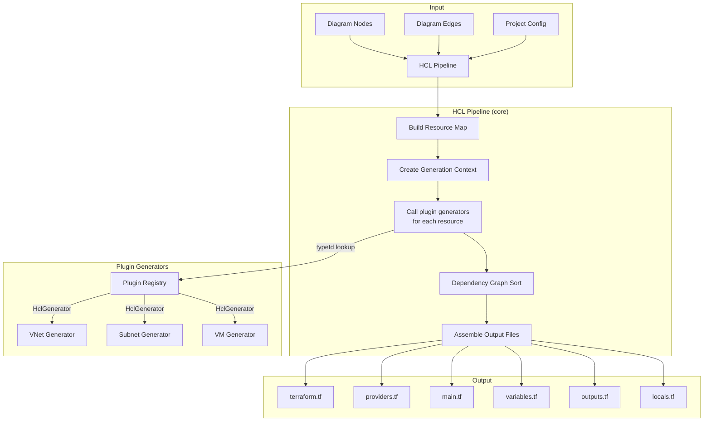
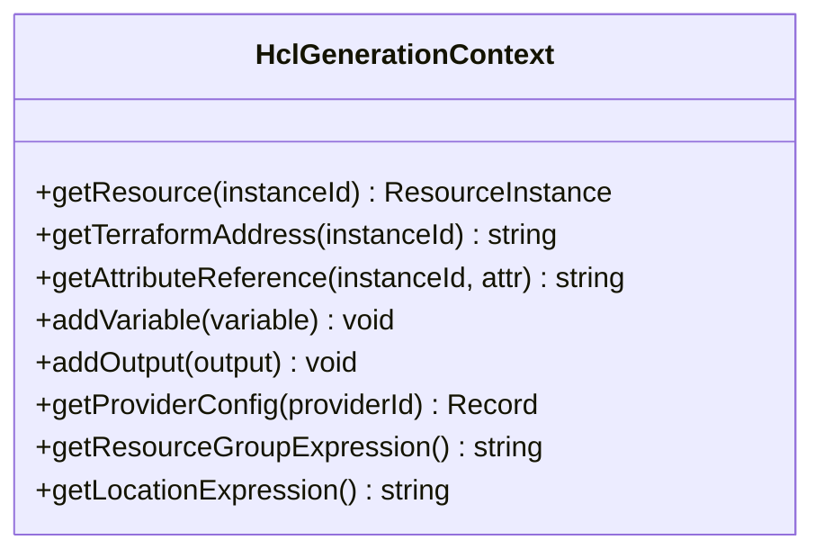
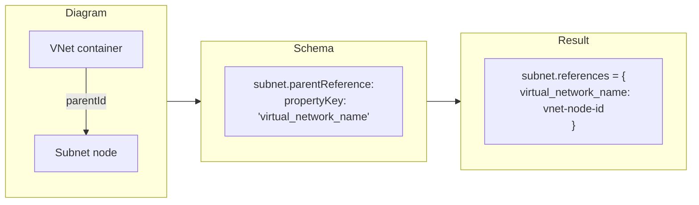
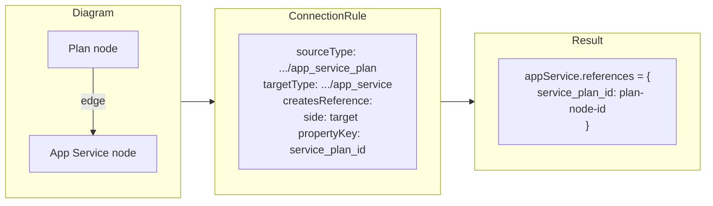
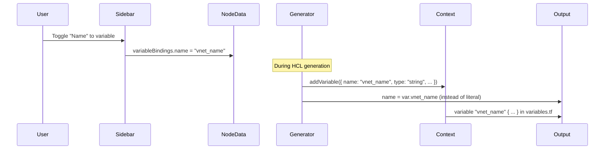

# HCL Generation

## Overview

The HCL generation system transforms a visual diagram into valid Terraform configuration files. The **core** provides the pipeline orchestrator, and **plugins** provide per-resource-type generators.

## Pipeline Architecture



## Output Format: Raw HCL Strings

Each `HclGenerator.generate()` returns raw HCL text blocks. This is deliberately simple:

- Generators are hand-written per resource type - they know the exact output shape
- No need for an HCL AST library (unnecessary complexity)
- `terraform fmt` (invoked via Tauri) normalizes formatting after generation
- Human-readable output that users can inspect and hand-edit

## Generation Context

The `HclGenerationContext` is created by the core pipeline and passed to every plugin generator. It provides:



- **Cross-resource references**: A subnet generator can look up its parent VNet's terraform address to produce `azurerm_virtual_network.main.name`
- **Variable registration**: Any generator can register a variable (e.g., when a user toggles a property to become a tfvar)
- **Output registration**: Generators can register outputs for important attributes
- **Provider config access**: Generators can read provider-level settings

## Dependency Resolution

References between resources are resolved through three mechanisms:

### Source 1: Containment References (parentId)

When a node is visually nested inside a container, `deriveParentReferences()` uses the child's `parentReference.propertyKey` to set the reference automatically:



No edges or connection rules needed — the visual nesting drives the reference.

### Source 2: Edge-to-Reference Mapping

For non-containment associations (e.g., App Service Plan → App Service), edges on the diagram map to references via `ConnectionRule`:



When an edge is created, the matching `ConnectionRule` determines which property on which side gets set as a reference.

### Source 3: Property-Based References

Some associations are configured via the property sidebar instead of edges. The resource schema declares a `reference` property type with `referenceTargetTypes`, and the user selects the target from a dropdown. Values are stored directly in `node.data.references` and flow through to HCL generators automatically.

Example: NSG association on Subnet/VM uses `nsg_id` reference property with a `visibleWhen` conditional toggle, instead of handles + connection rules.

### Step 2: Reference Resolution in Generators

Inside a generator, the context resolves references to Terraform expressions:

```typescript
// In subnet HCL generator:
const vnetRef = context.getAttributeReference(
  resource.references['virtual_network_name'],
  'name'
);
// Returns: "azurerm_virtual_network.main.name"
```

### Step 3: Topological Sort

Generated `HclBlock`s declare their dependencies via `dependsOn`. The `DependencyGraph` performs a topological sort so blocks are emitted in valid order:

```typescript
class DependencyGraph {
  constructor(blocks: HclBlock[]);
  topologicalSort(): HclBlock[];
}
```

## Variable Extraction

Any property field can be toggled to become a Terraform variable:



The generator checks if a property has a variable binding and emits `var.{name}` instead of the literal value. The context collects all variables and includes them in `variables.tf`.

## Generated File Structure

The pipeline produces these files:

| File | Contents |
|---|---|
| `terraform.tf` | `required_version`, `required_providers`, optional backend config |
| `providers.tf` | `provider "azurerm" { ... }` blocks for each active provider |
| `main.tf` | All `resource` and `data` blocks, topologically sorted |
| `variables.tf` | All `variable` blocks (from user-toggled properties + standard vars) |
| `outputs.tf` | All `output` blocks (from generators) |
| `locals.tf` | Common tags, shared expressions |

## Example: VNet Schema to Generated HCL

### Input: Diagram Node Data

```json
{
  "typeId": "azurerm/networking/virtual_network",
  "terraformName": "main",
  "properties": {
    "name": "my-vnet",
    "address_space": ["10.0.0.0/16"]
  },
  "references": {}
}
```

### Plugin Generator

```typescript
const vnetHclGenerator: HclGenerator = {
  typeId: 'azurerm/networking/virtual_network',

  generate(resource, context): HclBlock[] {
    const props = resource.properties;
    const rgExpr = context.getResourceGroupExpression();
    const locExpr = context.getLocationExpression();
    const addrList = (props.address_space as string[]).map(a => `"${a}"`).join(', ');

    return [{
      blockType: 'resource',
      terraformType: 'azurerm_virtual_network',
      name: resource.terraformName,
      content: [
        `resource "azurerm_virtual_network" "${resource.terraformName}" {`,
        `  name                = "${props.name}"`,
        `  resource_group_name = ${rgExpr}`,
        `  location            = ${locExpr}`,
        `  address_space       = [${addrList}]`,
        ``,
        `  tags = local.common_tags`,
        `}`,
      ].join('\n'),
    }];
  },
};
```

### Output: main.tf (excerpt)

```hcl
resource "azurerm_virtual_network" "main" {
  name                = "my-vnet"
  resource_group_name = var.resource_group_name
  location            = var.location
  address_space       = ["10.0.0.0/16"]

  tags = local.common_tags
}
```

## Project Config

The `ProjectConfig` controls global generation settings:

```typescript
interface ProjectConfig {
  providerConfigs: Record<ProviderId, Record<string, unknown>>;
  resourceGroupName: string;
  resourceGroupAsVariable: boolean;
  location: string;
  locationAsVariable: boolean;
  commonTags: Record<string, string>;
  backend?: {
    type: 'azurerm' | 'local' | 's3' | 'gcs';
    config: Record<string, string>;
  };
}
```

When `resourceGroupAsVariable` is true, the pipeline automatically adds a `var.resource_group_name` variable and all generators use `var.resource_group_name` instead of a literal string.

## Related Docs

- [Type Interfaces](type-interfaces.md) - HclGenerator, HclBlock, HclGenerationContext definitions
- [Plugin System](plugin-system.md) - How plugins register HCL generators
- [Architecture](architecture.md) - Where HCL generation fits in the data flow
