# Implementation Roadmap

## MVP Scope

5 Azure resources: **Resource Group, Virtual Network, Subnet, NSG, Virtual Machine**

This is enough to deploy a basic VM-in-a-VNet architecture, validating the entire pipeline end-to-end.

## Phase Overview

```mermaid
gantt
    title TerraStudio Implementation Phases
    dateFormat X
    axisFormat %s

    section Foundation
    Phase 1: Monorepo + Types      :p1, 0, 1
    Phase 2: Core Registry + HCL   :p2, 1, 2

    section First Plugin
    Phase 3: Networking Plugin      :p3, 2, 3

    section Desktop App
    Phase 4: Tauri Shell + Canvas   :p4, 3, 4
    Phase 5: Sidebar + Drag-Drop   :p5, 4, 5

    section Cross-Plugin
    Phase 6: Compute Plugin (VM)    :p6, 5, 6

    section Terraform
    Phase 7: Terraform Execution    :p7, 6, 7
    Phase 8: Deployment Status      :p8, 7, 8

    section Polish
    Phase 9: Save/Load + Polish     :p9, 8, 9

    section Export
    Phase 10: Export + Doc Gen      :p10, 9, 10
```

---

## Phase 1: Monorepo Scaffolding + Types Package

**Goal**: Working monorepo with the complete type contract.

### Tasks

1. Initialize pnpm workspace with `pnpm-workspace.yaml`
2. Set up Turborepo (`turbo.json`) with build/dev/typecheck/lint pipelines
3. Create root `tsconfig.base.json` with strict TypeScript settings
4. Create `packages/types/` with all interfaces:
   - `provider.ts` - ProviderId, ProviderConfig
   - `resource-schema.ts` - ResourceSchema, PropertySchema, HandleDefinition
   - `hcl.ts` - HclGenerator, HclBlock, HclGenerationContext, ResourceInstance
   - `node.ts` - ResourceNodeData, ResourceNodeComponent, PropertyEditorComponent
   - `connection.ts` - ConnectionRule
   - `plugin.ts` - InfraPlugin, ResourceTypeRegistration, PaletteCategory
   - `validation.ts` - ValidationError, PropertyValidation
5. Verify the types package builds and exports cleanly

### Verification
- `pnpm build` succeeds in types package
- `pnpm typecheck` passes with no errors
- Types can be imported from `@terrastudio/types`

---

## Phase 2: Core Registry + HCL Pipeline

**Goal**: Plugin registry and HCL generation working with mock data.

### Tasks

1. Create `packages/core/`
2. Implement `PluginRegistry`:
   - `registerPlugin()` with collision detection
   - `finalize()` with lifecycle hooks
   - All query methods (getNodeComponent, getHclGenerator, etc.)
   - `buildNodeTypesMap()` for Svelte Flow integration
3. Implement `plugin-registry.svelte.ts` (Svelte 5 reactive wrapper)
4. Implement HCL Pipeline:
   - `HclPipeline.generate()` - main orchestrator
   - `HclBlockBuilder` - assembles blocks into file contents
   - `DependencyGraph` - topological sort
   - `VariableCollector` - collects variables across generators
   - `ProviderConfigBuilder` - builds terraform.tf and providers.tf
5. Implement edge validation (`edge-rules.ts`)
6. Implement diagram validation (`diagram-validator.ts`, `resource-validator.ts`)

### Verification
- Unit tests for PluginRegistry: register, collision, finalize, query
- Unit tests for HclPipeline: generate with mock generators, dependency sorting
- `pnpm typecheck` passes across types + core

---

## Phase 3: Networking Plugin (VNet, Subnet, NSG)

**Goal**: First real plugin implementing three resource types.

### Tasks

1. Create `packages/plugin-azure-networking/`
2. Define the `azurerm` ProviderConfig (subscription_id, features block)
3. Implement VNet resource:
   - `schema.ts` - properties: name, address_space, dns_servers
   - `node.svelte` - container node (VNets hold subnets)
   - `hcl-generator.ts` - generates `azurerm_virtual_network` block
   - `icon.ts` - Azure VNet SVG icon
4. Implement Subnet resource:
   - `schema.ts` - properties: name, address_prefixes
   - `node.svelte` - container node (subnets hold resources)
   - `hcl-generator.ts` - generates `azurerm_subnet` block
   - `icon.ts` - Azure Subnet SVG icon
5. Implement NSG resource:
   - `schema.ts` - properties: name, security_rules
   - `node.svelte` - leaf node
   - `hcl-generator.ts` - generates `azurerm_network_security_group` block
   - `icon.ts` - Azure NSG SVG icon
6. Define connection rules (VNet -> Subnet, Subnet -> NSG)
7. Wire up the plugin entry point (`index.ts`)

### Verification
- Plugin registers with PluginRegistry without errors
- HCL pipeline generates valid Terraform for a VNet + Subnet + NSG diagram
- Run `terraform validate` on generated output

---

## Phase 4: Desktop App Shell + Canvas

**Goal**: Tauri app launches with an empty Svelte Flow canvas.

### Tasks

1. Initialize Tauri 2 + SvelteKit project in `apps/desktop/`
2. Install dependencies: `@xyflow/svelte`, `tailwindcss`, `bits-ui`
3. Configure Tauri permissions (shell, fs, dialog) in `capabilities/default.json`
4. Create `bootstrap.ts` - import networking plugin, initialize registry
5. Create `+page.svelte` - main SPA layout with 4 panels:
   - Left: ResourcePalette (empty for now)
   - Center: Canvas (Svelte Flow with zoom/pan/minimap)
   - Right: Sidebar (empty placeholder)
   - Bottom: TerraformPanel (empty placeholder)
6. Wire Svelte Flow's `nodeTypes` to the registry's `buildNodeTypesMap()`
7. Set up Tailwind with the app layout

### Verification
- `pnpm tauri dev` launches the desktop app
- Canvas renders with zoom, pan, minimap, background grid
- No console errors

---

## Phase 5: Property Sidebar + Drag-and-Drop

**Goal**: Full diagram interaction - drag resources, edit properties.

### Tasks

1. Build `ResourcePalette` - renders palette categories and items from registry
2. Build `PaletteItem` - draggable resource icons
3. Implement drag-from-palette-to-canvas:
   - Use HTML5 drag events + Svelte Flow's drop API
   - On drop: create node via `node-factory.ts`, set position
   - Container detection: if dropped on a container, set `parentId`
   - Validate parent-child via `canBeChildOf()` from connection rules
4. Build `PropertySidebar`:
   - Opens when a node is selected
   - Loads schema from registry, renders form fields
5. Build `PropertyRenderer` (generic schema-driven form):
   - String, number, boolean, select, multiselect, cidr, tags, array fields
   - Grouped by `PropertySchema.group`
   - Conditional visibility via `visibleWhen`
6. Wire property changes back to node data in the diagram store
7. Build `DeploymentBadge` component (grey dot for all nodes initially)
8. Implement node deletion (keyboard Delete key)

### Verification
- Drag VNet from palette onto canvas - node appears
- Drag Subnet into VNet - becomes child (moves with parent)
- Click node - sidebar shows correct properties from schema
- Edit a property - node data updates, label changes
- Delete key removes node and its children

---

## Phase 6: Compute Plugin (VM)

**Goal**: Second plugin validates cross-plugin connections.

### Tasks

1. Create `packages/plugin-azure-compute/`
2. Implement Resource Group resource (in a `plugin-azure-core` or in networking):
   - Container node, top-level grouping
   - `azurerm_resource_group` HCL generator
3. Implement Virtual Machine resource:
   - `schema.ts` - properties: name, size, os_type, admin_username, etc.
   - `node.svelte` - leaf node with VM icon
   - `hcl-generator.ts` - generates `azurerm_linux_virtual_machine` or `azurerm_windows_virtual_machine`
   - `icon.ts` - Azure VM SVG icon
4. Define cross-plugin connection rules:
   - VM -> Subnet (via NIC, or simplified direct connection)
   - VM -> NSG
5. Register compute plugin in `bootstrap.ts`

### Verification
- Both plugins load without conflicts
- Can build a diagram: Resource Group > VNet > Subnet > VM + NSG
- HCL generation produces valid Terraform with correct cross-resource references
- `terraform validate` passes on generated output

---

## Phase 7: Terraform Execution

**Goal**: Full init/validate/plan/apply workflow from the app.

### Tasks

1. Implement Rust backend `terraform/runner.rs`:
   - Spawn `terraform` as child process
   - Stream stdout/stderr via Tauri events
   - Handle exit codes
2. Implement Tauri commands (`commands.rs`):
   - `terraform_init`, `terraform_validate`, `terraform_plan`, `terraform_apply`
   - `terraform_show_state` - parse state JSON
   - `write_terraform_files` - write generated .tf files to disk
3. Build `TerraformPanel` UI:
   - Init / Validate / Plan / Apply buttons
   - Status indicator (Ready, Running, Success, Error)
4. Build `OutputConsole`:
   - Streaming terminal output display
   - Auto-scroll, ANSI color support
5. Build `VarsInputForm`:
   - Auto-generated from collected variables
   - Shown before `terraform apply`
   - Writes `terraform.tfvars` on submit
6. Wire the "Generate" button: diagram -> HCL pipeline -> write files
7. Wire Plan/Apply buttons to Tauri commands
8. Handle terraform not installed (detect on startup, show instructions)

### Verification
- Click Generate - .tf files appear in project directory
- Click Init - `terraform init` runs, output streams to console
- Click Validate - reports errors or success
- Click Plan - shows planned changes
- Click Apply - deploys to Azure (requires real subscription)

---

## Phase 8: Deployment Status

**Goal**: Green/grey dots on diagram nodes showing what's deployed.

### Tasks

1. Implement `state-manager.ts` in core:
   - Parse `terraform show -json` output
   - Match `{type}.{name}` addresses to diagram node IDs
   - Return status map: nodeId -> DeploymentStatus
2. Build `status-store.svelte.ts`:
   - Svelte 5 runes store for deployment status
   - Updates after every `terraform apply` or manual refresh
3. Update node components to show `DeploymentBadge`:
   - Green dot = created
   - Grey dot = pending (not yet deployed)
   - Red dot = failed
   - Yellow dot = modified (diagram differs from state)
4. Wire status refresh after `terraform apply` completes
5. Add a "Refresh Status" button for manual state sync

### Verification
- Deploy a diagram to Azure
- Green dots appear on deployed resources
- Add a new resource to diagram - shows grey dot
- Modify a deployed resource's properties - shows yellow dot

---

## Phase 9: Save/Load + Polish

**Goal**: Persist projects, keyboard shortcuts, error handling.

### Tasks

1. Implement project save/load:
   - Serialize diagram state (nodes, edges, project config) to JSON
   - Save via Tauri file dialog (`dialog:allow-save`)
   - Load via Tauri file dialog (`dialog:allow-open`)
   - Store as `.terrastudio` project file
2. Add keyboard shortcuts:
   - `Ctrl+S` - save project
   - `Ctrl+Z` / `Ctrl+Y` - undo/redo (node/edge mutations)
   - `Delete` - remove selected node(s)
   - `Ctrl+A` - select all
3. Error handling polish:
   - Terraform CLI not found
   - Invalid Azure credentials
   - Generation with missing required properties (show validation errors)
4. End-to-end test the full workflow:
   - Create project, build diagram, generate, validate, plan, apply, verify status, save, reload

### Verification
- Save project, close app, reopen, load - diagram restores perfectly
- Undo/redo works for add/delete/move operations
- Missing terraform shows helpful error message
- Full cycle works: diagram -> terraform -> deployed infrastructure -> green dots

---

## Phase 10: Export + Documentation Generation

**Goal**: Export diagrams as images and auto-generate architecture documentation from the diagram.

### Tasks

1. Implement diagram image export:
   - PNG export using Svelte Flow's `toObject()` + html-to-image (or canvas rendering)
   - SVG export (Svelte Flow nodes are already DOM elements, serialize to SVG)
   - Export controls: include/exclude minimap, background grid, deployment badges
   - Clipboard copy (paste diagram into Slack/Teams/docs)
2. Implement architecture documentation generator:
   - Walk the diagram graph to extract resource inventory, hierarchy, and connections
   - Generate a Markdown document with:
     - Title and description (from project config)
     - Architecture diagram (embedded exported image or Mermaid diagram)
     - Resource inventory table (name, type, key properties, deployment status)
     - Network topology section (VNets, subnets, CIDRs, NSG rules)
     - Resource dependency graph (Mermaid flowchart generated from edges)
     - Terraform variable reference (all variables with descriptions and defaults)
   - Template system: pluggable doc templates (plugins can contribute sections)
3. Add doc generation service in core:
   - `doc-generator.ts` - walks diagram, produces structured data
   - `doc-templates/` - Markdown templates (Handlebars or simple string interpolation)
   - Plugins can register `DocSection` contributions via a new optional field on `InfraPlugin`
4. Export formats:
   - Markdown (.md) - primary, with embedded Mermaid diagrams
   - HTML - rendered from Markdown with styles
   - PDF - via Tauri print-to-PDF or markdown-to-pdf library

### Verification
- Export diagram as PNG - opens file dialog, saves clean image
- Export as SVG - valid SVG file that opens in browsers/Figma
- Generate docs - produces a Markdown file with resource table, diagram, and dependency graph
- Generated Mermaid diagrams render correctly in GitHub/VS Code preview

---

## Future Phases (Post-MVP)

These are not part of the initial implementation but are natural extensions:

- **Import existing Terraform**: Parse `terraform show -json` from existing infrastructure into a diagram
- **More Azure plugins**: Database, Containers (AKS), Serverless, Monitoring
- **AWS/GCP plugins**: Validate the multi-provider architecture
- **Auto-layout**: dagre/elkjs for automatic node positioning
- **Template gallery**: Pre-built architectures (hub-spoke, 3-tier web app)
- **Cost estimation**: Query Azure pricing API based on diagram resources
- **Module support**: Group resources into reusable Terraform modules
- **Dark mode**: Tailwind dark theme

## Related Docs

- [Architecture](architecture.md) - System overview
- [Project Structure](project-structure.md) - Directory layout
- [Plugin System](plugin-system.md) - How to build plugins
