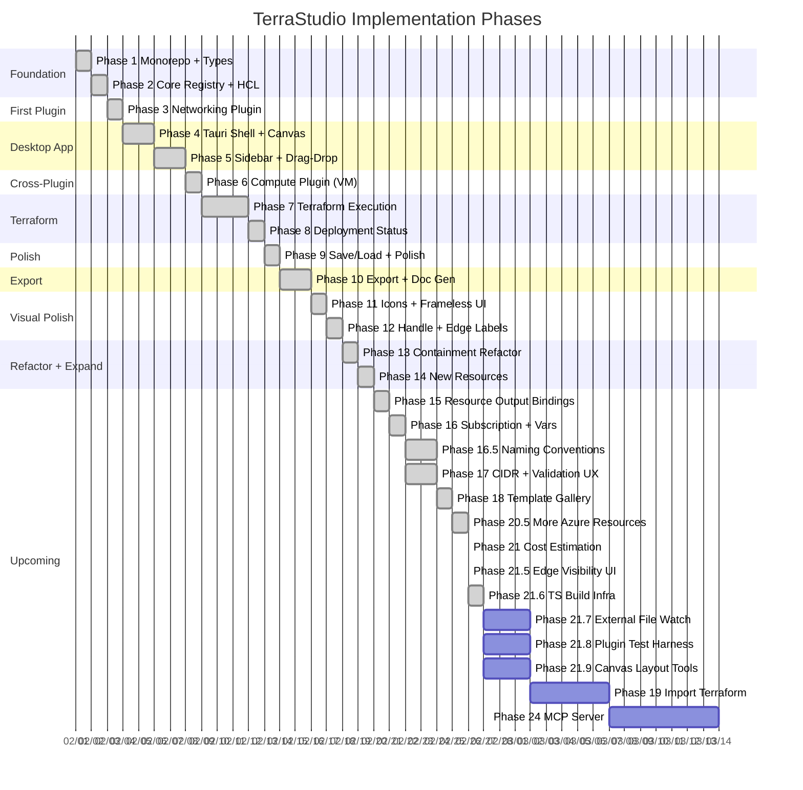

# Implementation Roadmap

## MVP Scope

9 Azure resources: **Resource Group, Virtual Network, Subnet, NSG, Virtual Machine, Storage Account, App Service Plan, App Service, Key Vault**

Core pipeline validated end-to-end: diagram → HCL generation → Terraform init/validate/plan/apply → deployment status.

## Phase Overview



---

## Phase 1: Monorepo Scaffolding + Types Package ✅

**Goal**: Working monorepo with the complete type contract.

### Tasks

1. Initialize pnpm workspace with `pnpm-workspace.yaml`
2. Set up Turborepo (`turbo.json`) with build/dev/typecheck/lint pipelines
3. Create root `tsconfig.base.json` with strict TypeScript settings
4. Create `packages/types/` with all interfaces:
   - `provider.ts` - ProviderId, ProviderConfig
   - `resource-schema.ts` - ResourceSchema, PropertySchema, HandleDefinition
   - `hcl.ts` - HclGenerator, HclBlock, HclGenerationContext, ResourceInstance
   - `node.ts` - ResourceNodeData, ResourceNodeComponent, PropertyEditorComponent
   - `connection.ts` - ConnectionRule
   - `plugin.ts` - InfraPlugin, ResourceTypeRegistration, PaletteCategory
   - `validation.ts` - ValidationError, PropertyValidation
5. Verify the types package builds and exports cleanly

### Verification
- `pnpm build` succeeds in types package
- `pnpm typecheck` passes with no errors
- Types can be imported from `@terrastudio/types`

### Implementation Notes
- Added `isContainer?: boolean` and `canBeChildOf?: ReadonlyArray<ResourceTypeId>` to `ResourceSchema` for container nesting
- Added `[key: string]: unknown` index signature to `ResourceNodeData` for SvelteFlow compatibility

---

## Phase 2: Core Registry + HCL Pipeline ✅

**Goal**: Plugin registry and HCL generation working with mock data.

### Tasks

1. Create `packages/core/`
2. Implement `PluginRegistry`:
   - `registerPlugin()` with collision detection
   - `finalize()` with lifecycle hooks
   - All query methods (getNodeComponent, getHclGenerator, etc.)
   - `buildNodeTypesMap()` for Svelte Flow integration
3. Implement `plugin-registry.svelte.ts` (Svelte 5 reactive wrapper)
4. Implement HCL Pipeline:
   - `HclPipeline.generate()` - main orchestrator
   - `HclBlockBuilder` - assembles blocks into file contents
   - `DependencyGraph` - topological sort
   - `VariableCollector` - collects variables across generators
   - `ProviderConfigBuilder` - builds terraform.tf and providers.tf
5. Implement edge validation (`edge-rules.ts`)
6. Implement diagram validation (`diagram-validator.ts`, `resource-validator.ts`)

### Verification
- Unit tests for PluginRegistry: register, collision, finalize, query
- Unit tests for HclPipeline: generate with mock generators, dependency sorting
- `pnpm typecheck` passes across types + core

---

## Phase 3: Networking Plugin (VNet, Subnet, NSG) ✅

**Goal**: First real plugin implementing three resource types.

### Tasks

1. Create `packages/plugin-azure-networking/`
2. Define the `azurerm` ProviderConfig (subscription_id, features block)
3. Implement VNet resource:
   - `schema.ts` - properties: name, address_space, dns_servers
   - `node.svelte` - container node (VNets hold subnets)
   - `hcl-generator.ts` - generates `azurerm_virtual_network` block
   - `icon.ts` - Azure VNet SVG icon
4. Implement Subnet resource:
   - `schema.ts` - properties: name, address_prefixes
   - `node.svelte` - container node (subnets hold resources)
   - `hcl-generator.ts` - generates `azurerm_subnet` block
   - `icon.ts` - Azure Subnet SVG icon
5. Implement NSG resource:
   - `schema.ts` - properties: name, security_rules
   - `node.svelte` - leaf node
   - `hcl-generator.ts` - generates `azurerm_network_security_group` block
   - `icon.ts` - Azure NSG SVG icon
6. Define connection rules (VNet -> Subnet, Subnet -> NSG)
7. Wire up the plugin entry point (`index.ts`)

### Verification
- Plugin registers with PluginRegistry without errors
- HCL pipeline generates valid Terraform for a VNet + Subnet + NSG diagram
- Run `terraform validate` on generated output

### Implementation Notes
- VNet and Subnet are container nodes (`isContainer: true`)
- Subnet uses `canBeChildOf: ['azurerm/networking/virtual_network']`
- NSG uses `canBeChildOf: ['azurerm/core/resource_group']`

---

## Phase 4: Desktop App Shell + Canvas ✅

**Goal**: Tauri app launches with an empty Svelte Flow canvas.

### Tasks

1. Initialize Tauri 2 + SvelteKit project in `apps/desktop/`
2. Install dependencies: `@xyflow/svelte`, `tailwindcss`, `bits-ui`
3. Configure Tauri permissions (shell, fs, dialog) in `capabilities/default.json`
4. Create `bootstrap.ts` - import networking plugin, initialize registry
5. Create `+page.svelte` - main SPA layout with 4 panels:
   - Left: ResourcePalette (empty for now)
   - Center: Canvas (Svelte Flow with zoom/pan/minimap)
   - Right: Sidebar (empty placeholder)
   - Bottom: TerraformPanel (empty placeholder)
6. Wire Svelte Flow's `nodeTypes` to the registry's `buildNodeTypesMap()`
7. Set up Tailwind with the app layout

### Verification
- `pnpm tauri dev` launches the desktop app
- Canvas renders with zoom, pan, minimap, background grid
- No console errors

### Implementation Notes
- Required `"dragDropEnabled": false` in `tauri.conf.json` — Tauri 2 WebView2 on Windows intercepts native drag events by default
- Drag-drop uses capture-phase event listeners via a Svelte action (`use:dndHandler`) to fire before SvelteFlow's internal pane handlers
- SvelteFlow v1.5.1 uses `bind:nodes`/`bind:edges` for two-way state sync (no `onnodeschange` prop)

---

## Phase 5: Property Sidebar + Drag-and-Drop ✅

**Goal**: Full diagram interaction - drag resources, edit properties.

### Tasks

1. Build `ResourcePalette` - renders palette categories and items from registry
2. Build `PaletteItem` - draggable resource icons
3. Implement drag-from-palette-to-canvas:
   - Use HTML5 drag events + Svelte Flow's drop API
   - On drop: create node via `node-factory.ts`, set position
   - Container detection: if dropped on a container, set `parentId`
   - Validate parent-child via `canBeChildOf()` from connection rules
4. Build `PropertySidebar`:
   - Opens when a node is selected
   - Loads schema from registry, renders form fields
5. Build `PropertyRenderer` (generic schema-driven form):
   - String, number, boolean, select, multiselect, cidr, tags, array fields
   - Grouped by `PropertySchema.group`
   - Conditional visibility via `visibleWhen`
6. Wire property changes back to node data in the diagram store
7. Build `DeploymentBadge` component (grey dot for all nodes initially)
8. Implement node deletion (keyboard Delete key)

### Verification
- Drag VNet from palette onto canvas - node appears
- Drag Subnet into VNet - becomes child (moves with parent)
- Click node - sidebar shows correct properties from schema
- Edit a property - node data updates, label changes
- Delete key removes node and its children

### Implementation Notes
- Container parent relationship uses `canBeChildOf` on child schemas (not `acceptsChildren` on parents) — more scalable
- `findContainerAtPosition()` computes absolute positions via parent chain walking to support 3+ levels of nesting
- `onnodedragstop` handler enables dynamic reparenting: drag nodes into, out of, and between containers
- Default container sizes scale by hierarchy level: RG 800x600, VNet 600x400, Subnet 350x250

---

## Phase 6: Compute Plugin (VM) ✅

**Goal**: Second plugin validates cross-plugin connections.

### Tasks

1. Create `packages/plugin-azure-compute/`
2. Implement Resource Group resource (in a `plugin-azure-core` or in networking):
   - Container node, top-level grouping
   - `azurerm_resource_group` HCL generator
3. Implement Virtual Machine resource:
   - `schema.ts` - properties: name, size, os_type, admin_username, etc.
   - `node.svelte` - leaf node with VM icon
   - `hcl-generator.ts` - generates `azurerm_linux_virtual_machine` or `azurerm_windows_virtual_machine`
   - `icon.ts` - Azure VM SVG icon
4. Define cross-plugin connection rules:
   - VM -> Subnet (via NIC, or simplified direct connection)
   - VM -> NSG
5. Register compute plugin in `bootstrap.ts`

### Verification
- Both plugins load without conflicts
- Can build a diagram: Resource Group > VNet > Subnet > VM + NSG
- HCL generation produces valid Terraform with correct cross-resource references
- `terraform validate` passes on generated output

### Implementation Notes
- Resource Group lives in compute plugin (as `azurerm/core/resource_group`)
- `ContainerResourceNode.svelte` renders containers with dashed border and `NodeResizer`
- `DefaultResourceNode.svelte` renders leaf nodes (VM, NSG)
- `buildNodeTypes()` in `bootstrap.ts` maps `isContainer` schemas to the container component

---

## Phase 7: Terraform Execution ✅

**Goal**: Full init/validate/plan/apply workflow from the app.

### Tasks

1. Implement Rust backend `terraform/runner.rs`:
   - Spawn `terraform` as child process
   - Stream stdout/stderr via Tauri events
   - Handle exit codes
2. Implement Tauri commands (`commands.rs`):
   - `terraform_init`, `terraform_validate`, `terraform_plan`, `terraform_apply`
   - `terraform_show_state` - parse state JSON
   - `write_terraform_files` - write generated .tf files to disk
3. Build `TerraformPanel` UI:
   - Init / Validate / Plan / Apply buttons
   - Status indicator (Ready, Running, Success, Error)
4. Build `OutputConsole`:
   - Streaming terminal output display
   - Auto-scroll, ANSI color support
5. Build `VarsInputForm`:
   - Auto-generated from collected variables
   - Shown before `terraform apply`
   - Writes `terraform.tfvars` on submit
6. Wire the "Generate" button: diagram -> HCL pipeline -> write files
7. Wire Plan/Apply buttons to Tauri commands
8. Handle terraform not installed (detect on startup, show instructions)

### Verification
- Click Generate - .tf files appear in project directory
- Click Init - `terraform init` runs, output streams to console
- Click Validate - reports errors or success
- Click Plan - shows planned changes
- Click Apply - deploys to Azure (requires real subscription)

### Implementation Notes
- Project system added first: create/open/save projects with directory structure (`diagrams/` + `terraform/`)
- Rust backend: `project/commands.rs` (create/load/save), `terraform/runner.rs` (process spawning with streaming), `terraform/commands.rs` (init/validate/plan/apply/destroy)
- Windows `CREATE_NO_WINDOW` flag (0x08000000) prevents console flash when spawning terraform.exe
- `terraform_apply` uses `-auto-approve` flag
- TerraformPanel: live streaming console with auto-scroll, status dots (grey/blue-pulse/green/red), terraform version badge
- Diagram converter: `DiagramNode[]` → `ResourceInstance[]` with edge-based references and parent container references from SvelteFlow `parentId`
- Welcome screen with recent projects list (persisted in `{app_data}/com.terrastudio.app/recent-projects.json`)
- VarsInputForm deferred to Phase 9 (Polish)

---

## Phase 8: Deployment Status ✅

**Goal**: Green/grey dots on diagram nodes showing what's deployed.

### Tasks

1. Implement `state-manager.ts` in core:
   - Parse `terraform show -json` output
   - Match `{type}.{name}` addresses to diagram node IDs
   - Return status map: nodeId -> DeploymentStatus
2. Build `status-store.svelte.ts`:
   - Svelte 5 runes store for deployment status
   - Updates after every `terraform apply` or manual refresh
3. Update node components to show `DeploymentBadge`:
   - Green dot = created
   - Grey dot = pending (not yet deployed)
   - Red dot = failed
   - Yellow dot = modified (diagram differs from state)
4. Wire status refresh after `terraform apply` completes
5. Add a "Refresh Status" button for manual state sync

### Verification
- Deploy a diagram to Azure
- Green dots appear on deployed resources
- Add a new resource to diagram - shows grey dot
- Modify a deployed resource's properties - shows yellow dot

### Implementation Notes
- `terraform_show` Rust command uses `run_terraform_capture()` (non-streaming, captures full stdout)
- `refreshDeploymentStatus()` in `terraform-service.ts` parses `terraform show -json`, matches `{terraformType}.{terraformName}` addresses to nodes
- Auto-refresh after apply/destroy in TerraformPanel + manual "Refresh Status" button
- DeploymentBadge component (from Phase 5) receives status updates through `diagram.updateNodeData()`

---

## Phase 9: Save/Load + Polish ✅

**Goal**: Persist projects, keyboard shortcuts, error handling.

### Tasks

1. Implement project save/load:
   - Serialize diagram state (nodes, edges, project config) to JSON
   - Save via Tauri file dialog (`dialog:allow-save`)
   - Load via Tauri file dialog (`dialog:allow-open`)
   - Store as `.terrastudio` project file
2. Add keyboard shortcuts:
   - `Ctrl+S` - save project
   - `Ctrl+Z` / `Ctrl+Y` - undo/redo (node/edge mutations)
   - `Delete` - remove selected node(s)
   - `Ctrl+A` - select all
3. Error handling polish:
   - Terraform CLI not found
   - Invalid Azure credentials
   - Generation with missing required properties (show validation errors)
4. End-to-end test the full workflow:
   - Create project, build diagram, generate, validate, plan, apply, verify status, save, reload

### Verification
- Save project, close app, reopen, load - diagram restores perfectly
- Undo/redo works for add/delete/move operations
- Missing terraform shows helpful error message
- Full cycle works: diagram -> terraform -> deployed infrastructure -> green dots

### Implementation Notes
- Save/load was implemented in Phase 7 (project system), this phase focused on polish
- Undo/redo: snapshot-based history stack in `diagram.svelte.ts` (MAX_HISTORY=50), captures full `{nodes, edges}` state via `structuredClone($state.snapshot(...))`, requires `unknown` intermediate cast to avoid TypeScript "excessively deep" error with Svelte Flow types
- `diagram.saveSnapshot()` called on `onnodedragstart` to capture pre-drag state for undo
- `diagram.loadDiagram()` bulk-loads nodes/edges without pushing individual history entries or marking dirty
- Dirty tracking: `project.markDirty()` called from `pushSnapshot()`, visual indicator in toolbar (asterisk on Save button + dot next to project name)
- Pre-generation validation: `validateDiagram()` from core runs before HCL generation, errors displayed in terraform panel
- Keyboard shortcuts: Ctrl+Z/Y (undo/redo), Ctrl+A (select all), Delete/Backspace (delete selected), Ctrl+S (save) — all skip when focus is in INPUT/TEXTAREA/SELECT

---

## Phase 10: Export + Documentation Generation ✅

**Goal**: Export diagrams as images and auto-generate architecture documentation from the diagram.

### Tasks

1. Implement diagram image export:
   - PNG export using Svelte Flow's `toObject()` + html-to-image (or canvas rendering)
   - SVG export (Svelte Flow nodes are already DOM elements, serialize to SVG)
   - Export controls: include/exclude minimap, background grid, deployment badges
   - Clipboard copy (paste diagram into Slack/Teams/docs)
2. Implement architecture documentation generator:
   - Walk the diagram graph to extract resource inventory, hierarchy, and connections
   - Generate a Markdown document with:
     - Title and description (from project config)
     - Architecture diagram (embedded exported image or Mermaid diagram)
     - Resource inventory table (name, type, key properties, deployment status)
     - Network topology section (VNets, subnets, CIDRs, NSG rules)
     - Resource dependency graph (Mermaid flowchart generated from edges)
     - Terraform variable reference (all variables with descriptions and defaults)
   - Template system: pluggable doc templates (plugins can contribute sections)
3. Add doc generation service in core:
   - `doc-generator.ts` - walks diagram, produces structured data
   - `doc-templates/` - Markdown templates (Handlebars or simple string interpolation)
   - Plugins can register `DocSection` contributions via a new optional field on `InfraPlugin`
4. Export formats:
   - Markdown (.md) - primary, with embedded Mermaid diagrams
   - HTML - rendered from Markdown with styles
   - PDF - via Tauri print-to-PDF or markdown-to-pdf library

### Verification
- Export diagram as PNG - opens file dialog, saves clean image
- Export as SVG - valid SVG file that opens in browsers/Figma
- Generate docs - produces a Markdown file with resource table, diagram, and dependency graph
- Generated Mermaid diagrams render correctly in GitHub/VS Code preview

### Implementation Notes
- `html-to-image@1.11.11` (`toPng`) captures `.svelte-flow__viewport` (not the outer `.svelte-flow` — avoids baking controls/minimap into the image), per the official Svelte Flow docs example
- Fixed 1024×768 output with `getViewportForBounds(nodesBounds, 1024, 768, 0.5, 2, 0.2)` for content fitting
- Clipboard copy uses `navigator.clipboard.write()` with `ClipboardItem` for native paste support
- Rust `write_export_file` command writes binary data (PNG bytes or UTF-8 Markdown) to user-selected paths via `@tauri-apps/plugin-dialog` save dialog
- Doc generator walks `diagram.nodes`/`diagram.edges`, pulls schemas from registry, produces Markdown with resource inventory table, parent-child hierarchy tree, Mermaid dependency graph, and per-resource property details
- Export dropdown in Toolbar with click-outside dismiss
- SVG export, HTML/PDF formats, and plugin doc section contributions deferred to future phases

---

## Phase 11: Visual Polish — Icons, Palette, Container Styling, Frameless UI ✅

**Goal**: Replace plain rectangles with real Azure resource icons, add collapsible palette sections, give containers provider-accurate styling, and modernize the window chrome.

### Tasks

1. **Borderless/frameless window**
   - Configure Tauri window decorations: `"decorations": false` in `tauri.conf.json`
   - Custom title bar in the Toolbar component: app icon, drag region, minimize/maximize/close buttons
   - Ensure window drag works via Tauri's `data-tauri-drag-region` attribute
   - Platform-appropriate close/minimize/maximize button placement (right on Windows)
   - Title bar blends seamlessly with the toolbar — no visible separation

2. **Collapsible palette sections**
   - Each `PaletteCategory` renders as a collapsible accordion section (header + toggle arrow)
   - Remembered open/closed state per session (UI store)
   - Smooth expand/collapse animation

3. **Resource SVG icons**
   - Source official Azure architecture SVG icons for each resource type (Resource Group, VNet, Subnet, NSG, VM, Storage Account, App Service, VMSS)
   - Store as inline SVG strings in each resource's `icon.ts` (already wired into the plugin contract)
   - Render icons in palette items, diagram nodes, and sidebar header
   - Palette items: icon + label, compact grid or list layout

4. **Custom container styling (plugin-driven)**
   - Add optional `ContainerStyle` interface to `@terrastudio/types`:
     ```ts
     interface ContainerStyle {
       borderColor?: string;
       borderStyle?: 'solid' | 'dashed' | 'dotted';
       backgroundColor?: string;
       headerColor?: string;
       borderRadius?: number;
     }
     ```
   - Add optional `containerStyle?: ContainerStyle` field to `ResourceSchema`
   - `ContainerResourceNode.svelte` reads `containerStyle` from schema and applies it
   - Defaults per resource: Resource Group (blue-grey border), VNet (teal dashed border, light teal background), Subnet (purple dashed border, light purple background)

5. **Update node components**
   - `DefaultResourceNode.svelte`: show SVG icon left of label, cleaner card layout
   - `ContainerResourceNode.svelte`: icon + label in header bar, styled border/background from schema

6. **Resource hover details**
   - Hovering over a diagram node shows a tooltip/popover with key resource details
   - Display: resource type, terraform name, deployment status, 2–3 key properties (from schema's top properties)
   - Delay on show (~300ms) to avoid flicker during mouse movement
   - Positioned above/below the node, doesn't interfere with drag or selection
   - Uses existing schema metadata — no new data needed

### Verification
- App window is frameless with custom title bar that matches the toolbar
- Palette shows collapsible sections with icons
- Diagram nodes display resource-specific SVG icons
- Containers have distinct visual styles matching Azure conventions
- Plugins can override container styling via schema
- Hovering a node shows a detail tooltip with type, terraform name, and key properties

---

## Phase 12: Handle Labels + Connector Labels ✅

**Goal**: Show what connections mean — labeled handles on nodes and labeled edges on the diagram.

### Tasks

1. **Labeled handles (inputs/outputs)**
   - `HandleDefinition` in `@terrastudio/types` already has `label` field — render it
   - Show labels next to connection handles on hover (tooltip) or always (small text)
   - Source handles (outputs): right side, labelled e.g. "subnet_id", "nsg_id"
   - Target handles (inputs): left side, labelled e.g. "subnet_id", "network_security_group_id"
   - Style: muted text, smaller font, positioned adjacent to the handle dot

2. **Labeled edges/connectors**
   - When an edge connects source handle → target handle, derive a label from the connection rule or handle names
   - Render edge labels using Svelte Flow's `EdgeLabelRenderer` or custom edge component
   - Label shows the relationship, e.g. "subnet_id", "nsg_association"
   - Labels appear on hover or always (configurable in UI store)
   - Custom edge component with a styled label badge at the midpoint

3. **Connection rule display**
   - When dragging a new connection, highlight compatible handles (green glow)
   - Dim incompatible handles (grey out)
   - Show a tooltip on the target handle with the connection type

### Verification
- Hover over a node handle → see "subnet_id" or similar label
- Draw a connection → edge shows label describing the relationship
- Incompatible handles are visually dimmed during connection drag

### Implementation Notes
- `HandleWithLabel.svelte` — shared component used by both `DefaultResourceNode` and `ContainerResourceNode`. Uses SvelteFlow's Handle `children` snippet to position labels adjacent to handles. Labels always visible (9px muted text).
- `useConnection()` hook inside `HandleWithLabel` drives connection drag highlighting — compatible handles glow green (`#22c55e`), incompatible handles dim to 30% opacity
- `EdgeRuleValidator` instantiated in `bootstrap.ts` from plugin connection rules, used for both `isValidConnection` prop (prevents invalid connections) and `onConnect` label derivation
- Edge labels use SvelteFlow's built-in `edge.label` rendering (SVG text with background rect) — no custom edge component needed. Styled via `.svelte-flow__edge-text` / `.svelte-flow__edge-textbg` CSS overrides.
- Edge labels are user-editable: click an edge to select it, edit label in the sidebar. `diagram.updateEdgeLabel()` with debounced history (same pattern as `updateNodeData`).
- `diagram.selectedEdgeId` tracks edge selection; `Sidebar.svelte` shows connection details (source/target names, editable label, delete button) when an edge is selected

---

## Phase 13: Containment Refactor ✅

**Goal**: Remove redundant containment edges — derive parent references from visual nesting instead of explicit edges.

### Changes

1. **Added `parentReference` to `ResourceSchema`**
   - New optional field: `parentReference: { propertyKey: string }`
   - When a node is visually nested inside a parent container, the HCL pipeline automatically sets the reference (e.g., Subnet inside VNet → `virtual_network_name` reference)

2. **Updated `deriveParentReferences()` in `diagram-converter.ts`**
   - Now reads `parentReference` from the child's schema instead of scanning connection rules
   - Accepts `getSchema` callback typed with `ResourceTypeId`

3. **Removed containment handles and connection rules**
   - VNet: removed `subnet-out` handle
   - Subnet: removed `vnet-in` and `resource-out` handles, added `parentReference: { propertyKey: 'virtual_network_name' }`
   - VM: removed `subnet-in` handle, added `parentReference: { propertyKey: 'subnet_id' }`
   - Resource Group: removed `resources-out` handle
   - Removed containment rules from both plugin connection rule files

4. **What stayed**: `canBeChildOf` (drag-drop validation), `isContainer` (rendering)

### Verification
- Containment works via visual nesting — no edges needed
- HCL generation produces correct parent references from `parentId`

---

## Phase 14: New Azure Resources + resolveTerraformType ✅

**Goal**: Expand the resource palette beyond the original 5 MVP resources.

### New Resources

1. **Storage Account** (`azurerm/storage/storage_account`) — new `plugin-azure-storage` package
   - Properties: name (3-24 lowercase alphanumeric), account_tier, replication_type, account_kind, access_tier, min_tls_version, https_traffic_only
   - Leaf node, `canBeChildOf: ['azurerm/core/resource_group']`

2. **App Service Plan** (`azurerm/compute/app_service_plan`)
   - Properties: name, os_type (Linux/Windows), sku_name (F1–P3v3)
   - Has `apps-out` source handle for connecting to App Services

3. **App Service** (`azurerm/compute/app_service`)
   - Properties: name, os_type, runtime_stack, always_on, https_only
   - Has `plan-in` target handle (accepts App Service Plan, maxConnections: 1)
   - Connection rule: App Service Plan → App Service creates `service_plan_id` reference

4. **Key Vault** (`azurerm/security/key_vault`)
   - Properties: name, sku_name, soft_delete_retention, purge_protection, deployment flags
   - HCL generator emits `data "azurerm_client_config" "current" {}` for tenant_id/object_id

### resolveTerraformType

- Added optional `resolveTerraformType?(properties)` to `HclGenerator` interface
- Fixes OS-variant resources where `schema.terraformType` is static but the actual Terraform type depends on `os_type` (e.g., `azurerm_linux_web_app` vs `azurerm_windows_web_app`)
- Implemented on VM and App Service generators
- `refreshDeploymentStatus()` uses it for correct state address matching

### Other Changes
- Official Azure SVG icons for all 4 new resources (with namespaced gradient IDs to prevent color collisions)
- New `security` palette category (order: 40) in compute plugin
- Updated CLAUDE.md with "Adding New Resources" criteria guide

---

## Phase 15: Resource Output Bindings ✅

**Goal**: Enable using outputs of one resource as inputs to another — e.g., a Storage Account's connection string becomes a Key Vault secret. Decoupled system where any resource's enabled outputs can connect to any `acceptsOutputs` handle.

### What Was Implemented

1. **Output definitions on all 9 resources**
   - Each schema declares an `outputs` array with `key`, `label`, `terraformAttribute`, and optional `sensitive` flag
   - Users toggle outputs on/off in the sidebar; enabled outputs create dynamic `out-{key}` source handles
   - `DefaultResourceNode` and `ContainerResourceNode` render dynamic handles using `useUpdateNodeInternals()` (separate hook from `useSvelteFlow()`)

2. **`acceptsOutputs` pattern (decoupled binding system)**
   - New `acceptsOutputs?: boolean` flag on `HandleDefinition` — target handles accept connections from any dynamic `out-*` handle without per-source-type `ConnectionRule` entries
   - `EdgeRuleValidator` extended with `OutputAcceptingHandle[]` — synthesizes validation rules dynamically when `out-*` connects to an `acceptsOutputs` handle
   - Eliminated N×M coupling: Key Vault's `secret-in` accepts outputs from any resource, no storage-specific rules needed
   - Bootstrap collects `OutputAcceptingHandle[]` from all schemas and passes to the validator

3. **Wildcard binding generators**
   - `BindingHclGenerator.sourceType` made optional — `undefined` means "any source resource"
   - `PluginRegistry.getBindingGenerator()` tries exact match first, falls back to wildcard
   - Single generic `keyvault-secret.ts` binding generator creates `azurerm_key_vault_secret` for any source attribute

4. **Binding edge UX**
   - Animated dashed edges (`animated: true`) visually distinguish binding edges from association edges
   - Edge labels derived from source output definitions: "Store Connection String as secret"
   - Edge IDs include `sourceHandle` to support multiple outputs from same source to same target
   - `addEdge()` deduplicates edges with same endpoints (SvelteFlow `bind:edges` auto-adds)

5. **Connected Secrets sidebar section**
   - When a node with `acceptsOutputs` handles is selected, sidebar shows "Connected Secrets"
   - Lists each connected binding: source name, attribute label, sensitive badge, disconnect (×) button
   - Fully reactive — updates as edges are added/removed

6. **Cleanup**
   - Removed storage-specific `storage-to-keyvault.ts` binding generator and connection rules
   - `extractOutputBindings()` in `diagram-converter.ts` now uses `EdgeRuleValidator` instead of raw rules

### Verification
- Enable any output on any resource → dynamic handle appears
- Drag from output handle to Key Vault's "Secret" → animated edge with descriptive label
- Multiple outputs from same source to same Key Vault → unique edges, all listed in sidebar
- Select Key Vault → "Connected Secrets" section shows all bindings with disconnect buttons
- Generate HCL → each binding produces a separate `azurerm_key_vault_secret` resource
- Existing static handles (Plan→App Service) work unchanged

---

## Phase 15.5: NSG Reference Properties ✅

**Goal**: Replace edge-based NSG associations (handles + connection rules) with property-based references — a boolean toggle + dropdown on Subnet/VM to select an NSG. Reduces visual clutter and is more intuitive.

### What Was Implemented

1. **`visibleWhen` conditional visibility in PropertyRenderer**
   - Evaluates `truthy`, `falsy`, `eq`, `neq`, `in`, `notIn` operators
   - Properties with unsatisfied `visibleWhen` conditions are hidden from the form

2. **`reference` property type rendering in PropertyRenderer**
   - New props: `references`, `diagramNodes`, `onReferenceChange`
   - Renders a `<select>` dropdown filtered by `referenceTargetTypes`
   - Values stored in `node.data.references` (not `properties`), flowing automatically through `diagram-converter.ts` to HCL generators

3. **PropertiesPanel wiring**
   - `onReferenceChange` updates `node.data.references`
   - `diagramNodes` built from all diagram nodes (excluding selected), mapped to `{id, typeId, label}`

4. **Schema changes**
   - Subnet: added `nsg_enabled` (boolean) + `nsg_id` (reference with `visibleWhen: { field: 'nsg_enabled', operator: 'truthy' }`) in Security group; removed `nsg-in` handle
   - VM: same pattern — `nsg_enabled` + `nsg_id` properties; removed `nsg-in` handle
   - NSG: removed `nsg-out` handle → `handles: []`

5. **Connection rules removed**
   - Networking plugin: `connectionRules = []` (NSG→Subnet rule removed)
   - Compute plugin: `connectionRules = []` (NSG→VM rule removed)

6. **HCL generators updated**
   - Subnet: emits `azurerm_subnet_network_security_group_association` when `references['nsg_id']` exists
   - VM: emits `azurerm_network_interface_security_group_association` when `references['nsg_id']` exists

7. **Stale reference cleanup**
   - `removeNode()` and `removeSelectedNodes()` clean up dangling references pointing to deleted nodes

8. **NSG badge on nodes**
   - `ContainerResourceNode` and `DefaultResourceNode` show the Azure NSG icon (from registry) when `data.references['nsg_id']` is set
   - Positioned in the badge area alongside the deployment status dot

### Verification
- Select a Subnet → toggle NSG checkbox → dropdown appears with available NSGs
- Select an NSG → shield icon appears on subnet header
- Same toggle/dropdown works on VM
- Generate Terraform → association blocks appear
- Delete the NSG node → references cleaned up, badges disappear
- No more NSG handles or edge connections available

---

## Phase 16: Azure Subscription Resource + Variable Management UI ✅

**Goal**: Add the subscription-level container and expose Terraform variable management in the UI.

### What Was Implemented

1. **Azure Subscription component** (`azurerm/core/subscription`)
   - Container node in compute plugin that wraps Resource Groups
   - Schema properties: `subscription_id`, `display_name`, `tenant_id`
   - HCL generator configures the `azurerm` provider block's `subscription_id`
   - Container styling: outermost dashed border, Azure blue header
   - `canBeChildOf: []` (top-level only), Resource Group uses `canBeChildOf: ['azurerm/core/subscription']`

2. **Azure CLI subscription picker** (`SubscriptionPicker.svelte`)
   - Inline browse-and-select UI on the Subscription node's properties panel
   - Tauri `az_list_subscriptions` Rust command wraps `az account list --output json`
   - Windows: spawned via `cmd /c az` (`.cmd` scripts can't be invoked directly); `CREATE_NO_WINDOW` flag
   - Graceful states: `ok` (searchable list), `not_installed` (install link), `not_logged_in` (run `az login` message), `no_subscriptions` (wrong tenant hint), `error`
   - Filter/search across subscription name and ID; default-subscription dot indicator
   - PropertiesPanel hides raw `subscription_id`/`display_name` fields when picker is active

3. **Terraform variable management UI** (`ProjectConfigPanel.svelte`)
   - Variables section shows collected Terraform variables after HCL generation
   - Displays variable name, type badge, description, and default values
   - Input fields for setting variable values (required variables highlighted with orange border)
   - Debounced variable value changes persisted to project config
   - Variables mapped to `terraform.tfvars` generation

4. **Project config UI** (`ProjectConfigPanel.svelte`)
   - Common Tags section: add/remove tags applied to all resources supporting tags
   - Theme toggle (dark/light) with palette support
   - Integrates with project store for persistence

---

## Phase 16.5: Naming Convention System + Project Setup Wizard ✅

**Goal**: Project-level resource naming templates with token-based patterns and a guided new-project wizard that configures naming, layout, and edge preferences upfront.

### What Was Implemented

1. **Naming convention system**
   - Per-resource naming templates stored in `project.config.namingConventions`
   - Token system: `{name}`, `{env}`, `{location}`, `{type}`, `{random}`, etc.
   - `applyNamingTemplate()` in `@terrastudio/core` applies templates during HCL generation
   - Naming convention editor in Project Settings panel with token chip UI
   - Live preview showing resolved name as tokens are inserted

2. **Schema improvements alongside naming**
   - `sensitive: true` flag on `PropertySchema` — renders as password field with show/hide toggle
   - Credential validation: required sensitive fields validated on blur
   - `property-as-variable` mode: any property can be toggled to emit a Terraform `var.name` reference instead of a hardcoded value

3. **VS-style 3-step new project wizard**
   - Inline wizard in the Welcome Screen (no modal)
   - Step 1: Project name + directory selection
   - Step 2: Naming convention — preset selector + custom token builder with live preview
   - Step 3: Canvas preferences — layout direction (TB/LR/BT/RL) + edge style
   - Accessible: token chips rendered as `<button>` elements, `aria-label` on interactive icons

4. **Canvas UX improvements**
   - Minimap toggle via `ControlButton` inside the SvelteFlow Controls panel (bottom-left); persisted to localStorage
   - Tab bar right-click context menu: **Close** (file tabs only) and **Close Others**; Canvas tab cannot be closed
   - `ui.closeOtherTabs(keepTabId)` in UiStore for batch-close

---

## Phase 17: Networking Intelligence + Validation UX ✅

**Goal**: Auto-populate subnet CIDR ranges, validate network topology, and improve property validation UX in the properties panel.

### What Was Implemented

1. **Auto-populate subnet CIDR ranges** ✅
   - CIDR utility module in `@terrastudio/core`: `nextAvailableCidr()`, `cidrsOverlap()`, `cidrContains()`
   - When a subnet is dropped into a VNet, auto-calculates the next available `/24` block
   - Skips ranges already assigned to existing sibling subnets
   - Comprehensive test coverage in `cidr-utils.test.ts`

2. **Subnet CIDR overlap detection** ✅
   - `validateNetworkTopology()` in `core/src/lib/validation/network-validator.ts`
   - Validates subnet CIDRs fall within parent VNet address space
   - Detects overlapping CIDRs between sibling subnets
   - Integrated into diagram validation pipeline

3. **Validation error highlights** ✅
   - Property form fields with validation errors get inline red border + error message
   - Real-time updates as the user types
   - Pre-generation validation (`validateDiagram()`) surfaces errors in the Terraform panel before HCL generation runs

4. **Variable-mode bypass + real-time variables panel** ✅
   - Any property can be switched to "variable mode" — emits `var.name` in HCL instead of a hardcoded value
   - Variables panel in sidebar shows all active Terraform variables with type badges, descriptions, and current values
   - Auto-regenerate toggle: diagram changes trigger HCL regeneration automatically

5. **Auto-regenerate toggle** ✅
   - Toggle in TerraformPanel to auto-regenerate `.tf` files on every diagram change
   - Debounced to avoid excessive writes

### Not Yet Implemented

- **Azure resource name availability validation** — requires Azure REST API or `az` CLI; would need a settings toggle, debounced validation, and inline status indicators

---

## Previously Future — Now Implemented ✅

These items were originally in "Future Phases" but have been completed:

- **Auto-layout** ✅ — `dagre` hierarchical layout in `layout-service.ts` with TB/BT/LR/RL directions, bottom-up container processing
- **Dark/light mode toggle** ✅ — Theme toggle in `AppSettingsPanel.svelte`, persisted to localStorage, palette support via `applyPalette()`
- **SVG export** ✅ — SVG, PNG, and clipboard export in `export-service.ts` using `html-to-image`
- **Canvas context menu** ✅ — Right-click on nodes/edges/pane for delete, duplicate, add-child actions
- **Drag selection + copy/paste** ✅ — Marquee selection, Ctrl+C/V for duplicating nodes with new IDs
- **Snap to grid + grid size** ✅ — Toggle and size picker in CanvasToolbar, persisted to localStorage
- **Hybrid grid auto-layout** ✅ — Project setting for grid-based layout as alternative to dagre
- **12 additional Azure resources across 3 plugins** ✅ — `plugin-azure-database`, `plugin-azure-monitoring`, `plugin-azure-security` added
- **Unsaved changes protection** ✅ — Dialog on close/new/open when project has unsaved edits

---

## Phase 18: Template Gallery ✅

**Goal**: Pre-built architecture templates users can start from instead of a blank canvas.

### What Was Implemented

1. **User/custom templates** ✅
   - Export current diagram as a reusable template (`.terrastudio-template.json`)
   - Import templates from file via Tauri dialog
   - User templates listed on the Welcome Screen alongside recent projects
   - Templates stored in `{app_data}/com.terrastudio.app/templates/`
   - Rust commands: `list_user_templates`, `load_user_template`, `open_templates_folder`

2. **Built-in bundled templates** ✅
   - 3 curated templates: Hub-Spoke Networking, Microservices + Key Vault, Serverless Data API
   - Welcome Screen displays built-in and user templates in separate sections
   - Keyboard shortcut (`Ctrl+T`) to open template browser

3. **Template metadata + thumbnails** ✅
   - `generateThumbnailPng()` in `export-service.ts` captures diagram canvas as PNG data URL
   - "Save as Template..." in File menu opens dialog to set name/description, auto-generates thumbnail
   - Thumbnails displayed on template cards in the Welcome Screen

---

---

## Phase 20.5: Additional Azure Data & Messaging Resources ✅

**Goal**: Expand data and messaging resource coverage with high-value resources commonly used in Azure architectures.

### New Resources Added

**plugin-azure-database** — 5 new resources, 3 new palette categories:

| Resource | TypeId | Terraform Type | Kind |
|---|---|---|---|
| Redis Cache | `azurerm/database/redis_cache` | `azurerm_redis_cache` | Leaf in RG |
| PostgreSQL Flexible Server | `azurerm/database/postgresql_flexible_server` | `azurerm_postgresql_flexible_server` | Container in RG |
| PostgreSQL Database | `azurerm/database/postgresql_flexible_server_database` | `azurerm_postgresql_flexible_server_database` | Leaf in Pg Server |
| Cosmos DB Account | `azurerm/database/cosmosdb_account` | `azurerm_cosmosdb_account` | Container in RG |
| Cosmos DB SQL Database | `azurerm/database/cosmosdb_sql_database` | `azurerm_cosmosdb_sql_database` | Leaf in Cosmos Account |

New palette categories: PostgreSQL (order 26), Cache (order 27), Cosmos DB (order 28)

**plugin-azure-compute** — 3 new resources, 1 new palette category:

| Resource | TypeId | Terraform Type | Kind |
|---|---|---|---|
| Service Bus Namespace | `azurerm/messaging/servicebus_namespace` | `azurerm_servicebus_namespace` | Container in RG |
| Service Bus Queue | `azurerm/messaging/servicebus_queue` | `azurerm_servicebus_queue` | Leaf in Namespace |
| Service Bus Topic | `azurerm/messaging/servicebus_topic` | `azurerm_servicebus_topic` | Leaf in Namespace |

New palette category: Messaging (order 38)

### Also Fixed
- App Service Plan: added `Y1 (Consumption)` SKU option — required by serverless templates but was missing from the dropdown
- Naming convention audit: added `cafAbbreviation` and `namingConstraints` to all resources that were missing them (Log Analytics, App Insights, Managed Identity, VNet, Subnet, NSG, App Service Plan, VM, blob containers, file shares, queues, tables)

---

## Phase 21: Cost Estimation ✅

**Goal**: Show estimated monthly costs for the designed infrastructure.

### What Was Implemented

1. **Azure Retail Prices API integration** ✅
   - `CostEstimationService` queries `https://prices.azure.com/api/retail/prices` per resource
   - Matches on `armRegionName`, `armSkuName`, `priceType: Consumption`
   - Caches results in `cost.svelte.ts` store keyed by node ID
   - Handles 10 resource types: VM, App Service Plan, App Service, Function App, Key Vault, Storage Account, Redis Cache, PostgreSQL Flexible Server, Cosmos DB Account, Service Bus Namespace

2. **Per-node cost badges** ✅
   - `CostBadge.svelte` rendered inside each `DefaultResourceNode` and `ContainerResourceNode`
   - Shows `~$X/mo` when pricing is available; hidden while loading
   - Visibility controlled by `ui.showCostBadges` toggle

3. **Cost breakdown panel** ✅
   - `CostPanel.svelte` floating panel showing per-resource line items
   - Groups by resource type, shows subtotals, grand total
   - Dirty banner (⚠️) when diagram has unsaved changes since last estimate
   - "Refresh estimates" button to re-fetch pricing
   - Export to CSV button

4. **Project config** ✅
   - `region` field on `ProjectConfig` (default `eastus`) used as `armRegionName` for pricing queries
   - Region picker in `ProjectConfigPanel.svelte`

5. **UI integration** ✅
   - Cost Estimation toggle in `ProjectConfigPanel.svelte`
   - Cost badges visibility toggle moved into the edge visibility dropdown in `CanvasToolbar.svelte`

---

## Phase 21.5: Edge Visibility UI & Toolbar Cleanup ✅

**Goal**: Consolidate canvas visibility controls into a single cohesive dropdown; remove scattered toolbar chips.

### What Was Implemented

1. **Per-category edge visibility toggles** ✅ (already done in Phase 4.x edge styling work)
   - "Show Edges" dropdown in `CanvasToolbar.svelte` with individual toggles for Structural, Reference, Binding, and Annotation edge categories
   - Each toggle wired to `ui.showEdgeCategory(category, visible)` in `ui.svelte.ts`

2. **Cost Badges toggle in edge visibility dropdown** ✅
   - "Cost Badges / Node estimates" toggle added at the bottom of the "Show Edges" dropdown, separated by a divider
   - Wired to `ui.showCostBadges` / `ui.setShowCostBadges()`
   - Consolidates all canvas visibility controls in one place

3. **Toolbar cleanup** ✅
   - Removed standalone cost chip button from the main toolbar
   - Toolbar remains clean with only essential action buttons

---

## Phase 21.6: TypeScript Build Infrastructure ✅

**Goal**: Achieve zero typecheck errors with strict TypeScript settings across all packages and the desktop app.

### What Was Implemented

1. **`IReactivePluginRegistry` interface** ✅
   - Created `packages/core/src/lib/registry/reactive-plugin-registry.interface.ts`
   - Bridges the gap between `ReactivePluginRegistry` (uses Svelte 5 `$state` runes, compiled by Svelte compiler only) and plain `tsc` / `svelte-check`
   - `packages/core/src/index.ts` exports `export declare const pluginRegistry: IReactivePluginRegistry` as a type-only stub
   - `packages/core/src/index.svelte.ts` overrides with the actual reactive instance at runtime (via `svelte` export condition in `package.json`)
   - All service files (`layout-service.ts`, `templates/service.ts`, `templates/validator.ts`, `terraform-service.ts`, `project-service.ts`) updated to accept `IReactivePluginRegistry`

2. **Implicit-any compliance** ✅
   - Added explicit type annotations to all arrow function parameters across `.svelte` and `.ts` files
   - Files fixed: `diagram.svelte.ts`, `DefaultResourceNode.svelte`, `ContainerResourceNode.svelte`, `PropertiesPanel.svelte`, `ResourcePalette.svelte`, `TerraformSidebar.svelte`, `SidePanel.svelte`, `DnDFlow.svelte`, `export-service.ts`
   - Imported `HandleDefinition`, `PropertySchema`, `OutputDefinition`, `PaletteCategory`, `ResourceTypeRegistration` from `@terrastudio/types` where needed

3. **CI green** ✅
   - 0 typecheck errors across all packages and the desktop app
   - Local verification command: `pnpm --filter @terrastudio/core build && pnpm --filter @terrastudio/desktop typecheck`

---

## Phase 21.7: External File Change Detection

**Goal**: Keep the app in sync when project files or generated Terraform files are modified outside of TerraStudio.

### Part A — Project file hot-reload

When the `.terrastudio` project file is modified on disk while the app is open, reload and reflect the changes in the UI rather than silently diverging.

1. **File watcher (Rust)**
   - Use `notify` crate to watch the open project file for changes
   - Debounce rapid changes (e.g., a save from an external editor may fire multiple events)
   - Emit a Tauri event `project://changed` to the frontend when a modification is detected

2. **Conflict detection (frontend)**
   - If the in-app diagram has unsaved changes when an external change is detected, show a dialog:
     - "This project was modified outside TerraStudio. Reload from disk (losing unsaved changes) or keep your current version?"
   - If there are no unsaved changes, silently hot-reload

3. **Hot-reload path**
   - Call the existing `load_project` path to re-parse the `.terrastudio` file
   - Diagram state, project config, and all stores are updated in-place
   - Undo history is cleared (external edits are not undoable)

### Part B — Terraform file change protection

When generated `.tf` files are modified outside the app, warn the user before overwriting them on the next HCL generation.

1. **Hash tracking**
   - After every HCL generation, compute SHA-256 hashes of each written `.tf` file and persist them in a `{project_dir}/terraform/.terrastudio-hashes.json` sidecar file
   - Hashes are keyed by filename: `{ "main.tf": "abc123...", "variables.tf": "def456..." }`

2. **Pre-generation check**
   - Before writing new `.tf` files, read the existing files from disk and recompute their hashes
   - Compare against the stored hashes — any file whose current hash differs from the stored hash has been externally modified
   - If any modified files are detected, show a confirmation dialog listing the changed files:
     - "The following Terraform files have been modified outside TerraStudio and will be overwritten: [list]. Proceed?"
   - User can choose **Overwrite** (continue generation) or **Cancel** (abort, keep external edits)

3. **Scope**
   - Only tracks files that TerraStudio itself generated (files in the hash sidecar)
   - Files not in the sidecar (e.g., user-created `.tf` files) are never touched by generation and not tracked
   - Hash sidecar is excluded from git via `.gitignore` recommendation in docs

---

## Phase 21.8: Plugin Conformance Test Suite

**Goal**: Provide a shared test harness in `@terrastudio/core` that any plugin can run to verify it correctly implements the plugin contract — catching missing fields, broken HCL generators, invalid schemas, and connection rule errors before they reach the app.

### What to build

1. **`plugin-test-harness.ts` in `@terrastudio/core`**
   - Exported utility: `testPlugin(plugin: InfraPlugin): PluginTestResult`
   - Runs a battery of conformance checks against a plugin object and returns structured pass/fail results
   - Designed to be called directly from vitest/jest `describe` blocks — no special test runner needed

2. **Schema conformance checks** (per `ResourceTypeRegistration`)
   - `schema.typeId` matches `{provider}/{category}/{resource}` format regex
   - `schema.terraformType` is a non-empty string
   - All `PropertySchema` entries have `key`, `type`, and `label`
   - `PropertySchema.options` is present when `type === 'select'` or `type === 'multiselect'`
   - `PropertySchema.options[].value` are all strings (not numbers)
   - `defaultValue` type matches the declared `type`
   - `visibleWhen.field` references a property key that exists in the same schema
   - `outputs[].key`, `outputs[].terraformAttribute` are non-empty strings when outputs are declared
   - `handles[].id` are unique within the resource
   - `parentReference.propertyKey` matches a key in `properties` when declared
   - `canBeChildOf` entries are valid `ResourceTypeId` format strings

3. **HCL generator smoke tests**
   - For each resource type, call `hclGenerator.generate(mockInstance, mockContext)` with a minimal mock
   - Assert the result is a non-empty `HclBlock[]`
   - Assert each block has `blockType`, `resourceType`, `resourceName`, and non-empty `content`
   - If `resolveTerraformType` is defined, call it with mock properties and assert it returns a non-empty string
   - Catch and report generator exceptions as test failures

4. **Connection rule checks**
   - `rule.sourceType` and `rule.targetType` are valid `ResourceTypeId` format strings
   - `rule.sourceHandle` and `rule.targetHandle` reference handle IDs that exist on the corresponding resource schemas
   - `createsReference.propertyKey` matches a property or reference key on the target schema when set

5. **Palette category checks**
   - Each category has a non-empty `name` and `order`
   - All resource types referenced in palette categories exist in the plugin's `resourceTypes` map
   - No duplicate `order` values across categories

6. **Plugin-level integration check**
   - `PluginRegistry` can `registerPlugin(plugin)` without throwing
   - `registry.buildNodeTypesMap()` returns an entry for every `ResourceTypeId` in the plugin
   - `registry.getPaletteCategories()` returns all declared categories

7. **Test fixture helpers**
   - `createMockResourceInstance(schema, overrides?)` — builds a valid `ResourceInstance` from a schema's defaults
   - `createMockHclContext(options?)` — returns an `HclGenerationContext` with stub implementations for all methods (`getResourceGroupExpression`, `getAttributeReference`, etc.)

8. **Per-plugin test files**
   - Add a `vitest` script to each plugin's `package.json`
   - Add `src/plugin.test.ts` to each plugin that imports and runs the harness:
     ```ts
     import { testPlugin } from '@terrastudio/core/testing';
     import plugin from './index.js';
     testPlugin(plugin); // auto-registers describe/it blocks via vitest
     ```
   - Each plugin test file can add resource-specific assertions (e.g., assert specific HCL content) alongside the harness

9. **CI integration**
   - Add `pnpm test` to all plugin packages in `turbo.json`
   - Tests run as part of the existing `pnpm build → typecheck → test` pipeline

### Verification
- `pnpm test` in any plugin package runs conformance checks and passes for all existing plugins
- Adding a resource with a missing required field (e.g., no `label` on a property) fails the test with a clear message
- Adding a connection rule that references a non-existent handle fails the test
- `createMockHclContext` + generator smoke test catches a thrown exception and reports the resource type

---

## Phase 21.9: Canvas Layout Tools

**Goal**: Give users precise control over node positioning — multi-select alignment, even distribution, minimum-spacing enforcement, and tidy edge-label placement.

---

### Part A — Multi-select alignment

A toolbar or context-menu action set that aligns all selected nodes relative to a chosen axis. Available when ≥ 2 nodes are selected.

**Alignment operations**

| Action | Description |
|---|---|
| Align left | Move all selected nodes so their left edges match the leftmost node |
| Align center (H) | Center all selected nodes on a shared vertical axis |
| Align right | Right edges match the rightmost node |
| Align top | Top edges match the topmost node |
| Align middle (V) | Center all selected nodes on a shared horizontal axis |
| Align bottom | Bottom edges match the bottommost node |

**Implementation notes**
- Read bounding boxes from `useNodes()` / `SvelteFlow`'s internal node map (each node has `positionAbsolute`, `width`, `height`)
- For contained nodes (inside a container), translate the absolute offset back to parent-relative coordinates before writing to `diagram.updateNodePosition()`
- All alignment moves are pushed as a single undo snapshot (group the batch in `diagram.svelte.ts`)
- Alignment toolbar appears as a floating strip above the canvas when ≥ 2 nodes are selected; hidden otherwise (similar to how Figma/Miro surface these controls)

---

### Part B — Even distribution

Distribute selected nodes so the gaps between them are equal. Available when ≥ 3 nodes are selected.

**Distribution operations**

| Action | Description |
|---|---|
| Distribute horizontally | Equal horizontal spacing between the leftmost and rightmost selected nodes |
| Distribute vertically | Equal vertical spacing between the topmost and bottommost selected nodes |

**Implementation notes**
- Sort nodes by their left edge (horizontal) or top edge (vertical)
- Total available space = span between outermost nodes' outer edges minus the sum of the inner nodes' widths/heights
- Gap = total available space / (count − 1)
- Outermost two nodes stay fixed; inner nodes are repositioned

---

### Part C — Minimum-spacing enforcement (snap-apart)

An optional toggle ("Keep nodes spaced") that prevents nodes from being placed closer together than a configurable minimum gap. Complements the existing grid snap.

**Behaviour**
- When enabled, on every node drag-end (the `onNodeDragStop` Svelte Flow event), check all other nodes for overlap or proximity violation
- If any node is within the minimum distance, nudge it outward (push, don't overlap) — apply a simple repulsion step, not continuous force simulation
- Minimum gap is configurable: default 20px; exposed as a field in project config or a canvas-toolbar slider
- Does **not** apply inside containers when a container is being resized (containers manage their own child layouts)
- Toggle state stored in `ui.svelte.ts` as `snapApart: boolean` and `snapApartGap: number`

**Implementation notes**
- Check only the nodes currently on the same canvas level (siblings — same `parentId` or both top-level)
- AABB overlap test: `rectA.right + gap > rectB.left && rectA.left < rectB.right + gap` (and the vertical equivalent)
- Resolve conflicts axis-by-axis to avoid oscillation: move along whichever axis has the smaller penetration depth
- Cap to a single pass (don't cascade — let the user nudge again if needed)

---

### Part D — Edge label routing

Prevent edge labels from overlapping each other and from overlapping node bodies.

**Goal**: When a canvas has many labeled edges, automatically offset labels so they sit in clear space rather than piling up or occluding nodes.

**Approach**
- After every layout change (node drag, zoom, new edge), run a lightweight label-nudge pass:
  1. Collect all visible edge label positions (each label anchors at the edge midpoint by default)
  2. Build a list of occupied rectangles: node bounding boxes + current label rects
  3. For each label, test if its rect overlaps an occupied rect; if so, slide it along the edge path by ±offset until it clears (or hits a maximum slide distance)
  4. Store the computed offset as `edgeLabelOffset` on the edge's display data (not persisted — recomputed on layout change)
- Debounce the pass so it doesn't run on every frame during drag

**Scope / limitations**
- Labels only; does not reroute the edge path itself (SVG path routing is handled by Svelte Flow's built-in edge types)
- Works best with ≤ ~40 labeled edges; beyond that, overlap resolution is best-effort
- Users can still manually override a label position by dragging it (Svelte Flow supports `labelStyle` and offset props on edge data)

**Implementation notes**
- Label nudge runs in `DnDFlow.svelte` via a `$effect` watching `diagram.displayEdges`
- Nudge results stored in a local `$state<Map<edgeId, {dx, dy}>>` — not persisted, not part of diagram state
- Svelte Flow `<SvelteFlowEdge>` / custom edge component reads the offset and shifts the `<EdgeLabelRenderer>` accordingly

---

### UI surface

All layout controls live in a **"Layout" toolbar section** that appears contextually:

- **Selection toolbar strip** (floating, above selected nodes): shows Align (6 buttons) and Distribute (2 buttons) when ≥ 2 nodes selected; Distribute enabled only when ≥ 3 selected
- **Canvas toolbar dropdown** ("Layout" button, next to "Show Edges"): houses the "Keep nodes spaced" toggle and gap slider, plus a "Reset label offsets" action

---

## Phase 19: Import Existing Terraform State

**Goal**: Parse existing Terraform state into a visual diagram for brownfield adoption.

### Tasks

1. **State parser**
   - Parse `terraform show -json` output into diagram nodes
   - Map Terraform resource types back to `ResourceTypeId` via plugin registry
   - Reconstruct containment hierarchy (RG → VNet → Subnet) from resource references

2. **Import UI**
   - "Import from State" action in File menu
   - Point to an existing `.tfstate` or Terraform directory
   - Preview imported resources before committing to canvas
   - Auto-layout imported nodes using dagre

3. **Reference reconstruction**
   - Detect cross-resource references in state and create edges/property references
   - Handle resources not yet supported by plugins (render as generic nodes)

---

## Phase 20: Expanded Azure Plugins

**Goal**: Broaden Azure resource coverage beyond networking, compute, and storage.

### Already Done (see Phase 20.5 and "Previously Future" section)

- `plugin-azure-database`: SQL Server + Database, Cosmos DB Account + SQL Database, Redis Cache, PostgreSQL Flexible Server + Database ✅
- `plugin-azure-monitoring`: Application Insights, Log Analytics Workspace ✅
- `plugin-azure-security`: Managed Identity ✅
- `plugin-azure-storage`: Storage Account, Blob Container, File Share, Queue, Table ✅
- Container Registry (`azurerm/containers/container_registry`) ✅
- Function App (`azurerm/compute/function_app`) ✅

### Future Resource Additions

1. **Containers/Kubernetes**
   - AKS Cluster (`azurerm_kubernetes_cluster`) — complex HCL with node pools, network profiles, RBAC
   - Container Instance / ACI (`azurerm_container_group`) — single-container or sidecar patterns

2. **Networking (advanced)**
   - Load Balancer Standard (`azurerm_lb` + `azurerm_lb_backend_address_pool` + `azurerm_lb_rule`)
   - Application Gateway (`azurerm_application_gateway`) — WAF, routing rules, backend pools
   - Azure Bastion (`azurerm_bastion_host`) — secure RDP/SSH access
   - NAT Gateway (`azurerm_nat_gateway`) — outbound SNAT for subnets
   - Route Table + Route (`azurerm_route_table` + `azurerm_route`) — custom UDR

3. **Observability**
   - Diagnostic Settings (`azurerm_monitor_diagnostic_setting`) — link any resource to Log Analytics

4. **Messaging**
   - Event Hub Namespace + Event Hub (`azurerm_eventhub_namespace` + `azurerm_eventhub`)
   - Event Grid Topic + Subscription

---

## Phase 22: Module Support

**Goal**: Group resources into reusable Terraform modules.

### Tasks

1. **Module abstraction**
   - Select multiple resources → "Create Module"
   - Module becomes a collapsible group on the canvas
   - Auto-extract input variables from cross-module references
   - Generate `modules/` directory with self-contained `.tf` files

2. **Module reuse**
   - Instantiate a module multiple times with different variable values
   - Module instances rendered as single nodes with input/output handles

---

## Phase 23: Multi-Provider (AWS/GCP)

**Goal**: Validate the multi-provider architecture with at least one non-Azure plugin.

### Tasks

1. **AWS VPC plugin** (`@terrastudio/plugin-aws-vpc`)
   - VPC, Subnet, Security Group, Internet Gateway
   - Validates that the plugin contract works for non-Azure providers

2. **Cross-provider diagrams**
   - Mixed Azure + AWS diagrams generate separate provider blocks
   - No cross-provider connection rules by default

---

## Phase 24: MCP Server

**Goal**: Expose TerraStudio's diagram and Terraform functionality via a Model Context Protocol server so that AI assistants and other apps can programmatically control the app.

### Tasks

1. **Transport layer**
   - Implement an MCP server as a Tauri sidecar process (Node.js or Rust) that communicates with the desktop app over a local IPC channel (e.g., Tauri events or a localhost WebSocket)
   - Support stdio transport for direct AI assistant integration (Claude Desktop, VS Code Copilot, etc.)
   - Support SSE/HTTP transport for web-based clients

2. **Resource tools**
   - `list_resources` — return all nodes on the current diagram with type, name, and properties
   - `add_resource` — add a resource to the canvas by typeId, with optional position and initial properties
   - `update_resource` — update properties of an existing resource by node ID
   - `remove_resource` — delete a resource (and its children) from the diagram
   - `connect_resources` — create an edge between two nodes (source handle → target handle)
   - `disconnect_resources` — remove an edge by ID

3. **Project tools**
   - `open_project` — open a `.terrastudio` project file by path
   - `save_project` — save the current project
   - `new_project` — create a new project with a given name and directory
   - `get_project_config` — return the current project config (region, naming conventions, tags)
   - `set_project_config` — update project config fields

4. **Terraform tools**
   - `generate_hcl` — run the HCL pipeline and return generated file contents
   - `run_terraform` — execute a Terraform command (`init`, `validate`, `plan`, `apply`, `destroy`) and stream output
   - `get_deployment_status` — return deployment status for all nodes

5. **Query / read tools**
   - `get_diagram` — return the full diagram as a JSON snapshot (nodes + edges)
   - `get_available_resource_types` — list all registered resource types by provider and category
   - `estimate_costs` — trigger cost estimation and return per-resource estimates

6. **MCP resources (read-only context)**
   - Expose the current diagram as an MCP `resource` so AI assistants can read it as context without a tool call
   - Expose the generated HCL files as MCP resources

7. **Packaging**
   - Ship the MCP server as part of the TerraStudio app bundle (Tauri sidecar)
   - Provide an `mcp.json` manifest so Claude Desktop / VS Code can auto-discover the server
   - Document setup in README: how to point an AI assistant at the running server

---

## Future Ideas

- **Plugin doc sections**: Plugins contribute custom sections to exported architecture docs
- **Azure resource name availability validation**: Real-time name validation via Azure REST API
- **Drift detection**: Compare deployed state to diagram and highlight differences
- **Git integration**: Version control diagram files with diff visualization
- **Collaboration**: Real-time multi-user editing via CRDT

## Related Docs

- [Architecture](architecture.md) - System overview
- [Project Structure](project-structure.md) - Directory layout
- [Plugin System](plugin-system.md) - How to build plugins
