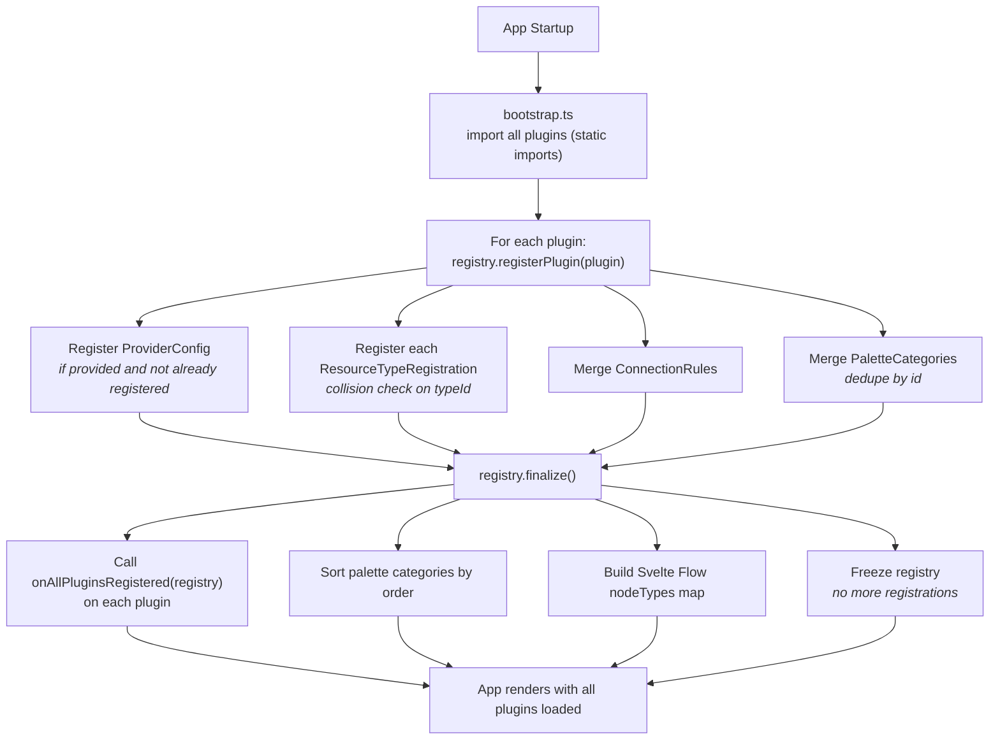

# Plugin System

## Overview

The application uses a plugin architecture where the **core** provides the diagramming engine, property sidebar framework, HCL generation pipeline, and Terraform execution, while **plugins** provide the actual cloud resource definitions.

A plugin is an npm package that implements the `InfraPlugin` interface. It registers resource types (schemas, node components, HCL generators, icons) and connection rules with the core's `PluginRegistry`.

## The Plugin Contract

Every plugin must default-export an object implementing `InfraPlugin`:

```typescript
// packages/plugin-networking/src/index.ts
import type { InfraPlugin } from '@terrastudio/types';

const plugin: InfraPlugin = {
  id: '@terrastudio/plugin-azure-networking',
  name: 'Azure Networking',
  version: '0.1.0',
  providerId: 'azurerm',

  // Only set by the "primary" plugin for a provider
  providerConfig: azurermProviderConfig,

  // Map of ResourceTypeId -> ResourceTypeRegistration
  resourceTypes: new Map([
    ['azurerm/networking/virtual_network', vnetRegistration],
    ['azurerm/networking/subnet', subnetRegistration],
    ['azurerm/networking/nsg', nsgRegistration],
  ]),

  // Edge validation rules
  connectionRules: [...],

  // Sidebar palette categories
  paletteCategories: [
    { id: 'networking', label: 'Networking', order: 10 },
  ],

  // Optional: called after ALL plugins are loaded
  onAllPluginsRegistered(registry) { ... },
};

export default plugin;
```

## What a Plugin Provides

### 1. Resource Type Registrations

Each resource type bundles everything the core needs:

```typescript
interface ResourceTypeRegistration {
  schema: ResourceSchema;                // Properties, handles, metadata
  nodeComponent: ResourceNodeComponent;  // Svelte component for the canvas
  propertyEditor?: PropertyEditorComponent; // Optional custom sidebar (default: auto-generated)
  hclGenerator: HclGenerator;            // Produces Terraform HCL blocks
  icon: IconDefinition;                  // SVG or Svelte component
}
```

### 2. Provider Configuration

One plugin per provider should define the `ProviderConfig`. This generates the `provider "azurerm" { ... }` and `required_providers` blocks in the Terraform output.

```typescript
const azurermProviderConfig: ProviderConfig = {
  id: 'azurerm',
  displayName: 'Azure Resource Manager',
  source: 'hashicorp/azurerm',
  version: '~> 4.0',
  configSchema: [
    { key: 'subscription_id', label: 'Subscription ID', type: 'string', required: true },
  ],
  defaultConfig: { subscription_id: '' },
  generateProviderBlock(config) { ... },
  generateRequiredProvider() { ... },
};
```

Multiple plugins can share a provider (e.g., `plugin-networking` and `plugin-compute` both use `azurerm`). Only the first one to register the provider config wins.

### 3. Connection Rules

Plugins define which resource types can connect via edges:

```typescript
const rules: ConnectionRule[] = [
  {
    sourceType: 'azurerm/networking/virtual_network',
    sourceHandle: 'subnet-out',
    targetType: 'azurerm/networking/subnet',
    targetHandle: 'vnet-in',
    createsReference: { side: 'target', propertyKey: 'virtual_network_name' },
    label: 'Contains subnet',
  },
];
```

Connection rules can reference resource types from **other plugins** (e.g., a compute plugin's VM connecting to a networking plugin's subnet). The `onAllPluginsRegistered` hook lets plugins define cross-plugin connections after all types are available.

### 4. Palette Categories

Each plugin declares the categories its resources belong to. The palette displays these as collapsible groups:

```typescript
paletteCategories: [
  { id: 'networking', label: 'Networking', order: 10, icon: { type: 'svg', svg: '...' } },
]
```

Categories with the same `id` from different plugins are deduplicated.

## Registration Flow



### Why Static Imports?

Plugins are imported in `bootstrap.ts` with static `import` statements:

```typescript
import networkingPlugin from '@terrastudio/plugin-azure-networking';
import computePlugin from '@terrastudio/plugin-azure-compute';

const plugins = [networkingPlugin, computePlugin];
```

This is intentional. Vite must compile Svelte components at build time. Dynamic `import()` of Svelte files requires complex SSR-style handling. Static imports enable full tree-shaking and type safety. The tradeoff: adding a plugin requires editing one line in `bootstrap.ts`.

## Plugin Registry

The `PluginRegistry` is a singleton in `@terrastudio/core` that serves as the central lookup for everything plugins provide:

```typescript
class PluginRegistry {
  registerPlugin(plugin: InfraPlugin): void;
  finalize(): void;

  // Queries used by the core
  getNodeComponent(typeId: ResourceTypeId): ResourceNodeComponent;
  getPropertyEditor(typeId: ResourceTypeId): PropertyEditorComponent | undefined;
  getHclGenerator(typeId: ResourceTypeId): HclGenerator;
  getResourceSchema(typeId: ResourceTypeId): ResourceSchema;
  getIcon(typeId: ResourceTypeId): IconDefinition;
  getProviderConfig(providerId: ProviderId): ProviderConfig;
  getConnectionRules(): ConnectionRule[];
  getPaletteCategories(): PaletteCategory[];
  getResourceTypesForCategory(category: string): ResourceTypeRegistration[];
  buildNodeTypesMap(): Record<string, Component<any>>;  // For Svelte Flow
}
```

A Svelte 5 reactive wrapper (`plugin-registry.svelte.ts`) exposes the registry through `$state` so that when `finalize()` is called, components reactively pick up the loaded node types.

## How to Create a New Plugin

### Step 1: Create the package

```
packages/plugin-mycloud/
  package.json        # peer deps: @terrastudio/types, @xyflow/svelte, svelte
  src/
    index.ts          # Default export implementing InfraPlugin
    plugin.ts         # Plugin manifest
    resources/
      my-resource/
        schema.ts         # ResourceSchema
        node.svelte       # Svelte Flow node component
        hcl-generator.ts  # HclGenerator implementation
        icon.ts           # IconDefinition
        index.ts          # ResourceTypeRegistration bundle
```

### Step 2: Define a resource schema

See [type-interfaces.md](type-interfaces.md) for the full `ResourceSchema` interface.

### Step 3: Build the node component

A Svelte Flow custom node that receives `ResourceNodeData` via props:

```svelte
<script lang="ts">
  import { Handle, Position, type NodeProps } from '@xyflow/svelte';
  let { data, selected }: NodeProps = $props();
</script>

<div class="my-node" class:selected>
  <div class="header">{data.label}</div>
  <Handle type="source" position={Position.Bottom} id="out" />
</div>
```

### Step 4: Implement the HCL generator

```typescript
const generator: HclGenerator = {
  typeId: 'mycloud/category/resource_type',
  generate(resource, context) {
    return [{
      blockType: 'resource',
      terraformType: 'mycloud_resource',
      name: resource.terraformName,
      content: `resource "mycloud_resource" "${resource.terraformName}" {\n  name = "${resource.properties.name}"\n}`,
    }];
  },
};
```

### Step 5: Register in bootstrap.ts

```typescript
import myCloudPlugin from '@terrastudio/plugin-mycloud';
const plugins = [...existingPlugins, myCloudPlugin];
```

## How to Add a Resource to an Existing Plugin

1. Create a new directory under `resources/` in the plugin
2. Define `schema.ts`, `node.svelte`, `hcl-generator.ts`, `icon.ts`
3. Create `index.ts` that bundles them into a `ResourceTypeRegistration`
4. Add the registration to the plugin's `resourceTypes` map in `index.ts`
5. Add any new connection rules to `connections/rules.ts`

No core changes needed. The registry picks up the new type automatically.

## Multi-Provider Support

The same app can host Azure, AWS, and GCP plugins simultaneously:

- Each plugin declares its `providerId` (e.g., `'azurerm'`, `'aws'`, `'google'`)
- The palette shows categories from all providers
- The HCL pipeline generates `required_providers` and `provider` blocks for all active providers
- Connection rules are provider-scoped by default (a VNet can't connect to an S3 bucket unless a plugin explicitly defines that rule)

To add AWS support: create `@terrastudio/plugin-aws-vpc`, `@terrastudio/plugin-aws-compute`, etc. that use `providerId: 'aws'` and define their own `ProviderConfig`. Zero core changes.

## Related Docs

- [Type Interfaces](type-interfaces.md) - Full TypeScript interface definitions
- [HCL Generation](hcl-generation.md) - How the generation pipeline works
- [Architecture](architecture.md) - High-level system overview
