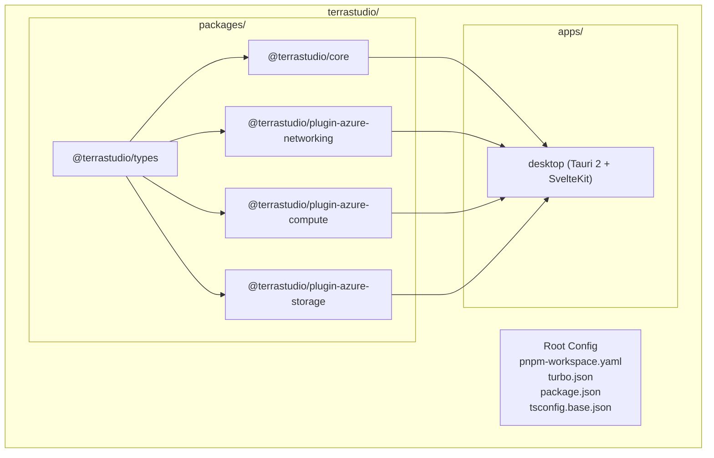
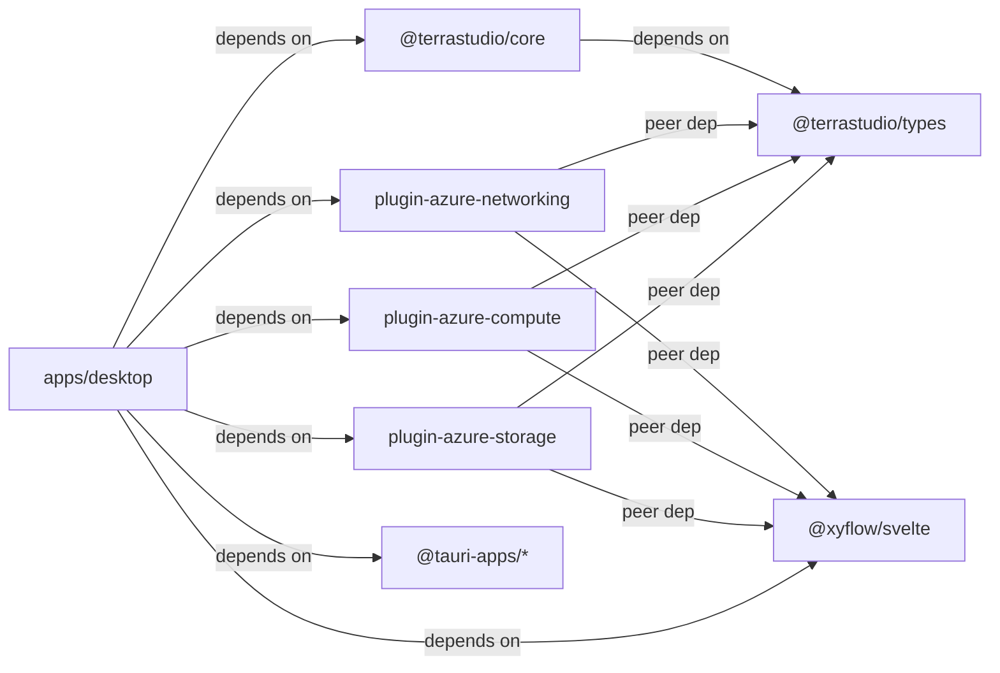

# Project Structure

## Monorepo Layout

TerraStudio uses a pnpm workspaces monorepo with Turborepo for build orchestration.



## Root Files

```
terrastudio/
├── pnpm-workspace.yaml          # Workspace definition
├── turbo.json                   # Turborepo pipeline config
├── package.json                 # Root scripts, shared devDependencies
├── tsconfig.base.json           # Shared TypeScript config
├── CLAUDE.md                    # Project context for Claude Code
└── docs/                        # Architecture documentation
    ├── architecture.md
    ├── plugin-system.md
    ├── type-interfaces.md
    ├── hcl-generation.md
    ├── project-structure.md     # (this file)
    └── implementation-roadmap.md
```

## packages/types/

Shared TypeScript interfaces. Zero runtime dependencies. This is the contract between core and plugins.

```
packages/types/
├── package.json                 # @terrastudio/types
├── tsconfig.json
└── src/
    ├── index.ts                 # Barrel export
    ├── provider.ts              # ProviderId, ProviderConfig
    ├── resource-schema.ts       # ResourceSchema, PropertySchema, HandleDefinition
    ├── hcl.ts                   # HclGenerator, HclBlock, HclGenerationContext, ResourceInstance
    ├── node.ts                  # ResourceNodeData, ResourceNodeComponent, PropertyEditorComponent
    ├── connection.ts            # ConnectionRule
    ├── plugin.ts                # InfraPlugin, ResourceTypeRegistration, PaletteCategory
    └── validation.ts            # ValidationError, PropertyValidation
```

## packages/core/

Diagram engine, property sidebar framework, HCL pipeline, Terraform execution bridge. Provider-agnostic.

```
packages/core/
├── package.json                 # @terrastudio/core
├── tsconfig.json
└── src/
    ├── index.ts                 # Barrel export
    └── lib/
        ├── registry/
        │   ├── plugin-registry.ts           # PluginRegistry class (singleton)
        │   ├── plugin-registry.svelte.ts    # Svelte 5 reactive wrapper ($state)
        │   └── node-type-resolver.ts        # Resolves typeId -> Svelte component
        │
        ├── hcl/
        │   ├── pipeline.ts                  # HCL generation orchestrator
        │   ├── block-builder.ts             # Assembles HCL blocks into file contents
        │   ├── dependency-graph.ts          # Topological sort of resource blocks
        │   ├── variable-collector.ts        # Collects variables across generators
        │   ├── output-collector.ts          # Collects outputs
        │   └── provider-config-builder.ts   # Builds provider + required_providers blocks
        │
        ├── terraform/
        │   ├── executor.ts                  # Invokes terraform CLI via Tauri IPC
        │   ├── plan-parser.ts               # Parses terraform plan -json output
        │   └── state-manager.ts             # Parses terraform show -json, maps to nodes
        │
        ├── diagram/
        │   ├── canvas.svelte.ts             # SvelteFlow wrapper utilities
        │   ├── node-factory.ts              # Creates node instances from schemas
        │   ├── edge-rules.ts                # Validates edges against ConnectionRules
        │   └── layout-engine.ts             # Auto-layout algorithms
        │
        ├── sidebar/
        │   ├── property-sidebar.svelte      # Sidebar shell (shows on node select)
        │   └── property-renderer.svelte     # Generic schema-driven form renderer
        │
        ├── deployment/
        │   └── status-store.svelte.ts       # Reactive deployment status per node
        │
        ├── validation/
        │   ├── diagram-validator.ts         # Validates entire diagram pre-generation
        │   └── resource-validator.ts        # Validates individual resource configs
        │
        └── export/
            ├── image-exporter.ts            # PNG/SVG export from diagram
            ├── doc-generator.ts             # Walks diagram, produces structured doc data
            └── doc-templates/               # Markdown templates for doc generation
                └── default.ts               # Default architecture doc template
```

## packages/plugin-azure-networking/

Example plugin. Every plugin follows this pattern.

```
packages/plugin-azure-networking/
├── package.json                 # @terrastudio/plugin-azure-networking
├── tsconfig.json
└── src/
    ├── index.ts                 # Default export: InfraPlugin
    ├── provider-config.ts       # azurerm ProviderConfig (only in one Azure plugin)
    │
    ├── resources/
    │   ├── vnet/
    │   │   ├── index.ts             # ResourceTypeRegistration bundle
    │   │   ├── schema.ts            # ResourceSchema
    │   │   ├── node.svelte          # Custom Svelte Flow node component
    │   │   ├── hcl-generator.ts     # HclGenerator implementation
    │   │   └── icon.ts              # IconDefinition (inline SVG)
    │   │
    │   ├── subnet/
    │   │   ├── index.ts
    │   │   ├── schema.ts
    │   │   ├── node.svelte
    │   │   ├── hcl-generator.ts
    │   │   └── icon.ts
    │   │
    │   └── nsg/
    │       ├── index.ts
    │       ├── schema.ts
    │       ├── node.svelte
    │       ├── hcl-generator.ts
    │       └── icon.ts
    │
    └── connections/
        └── rules.ts                 # ConnectionRule[] for networking resources
```

### Adding a new resource to this plugin

1. Create `resources/public-ip/` with `index.ts`, `schema.ts`, `node.svelte`, `hcl-generator.ts`, `icon.ts`
2. Import and add to the `resourceTypes` map in `src/index.ts`
3. Add connection rules in `connections/rules.ts`

## apps/desktop/

The Tauri 2 desktop application. Wires core + plugins together.

```
apps/desktop/
├── package.json
├── svelte.config.js
├── vite.config.ts
├── tsconfig.json
├── tailwind.config.ts
│
├── src-tauri/                       # Rust backend
│   ├── Cargo.toml
│   ├── tauri.conf.json
│   ├── capabilities/
│   │   └── default.json             # Shell, FS, dialog permissions
│   └── src/
│       ├── main.rs                  # Tauri entry point
│       ├── lib.rs                   # Plugin/command registration
│       ├── commands.rs              # Tauri #[command] IPC handlers
│       └── terraform/
│           ├── mod.rs
│           ├── runner.rs            # Spawn terraform CLI, stream stdout/stderr
│           ├── parser.rs            # Parse terraform show -json
│           └── state.rs             # Track deployment state per resource
│
├── src/                             # Svelte frontend
│   ├── app.html
│   ├── app.css                      # Tailwind imports
│   │
│   ├── lib/
│   │   ├── bootstrap.ts             # Plugin imports + registry initialization
│   │   │
│   │   ├── stores/
│   │   │   ├── diagram.svelte.ts    # Nodes + edges ($state runes)
│   │   │   ├── project.svelte.ts    # Project metadata, file paths
│   │   │   └── ui.svelte.ts         # Panel visibility, layout state
│   │   │
│   │   └── components/
│   │       ├── Canvas.svelte        # SvelteFlow wrapper + drop handling
│   │       ├── CanvasControls.svelte
│   │       ├── Toolbar.svelte       # Top bar: file, edit, actions
│   │       ├── ResourcePalette.svelte
│   │       ├── PaletteCategory.svelte
│   │       ├── PaletteItem.svelte
│   │       ├── Sidebar.svelte       # Right sidebar wrapper
│   │       ├── TerraformPanel.svelte
│   │       ├── OutputConsole.svelte
│   │       ├── VarsInputForm.svelte
│   │       └── DeploymentBadge.svelte
│   │
│   └── routes/
│       ├── +layout.svelte
│       └── +page.svelte             # Main (and only) SPA page
│
└── static/
    └── azure-icons/                 # Microsoft Azure SVG icons (optional fallback)
        ├── compute/
        ├── network/
        ├── storage/
        └── core/
```

## Package Dependencies



## Key Config Files

### pnpm-workspace.yaml

```yaml
packages:
  - 'packages/*'
  - 'apps/*'
```

### turbo.json

```json
{
  "$schema": "https://turbo.build/schema.json",
  "tasks": {
    "build": {
      "dependsOn": ["^build"],
      "outputs": ["dist/**"]
    },
    "dev": {
      "cache": false,
      "persistent": true
    },
    "typecheck": {
      "dependsOn": ["^build"]
    },
    "lint": {}
  }
}
```

### Plugin package.json exports

```json
{
  "exports": {
    ".": {
      "svelte": "./src/index.ts",
      "types": "./dist/index.d.ts",
      "import": "./dist/index.js"
    }
  }
}
```

The `svelte` condition lets Vite resolve raw `.svelte` source during development. The `import` condition is for production builds.

## Related Docs

- [Architecture](architecture.md) - High-level system overview
- [Plugin System](plugin-system.md) - Plugin package structure in detail
- [Implementation Roadmap](implementation-roadmap.md) - Build order
