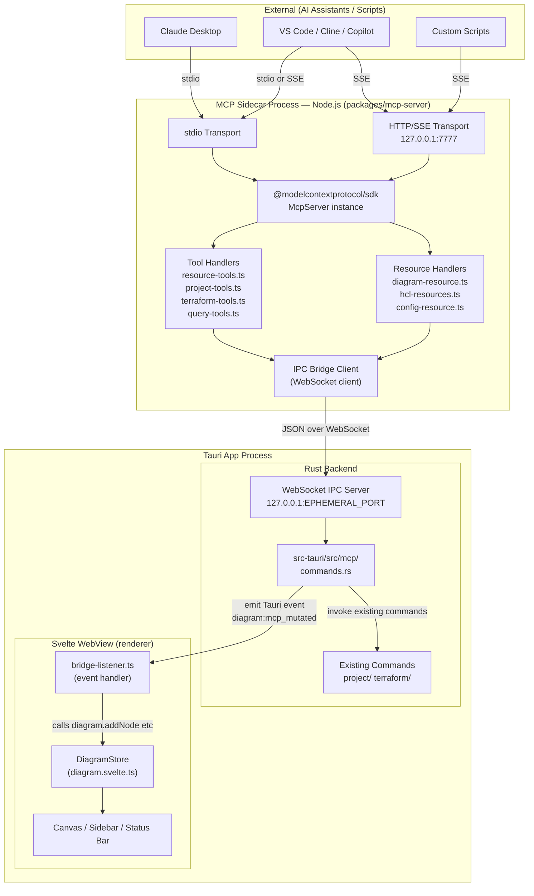
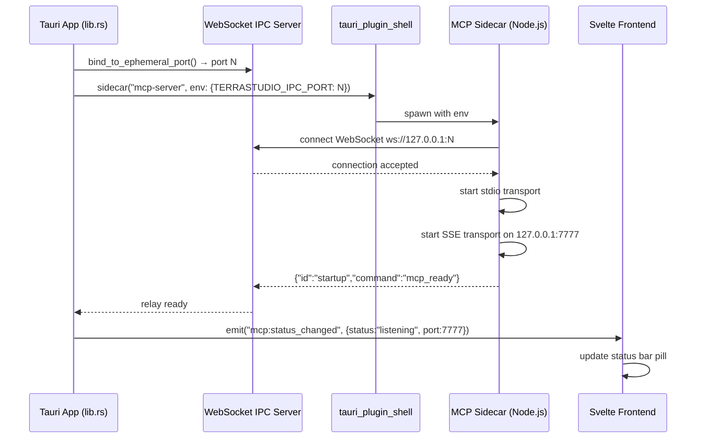

# MCP Server Specification

**Spec ID**: SPEC-001
**Status**: Draft
**Created**: 2026-02-27
**PRD Source**: `docs/prd-phase-24-mcp-server.md` (v1.0, 2026-02-27)
**Author**: AI Spec Writer

---

## 1. Overview

This specification covers the design and implementation of the TerraStudio MCP (Model Context
Protocol) Server — a Tauri sidecar process that exposes TerraStudio's diagram and Terraform
capabilities as a structured, AI-accessible API. The sidecar implements MCP specification
version 2025-03-26 using the `@modelcontextprotocol/sdk` TypeScript SDK and ships bundled with
the TerraStudio desktop installer at version 0.6.0.

The MCP server enables AI coding assistants (Claude Desktop, VS Code with Cline or GitHub Copilot
Chat, Cursor) to read the current diagram as context, programmatically create and connect
infrastructure resources on the canvas, trigger Terraform operations with streaming output, and
query cost estimates — all without human drag-and-drop interaction. It also exposes an HTTP/SSE
transport for custom automation scripts.

The architecture uses a three-layer approach: the MCP SDK handles protocol concerns in the Node.js
sidecar; a localhost WebSocket IPC bridge carries JSON messages between the sidecar and the Tauri
Rust backend; and a new Svelte `bridge-listener.ts` module applies diagram mutations to the
`diagram.svelte.ts` reactive state store, preserving the existing unidirectional data flow and
Svelte 5 reactivity model. MCP mutations are intentionally excluded from the undo/redo stack (per
stakeholder decision).

---

## 2. Goals & Non-Goals

### Goals

- Expose all 17 MCP tools defined in the PRD across four categories: resource tools, project tools,
  Terraform tools, and query tools.
- Expose three MCP resources (`terrastudio://diagram/current`, `terrastudio://hcl/{filename}`,
  `terrastudio://project/config`) for passive context loading by AI assistants.
- Support both stdio transport (Claude Desktop / VS Code) and HTTP/SSE transport (scripts),
  with the SSE endpoint bound exclusively to `127.0.0.1`.
- Bundle the sidecar in the TerraStudio installer for Windows x64, macOS x64, macOS arm64, and
  Linux x64 with a bundle-size increase under 15 MB.
- Maintain full backward compatibility with existing `.terrastudio.json` project files; no file
  format changes are introduced.
- Provide an `mcp.json` manifest and in-app status indicator so users can connect AI assistants
  without manual configuration.
- Guard destructive Terraform operations (`apply`, `destroy`) behind a mandatory `confirmed: true`
  parameter.
- Achieve read-only tool latency under 200 ms and write tool latency under 500 ms for diagrams up
  to 100 nodes.

### Non-Goals

- Standalone / headless operation: the MCP server requires the TerraStudio desktop app to be
  running. No server-only deployment mode.
- Undo/redo integration: MCP mutations are not pushed to the `DiagramStore` undo stack (per
  stakeholder decision). The user cannot Ctrl+Z an AI-driven change in v1.
- Remote (non-localhost) access: no TLS, no API key authentication, no `0.0.0.0` binding (unless
  user explicitly opts in with a security warning).
- Plugin-extensible MCP tools: plugins cannot register additional tools in v1.
- Diagram image/PNG export via MCP.
- Plugin management (install/enable/disable) via MCP.
- Interactive Terraform variable prompting; `run_terraform` uses variable values from project
  config only.
- Multi-instance support (two simultaneous TerraStudio windows with separate MCP servers).
- MCP prompts primitive (`prompts/list`, `prompts/get`) — deferred to v2.

---

## 3. Background & Context

### Current State

TerraStudio 0.5.2 is a fully GUI-driven application. The data flow is:

```
Palette drag → DiagramStore ($state) → Sidebar (edit) → HCL Generator → Terraform CLI → Status
```

There is no programmatic API. The Rust backend exposes ~22 Tauri commands (see `lib.rs`) all
invoked via `invoke()` from the Svelte WebView — there is no external entry point.

### Why Now

Phases 1–21 established the complete feature set (resources, HCL generation, Terraform execution,
cost estimation, export, naming conventions). Phase 24 adds a programmatic API surface on top of
a stable feature set, making it the natural integration point before GA (0.6.0).

### MCP Primer

MCP defines:
- **Tools**: Callable functions the LLM invokes with structured arguments (like function calling).
- **Resources**: Read-only documents the LLM loads as context (like RAG documents).
- **Transports**: stdio (spawn as child process) or HTTP+SSE (connect to running server).

### Key Architectural Constraint

The Svelte diagram state lives in the WebView process (renderer thread). The MCP sidecar is a
separate OS process. All diagram mutations from the MCP sidecar must route through:

```
MCP sidecar → WebSocket IPC bridge → Rust backend → Tauri event → Svelte WebView → DiagramStore
```

The sidecar never directly reads or writes diagram state or the filesystem. All file I/O goes
through the IPC bridge.

---

## 4. Detailed Design

### 4.1 Architecture



#### Startup Sequence



### 4.2 Data Models / Interfaces

#### IPC Bridge Wire Format

```typescript
// packages/mcp-server/src/bridge.ts

/** Sent from sidecar to Tauri over WebSocket */
export interface BridgeRequest {
  id: string;        // UUID v4 for response correlation
  command: string;   // e.g., "mcp_add_resource"
  params: unknown;   // JSON payload
}

/** Sent from Tauri to sidecar in response to a BridgeRequest */
export interface BridgeResponse {
  id: string;            // correlates to BridgeRequest.id
  result?: unknown;      // present on success
  error?: {
    code: string;        // e.g., "NOT_FOUND", "VALIDATION_ERROR", "BRIDGE_DISCONNECTED"
    message: string;     // human-readable description
    details?: unknown;   // optional structured detail (e.g., suggestions array)
  };
}

/** Sent from Tauri to sidecar without a corresponding request (push events) */
export interface BridgePush {
  event: string;   // e.g., "diagram:changed", "terraform:stdout", "terraform:stderr"
  data: unknown;
}

export type BridgeMessage = BridgeResponse | BridgePush;
```

#### MCP Tool Schemas (Zod)

```typescript
// packages/mcp-server/src/schemas.ts
import { z } from 'zod';

export const PositionSchema = z.object({
  x: z.number(),
  y: z.number(),
});

export const AddResourceInputSchema = z.object({
  typeId:     z.string().describe('Registered ResourceTypeId, e.g. "azurerm/networking/virtual_network"'),
  properties: z.record(z.unknown()).optional().describe('Partial properties; schema defaults applied for omitted keys'),
  position:   PositionSchema.optional().describe('Canvas position; auto-placed if omitted'),
  parentId:   z.string().optional().describe('instanceId of a container node (Resource Group, VNet, etc.)'),
});

export const UpdateResourceInputSchema = z.object({
  instanceId:  z.string().describe('UUID of the resource node to update'),
  properties:  z.record(z.unknown()).describe('Partial properties; only provided keys are updated'),
});

export const RemoveResourceInputSchema = z.object({
  instanceId: z.string().describe('UUID of the resource node to remove; child nodes are also removed'),
});

export const ConnectResourcesInputSchema = z.object({
  sourceInstanceId: z.string(),
  sourceHandle:     z.string().describe('Handle ID on the source node, e.g. "nsg-out"'),
  targetInstanceId: z.string(),
  targetHandle:     z.string().describe('Handle ID on the target node, e.g. "nsg-in"'),
});

export const DisconnectResourcesInputSchema = z.object({
  edgeId: z.string().describe('ID of the edge to remove'),
});

export const OpenProjectInputSchema = z.object({
  projectPath: z.string().describe('Absolute path to a TerraStudio project directory containing terrastudio.json'),
});

export const NewProjectInputSchema = z.object({
  name:          z.string().min(1),
  directoryPath: z.string().describe('Absolute path to the parent directory where the project folder will be created'),
});

export const SetProjectConfigInputSchema = z.object({
  config: z.record(z.unknown()).describe('Partial ProjectConfig to merge into the current project config'),
});

export const RunTerraformInputSchema = z.object({
  command:   z.enum(['init', 'validate', 'plan', 'apply', 'destroy']),
  confirmed: z.boolean().optional().describe('Must be true for "apply" and "destroy" to execute'),
});
```

#### MCP Tool Output Types

```typescript
// packages/mcp-server/src/types.ts

export interface ResourceEntry {
  instanceId:       string;
  typeId:           string;
  label:            string;
  terraformName:    string;
  properties:       Record<string, unknown>;
  references:       Record<string, string>;
  parentId?:        string;
  deploymentStatus: 'pending' | 'creating' | 'updating' | 'created' | 'failed' | 'destroyed';
  position:         { x: number; y: number };
}

export interface AddResourceOutput {
  instanceId:    string;
  terraformName: string;
  position:      { x: number; y: number };
}

export interface ConnectResourcesOutput {
  edgeId: string;
}

export interface ResourceTypeInfo {
  typeId:       string;
  displayName:  string;
  category:     string;
  provider:     string;
  description:  string;
  isContainer:  boolean;
  canBeChildOf: string[];
  handles: Array<{
    id:       string;
    type:     'source' | 'target';
    label:    string;
    position: 'top' | 'bottom' | 'left' | 'right';
  }>;
  properties: Array<{
    key:           string;
    label:         string;
    type:          string;
    required:      boolean;
    description?:  string;
    defaultValue?: unknown;
  }>;
}

export interface RunTerraformOutput {
  exitCode:        number;
  success:         boolean;
  diagnostics:     Array<{ severity: string; summary: string; detail: string }>;
  resourceChanges: Array<{ address: string; action: string; success: boolean; error?: string }>;
}

export interface CostEstimateEntry {
  monthly:   number;
  currency:  string;
  breakdown: Record<string, unknown>;
}

/** Sensitive keys redacted from ProjectConfig before returning via get_project_config */
export const REDACTED_CONFIG_KEYS = ['subscription_id', 'tenant_id', 'client_id', 'client_secret'] as const;
```

#### Rust IPC Bridge Types

```rust
// apps/desktop/src-tauri/src/mcp/types.rs

use serde::{Deserialize, Serialize};

#[derive(Debug, Deserialize)]
pub struct BridgeRequest {
    pub id: String,
    pub command: String,
    pub params: serde_json::Value,
}

#[derive(Debug, Serialize)]
pub struct BridgeResponse {
    pub id: String,
    #[serde(skip_serializing_if = "Option::is_none")]
    pub result: Option<serde_json::Value>,
    #[serde(skip_serializing_if = "Option::is_none")]
    pub error: Option<BridgeError>,
}

#[derive(Debug, Serialize)]
pub struct BridgeError {
    pub code: String,
    pub message: String,
    #[serde(skip_serializing_if = "Option::is_none")]
    pub details: Option<serde_json::Value>,
}

#[derive(Debug, Serialize)]
pub struct BridgePush {
    pub event: String,
    pub data: serde_json::Value,
}

#[derive(Debug, Deserialize)]
pub struct McpAddResourceParams {
    pub type_id: String,
    pub properties: Option<serde_json::Value>,
    pub position: Option<McpPosition>,
    pub parent_id: Option<String>,
}

#[derive(Debug, Deserialize, Serialize)]
pub struct McpPosition {
    pub x: f64,
    pub y: f64,
}

#[derive(Debug, Deserialize)]
pub struct McpUpdateResourceParams {
    pub instance_id: String,
    pub properties: serde_json::Value,
}

#[derive(Debug, Deserialize)]
pub struct McpConnectResourcesParams {
    pub source_id: String,
    pub source_handle: String,
    pub target_id: String,
    pub target_handle: String,
}
```

### 4.3 Component Breakdown

#### `packages/mcp-server/` (New Package)

| File | Responsibility |
|---|---|
| `package.json` | `@terrastudio/mcp-server`, private, scripts: `build` (esbuild), `start` |
| `tsconfig.json` | Extends root tsconfig; targets Node 20; `module: "commonjs"` for esbuild compat |
| `src/index.ts` | Entry point: reads `TERRASTUDIO_IPC_PORT` env, creates `BridgeClient`, instantiates `McpServer`, starts stdio + SSE transports |
| `src/server.ts` | `McpServer` instance creation; registers all tools and resources; exports `startServer()` |
| `src/bridge.ts` | `BridgeClient` class: WebSocket client, request queue, pending promise map, reconnect logic with exponential backoff |
| `src/schemas.ts` | All Zod schemas for tool inputs (used for MCP `inputSchema` and runtime validation) |
| `src/types.ts` | TypeScript output types (not Zod — plain interfaces for type checking) |
| `src/tools/resource-tools.ts` | `list_resources`, `add_resource`, `update_resource`, `remove_resource`, `connect_resources`, `disconnect_resources` |
| `src/tools/project-tools.ts` | `open_project`, `save_project`, `new_project`, `get_project_config`, `set_project_config` |
| `src/tools/terraform-tools.ts` | `generate_hcl`, `run_terraform` (with streaming + confirmation guard), `get_deployment_status` |
| `src/tools/query-tools.ts` | `get_diagram`, `get_available_resource_types`, `estimate_costs` |
| `src/resources/diagram-resource.ts` | MCP resource `terrastudio://diagram/current` |
| `src/resources/hcl-resources.ts` | MCP resource `terrastudio://hcl/{filename}` (dynamic, one per generated file) |
| `src/resources/config-resource.ts` | MCP resource `terrastudio://project/config` |

#### `apps/desktop/src-tauri/src/mcp/` (New Rust Module)

| File | Responsibility |
|---|---|
| `mod.rs` | Module declaration; exports `IpcBridgeServer` |
| `server.rs` | `IpcBridgeServer`: binds WebSocket, accepts the single sidecar connection, dispatches commands to `commands.rs`, forwards Tauri events to sidecar as `BridgePush` |
| `commands.rs` | Handlers for each bridge command: validates params, emits Tauri events for mutations, calls existing Rust command functions for read operations |
| `types.rs` | `BridgeRequest`, `BridgeResponse`, `BridgePush`, `McpAddResourceParams`, etc. (see section 4.2) |
| `manifest.rs` | `generate_mcp_json()`: writes `mcp.json` to app config directory on first launch |

#### `apps/desktop/src/lib/mcp/` (New Frontend Module)

| File | Responsibility |
|---|---|
| `bridge-listener.ts` | Registers Tauri event listener for `diagram:mcp_mutated`; dispatches to `diagram.svelte.ts` store methods; handles mutation sequencing |
| `mcp-status.svelte.ts` | Reactive store for MCP server status (`'starting' \| 'listening' \| 'error' \| 'disabled'`), port, error message |

#### Modified Files

| File | Change |
|---|---|
| `apps/desktop/src-tauri/src/lib.rs` | Add `mod mcp;`; start `IpcBridgeServer` in `setup()` hook; launch sidecar via `tauri_plugin_shell`; register new Tauri commands |
| `apps/desktop/src-tauri/Cargo.toml` | Add `tauri-plugin-shell`, `tokio-tungstenite`, `uuid` dependencies |
| `apps/desktop/src-tauri/tauri.conf.json` | Add `bundle.externalBin` for sidecar; add `shell` plugin permissions |
| `apps/desktop/src/lib/bootstrap.ts` | Call `bridgeListener.initialize()` after app startup |
| `apps/desktop/src/lib/components/StatusBar.svelte` | Add MCP status pill component |
| `apps/desktop/src/routes/settings/+page.svelte` | Add MCP Server tab |
| `pnpm-workspace.yaml` | Add `packages/mcp-server` |
| `turbo.json` | Add `mcp-server` build pipeline task |

### 4.4 API / Contract Changes

#### New Rust IPC Bridge Commands (dispatched over WebSocket, not Tauri `invoke`)

These are internal bridge commands handled by `apps/desktop/src-tauri/src/mcp/commands.rs`. They
are NOT Tauri commands and cannot be called from the WebView via `invoke()`.

| Bridge Command | Params (JSON) | Response (JSON) |
|---|---|---|
| `mcp_get_diagram_snapshot` | `{}` | `{ nodes: Node[], edges: Edge[] }` |
| `mcp_get_resource_types` | `{}` | `ResourceTypeInfo[]` |
| `mcp_get_deployment_status` | `{}` | `Record<instanceId, DeploymentStatus>` |
| `mcp_get_generated_hcl` | `{}` | `Record<filename, content>` |
| `mcp_get_project_config` | `{}` | `ProjectConfig` (sensitive keys redacted) |
| `mcp_add_resource` | `McpAddResourceParams` | `{ instanceId, terraformName, position }` |
| `mcp_update_resource` | `McpUpdateResourceParams` | `{}` |
| `mcp_remove_resource` | `{ instanceId }` | `{}` |
| `mcp_connect_resources` | `McpConnectResourcesParams` | `{ edgeId }` |
| `mcp_disconnect_resources` | `{ edgeId }` | `{}` |
| `mcp_open_project` | `{ projectPath }` | `ProjectData` |
| `mcp_save_project` | `{}` | `{}` |
| `mcp_new_project` | `{ name, directoryPath }` | `ProjectData` |
| `mcp_set_project_config` | `{ config }` | `{}` |
| `mcp_estimate_costs` | `{}` | `CostEstimateMap` |

#### New Tauri Events

| Event Name | Direction | Payload |
|---|---|---|
| `diagram:mcp_mutated` | Rust → WebView | `McpMutation` (see below) |
| `mcp:status_changed` | Rust → WebView | `{ status: 'listening' \| 'error' \| 'starting', port?: number, error?: string }` |
| `terraform:stdout` | Rust → sidecar (via bridge push) | `{ line: string }` |
| `terraform:stderr` | Rust → sidecar (via bridge push) | `{ line: string }` |
| `terraform:done` | Rust → sidecar (via bridge push) | `RunTerraformOutput` |
| `diagram:changed` | Rust → sidecar (via bridge push) | `{}` (triggers resource subscription notifications) |

```typescript
// McpMutation union type (TypeScript, for bridge-listener.ts)
type McpMutation =
  | { op: 'add_node';         payload: DiagramNode }
  | { op: 'update_node_data'; instanceId: string; data: Partial<ResourceNodeData> }
  | { op: 'remove_node';      instanceId: string }
  | { op: 'add_edge';         payload: DiagramEdge }
  | { op: 'remove_edge';      edgeId: string };
```

---

## 5. Implementation Plan

### 5.1 Phases

#### Phase 24a — Core Infrastructure (target: 2026-03-07 to 2026-03-10)

**Goal**: Read-only MCP server working with Claude Desktop via stdio.

Deliverables:
1. `packages/mcp-server/` scaffolded with `package.json`, `tsconfig.json`, esbuild config.
2. `BridgeClient` in `src/bridge.ts` with connection, request/response correlation, exponential
   backoff reconnect (200 ms initial, 5 s max, 5 retries), and `BRIDGE_DISCONNECTED` error on
   in-flight requests.
3. Rust `IpcBridgeServer` in `src-tauri/src/mcp/server.rs`: binds ephemeral WebSocket port on
   `127.0.0.1`, stores port in `AppState`, sets `TERRASTUDIO_IPC_PORT` env before launching
   sidecar.
4. Bridge commands: `mcp_get_diagram_snapshot`, `mcp_get_resource_types`.
5. MCP tools: `get_diagram`, `list_resources`, `get_available_resource_types`.
6. MCP resource: `terrastudio://diagram/current`.
7. stdio transport only; SSE disabled in 24a.
8. Sidecar declared in `tauri.conf.json` `bundle.externalBin`; launched from `lib.rs` `setup()`.
9. `manifest.rs`: writes `mcp.json` to OS config dir on first launch.
10. Turborepo build pipeline: `pnpm build` in `packages/mcp-server` produces bundled JS; `cargo
    tauri build` copies binary to `externalBin`.

Milestone: Claude Desktop can be pointed at the `mcp.json` manifest and `get_diagram` returns
the current canvas state.

#### Phase 24b — Write Tools + Project Tools (target: 2026-03-10 to 2026-03-12)

**Goal**: AI assistant can build a diagram from scratch.

Deliverables:
1. Rust bridge command handlers: `mcp_add_resource`, `mcp_update_resource`, `mcp_remove_resource`,
   `mcp_connect_resources`, `mcp_disconnect_resources`.
2. Each mutation handler emits `diagram:mcp_mutated` Tauri event with the appropriate `McpMutation`
   payload. Write operations are serialized through a single-writer async mutex in `server.rs` to
   prevent race conditions.
3. `apps/desktop/src/lib/mcp/bridge-listener.ts`: registers `diagram:mcp_mutated` listener;
   dispatches to `diagram.addNode()`, `diagram.updateNodeData()`, `diagram.removeNode()`,
   `diagram.addEdge()`, `diagram.removeEdge()` without pushing to undo history (call underlying
   state mutations with `skipHistory = true` flag or equivalent bypass).
4. MCP tools: `add_resource`, `update_resource`, `remove_resource`, `connect_resources`,
   `disconnect_resources`.
5. Bridge commands: `mcp_open_project`, `mcp_save_project`, `mcp_new_project`,
   `mcp_get_project_config`, `mcp_set_project_config`.
6. MCP tools: `open_project`, `save_project`, `new_project`, `get_project_config`,
   `set_project_config`.
7. `add_resource` auto-positioning: if `position` omitted, place at `{ x: lastNodeX + 250, y: lastNodeY }`,
   wrapping to next row after every 4 nodes. Default starting position: `{ x: 100, y: 100 }`.
8. `add_resource` parent validation against `canBeChildOf` schema field.
9. `connect_resources` validation against plugin `ConnectionRule` set (query via
   `mcp_get_resource_types` bridge command which includes handle/rule data).
10. Error responses: unknown `typeId` returns `NOT_FOUND` with `suggestions` (up to 5 partial
    matches via Levenshtein distance on registered type IDs).

Milestone: AI assistant can scaffold a Resource Group + VNet + Subnet + App Service from a single
conversation.

#### Phase 24c — Terraform Tools + SSE + UI (target: 2026-03-12 to 2026-03-14)

**Goal**: Full feature set; production-ready for 0.6.0.

Deliverables:
1. Bridge commands: `mcp_estimate_costs`.
2. MCP tools: `generate_hcl`, `run_terraform` (with streaming + `confirmed` guard),
   `get_deployment_status`, `estimate_costs`.
3. `run_terraform` streaming: Rust runner emits `terraform:stdout` and `terraform:stderr` bridge
   push events per line; sidecar translates to MCP progress notifications.
4. `confirmed: true` guard: `run_terraform` with `apply` or `destroy` and `confirmed` falsy
   returns `{ error: "CONFIRMATION_REQUIRED", message: "..." }` without executing.
5. Native OS toast notification (via `tauri-plugin-notification`) when `apply` or `destroy` is
   confirmed via MCP.
6. HCL file MCP resources: `terrastudio://hcl/main.tf`, `terrastudio://hcl/providers.tf`, etc.
   (dynamic list fetched from `mcp_get_generated_hcl` bridge command).
7. MCP resource: `terrastudio://project/config`.
8. SSE/HTTP transport: bound to `127.0.0.1:{port}` (default 7777); port configurable via
   `TERRASTUDIO_SSE_PORT` env (set from settings); `/health` endpoint returning
   `{ status: "ok", version: "<app_version>" }`.
9. Port collision detection: if 7777 is taken, auto-increment to 7778..7800; update status bar
    and `mcp.json`.
10. `mcp-status.svelte.ts` reactive store and `McpStatusPill.svelte` component in status bar.
11. MCP Server tab in Settings page.
12. `bridge-listener.ts` connected in `bootstrap.ts`.
13. README documentation for Claude Desktop, VS Code Cline, and Cursor setup.

Milestone: Full Phase 24 feature set; version bump to 0.6.0.

### 5.2 File Changes

#### New Files

```
packages/mcp-server/
├── package.json
├── tsconfig.json
├── esbuild.config.mjs
└── src/
    ├── index.ts
    ├── server.ts
    ├── bridge.ts
    ├── schemas.ts
    ├── types.ts
    ├── tools/
    │   ├── resource-tools.ts
    │   ├── project-tools.ts
    │   ├── terraform-tools.ts
    │   └── query-tools.ts
    └── resources/
        ├── diagram-resource.ts
        ├── hcl-resources.ts
        └── config-resource.ts

apps/desktop/src-tauri/src/mcp/
├── mod.rs
├── server.rs
├── commands.rs
├── types.rs
└── manifest.rs

apps/desktop/src/lib/mcp/
├── bridge-listener.ts
└── mcp-status.svelte.ts

apps/desktop/src/lib/components/McpStatusPill.svelte
```

#### Modified Files

```
apps/desktop/src-tauri/src/lib.rs              — add mod mcp; setup IPC bridge; launch sidecar
apps/desktop/src-tauri/Cargo.toml              — add tauri-plugin-shell, tokio-tungstenite, uuid
apps/desktop/src-tauri/tauri.conf.json         — add bundle.externalBin, shell plugin permissions
apps/desktop/src/lib/bootstrap.ts             — initialize bridge-listener
apps/desktop/src/lib/stores/diagram.svelte.ts — add skipMcpHistory bypass for bridge mutations
apps/desktop/src/lib/components/StatusBar.svelte — add McpStatusPill
apps/desktop/src/routes/settings/+page.svelte — add MCP Server tab
pnpm-workspace.yaml                            — add packages/mcp-server
turbo.json                                     — add mcp-server build task
```

### 5.3 Dependencies

#### New npm Dependencies (`packages/mcp-server`)

| Package | Version | Purpose |
|---|---|---|
| `@modelcontextprotocol/sdk` | `^1.x` | MCP server implementation (stdio + SSE transports) |
| `zod` | `^3.x` | Runtime schema validation for tool inputs |
| `ws` | `^8.x` | WebSocket client for IPC bridge |
| `uuid` | `^9.x` | Request ID generation |
| `esbuild` | `^0.21.x` | Build-time bundling to single JS file (dev dependency) |

#### New Cargo Dependencies (`apps/desktop/src-tauri`)

| Crate | Version | Purpose |
|---|---|---|
| `tauri-plugin-shell` | `2.x` | Sidecar launch and lifecycle management |
| `tokio-tungstenite` | `^0.21` | WebSocket server for IPC bridge |
| `uuid` | `^1.x` (features: v4) | Bridge request ID generation |
| `futures-util` | `^0.3` | WebSocket stream utilities |

**Build Tooling Decision (OQ-01 resolved per stakeholder)**: Use **esbuild** to bundle the MCP
server TypeScript to a single `mcp-server.js` file, then launch it with the Node.js binary
bundled by Tauri's `externalBin`. This keeps the implementation in TypeScript (sharing types from
`@terrastudio/types`) while avoiding the 30–50 MB overhead of `pkg`. The Node.js binary for each
platform is fetched at build time and stored in `apps/desktop/src-tauri/binaries/`. Target bundle
size increase: under 15 MB (Node.js slim binary ~12 MB + bundled JS ~1 MB).

---

## 6. Edge Cases & Error Handling

### IPC Bridge Disconnection

If the WebSocket between the sidecar and Tauri backend disconnects while a tool call is in-flight:
- The `BridgeClient` rejects all pending promises with a `BRIDGE_DISCONNECTED` error.
- The MCP SDK propagates this as a structured tool error to the AI client.
- The sidecar begins reconnection with exponential backoff (200 ms, 400 ms, 800 ms, 1.6 s, 3.2 s,
  5 s cap) for up to 5 retries before giving up and logging a fatal error.

### Sidecar Crash / Restart

- Tauri's `tauri_plugin_shell` monitors the sidecar PID. On unexpected exit, the Tauri app logs
  the event and emits `mcp:status_changed { status: 'error' }` to update the status pill.
- Auto-restart: attempt up to 3 restarts with a 2-second delay between each. After 3 failures,
  mark as `error` and require manual toggle from the Settings MCP tab.
- A PID lock file is written to the OS temp directory at sidecar startup and cleaned up on
  graceful shutdown, allowing stale process detection on next app launch.

### Port Collision (SSE)

- On startup, test if port 7777 is available by attempting a bind. If occupied, increment to
  7778, 7779, ... up to 7800. If all are occupied, log a warning and disable the SSE transport
  (stdio continues to work).
- The resolved port is written back to the status bar and regenerated into `mcp.json`.

### `add_resource` with Unknown `typeId`

- The IPC bridge command `mcp_add_resource` queries the registered types before modifying any
  state.
- If the `typeId` is not found, return error `NOT_FOUND` with:
  ```json
  {
    "code": "NOT_FOUND",
    "message": "Resource type 'azurerm/networking/vnet' is not registered.",
    "details": {
      "suggestions": [
        "azurerm/networking/virtual_network",
        "azurerm/networking/subnet"
      ]
    }
  }
  ```
- Suggestions are computed by filtering registered type IDs where either the `typeId` or
  `displayName` contains any segment of the invalid input (case-insensitive substring match;
  Levenshtein for close misspellings). Return up to 5 results.

### `add_resource` with Invalid `parentId`

- Validate that the referenced parent node exists in the diagram snapshot.
- Validate that the child's schema `canBeChildOf` includes the parent's `typeId`.
- If either check fails, return `VALIDATION_ERROR` with a descriptive message. Canvas is not
  modified.

### `connect_resources` with Invalid Connection

- Before emitting `diagram:mcp_mutated`, validate the proposed connection against the plugin's
  `ConnectionRule` set (via the snapshot). If invalid, return `VALIDATION_ERROR`. No edge is
  created.

### `run_terraform` Without Confirmed Flag

- If `command` is `apply` or `destroy` and `confirmed` is not `true`:
  ```json
  {
    "error": "CONFIRMATION_REQUIRED",
    "message": "Destructive command 'apply' requires confirmed: true. Pass confirmed: true to proceed. This will modify real cloud infrastructure."
  }
  ```
- No Terraform process is spawned.

### No Open Project

- Tools that require an open project (`save_project`, `generate_hcl`, `run_terraform`,
  `get_project_config`, `set_project_config`, `list_resources`, `add_resource`, etc.) check
  whether the Tauri `project_path` state is non-null.
- If no project is open, return `NO_PROJECT_OPEN` error code.

### Diagram Mutation Race Conditions

- The `IpcBridgeServer` processes all write commands (`mcp_add_resource`, `mcp_update_resource`,
  `mcp_remove_resource`, `mcp_connect_resources`, `mcp_disconnect_resources`) through a single
  `tokio::sync::Mutex`-guarded writer queue.
- Read commands (`mcp_get_diagram_snapshot`, etc.) bypass the queue and execute concurrently.
- The bridge response for a write command is sent only after the corresponding `diagram:mcp_mutated`
  event is acknowledged by the WebView (confirmed via a round-trip Tauri event, or with a
  configurable 2-second timeout after which the command is considered applied).

---

## 7. Testing Strategy

### Unit Tests (packages/mcp-server)

- **Schema validation**: For each Zod schema, test valid inputs pass and invalid inputs produce
  descriptive errors. Files: `src/schemas.test.ts`.
- **BridgeClient reconnect logic**: Mock a WebSocket server that disconnects; verify exponential
  backoff timing and `BRIDGE_DISCONNECTED` error on pending requests.
- **`add_resource` type validation**: Unit-test the suggestion algorithm with known invalid type
  IDs against a fixture registry.
- **`run_terraform` confirmation guard**: Verify `apply`/`destroy` without `confirmed: true`
  returns `CONFIRMATION_REQUIRED` without calling the bridge.

### Integration Tests (Rust + Sidecar)

- **IPC bridge round-trip**: Spawn a test WebSocket server; have the `BridgeClient` send 20
  rapid requests; verify all 20 responses are correlated correctly and returned in order.
- **Diagram mutation sequencing**: Fire 20 concurrent `mcp_add_resource` bridge commands; verify
  the serialization mutex results in exactly 20 nodes in the diagram snapshot with no duplicates.
- **Bridge push events**: Verify that `terraform:stdout` push events arrive at the sidecar within
  1 second of the Terraform subprocess emitting the line.

### End-to-End / Manual Tests

- **Claude Desktop smoke test**: Configure `mcp.json`, launch Claude Desktop, ask "list my
  resources" → verify correct node list returned.
- **Scaffold test**: Ask Claude Desktop to "create a Resource Group named rg-test, a VNet inside
  it, and a Subnet inside the VNet" → verify 3 nodes appear on the canvas with correct parentage.
- **`run_terraform plan` streaming**: Invoke via SSE client; verify streaming lines arrive before
  the final result.
- **Port collision test**: Manually occupy port 7777 before launching TerraStudio; verify the app
  auto-selects 7778 and updates the status bar.
- **Sidecar crash recovery**: Kill the sidecar process externally; verify the status pill shows
  "MCP Error" within 2 seconds and the sidecar is restarted.

---

## 8. Security & Performance Considerations

### Security

**Localhost-only binding**: Both the IPC bridge WebSocket and the SSE/HTTP transport MUST be bound
to `127.0.0.1`. The `IpcBridgeServer` in Rust explicitly uses `"127.0.0.1:0"` for the ephemeral
bind. The SSE server uses `"127.0.0.1:{port}"`. Binding to `0.0.0.0` is unconditionally rejected
in the production build; a debug-only compile flag may allow it for testing.

**Ephemeral IPC port**: The IPC bridge port changes at each app launch. This prevents a malicious
process that discovers the port number from sending crafted commands between app restarts. The port
is communicated to the sidecar only via the `TERRASTUDIO_IPC_PORT` environment variable set at
spawn time.

**No filesystem access from sidecar**: The sidecar has no Tauri capabilities and no
`tauri_plugin_fs` access. All file I/O is proxied through the IPC bridge, where the Rust backend
enforces the same path constraints as the existing Tauri commands (project directory scope).

**Sensitive field redaction**: `mcp_get_project_config` and the `terrastudio://project/config`
resource strip fields matching `REDACTED_CONFIG_KEYS` (`subscription_id`, `tenant_id`,
`client_id`, `client_secret`) before sending to the sidecar. The redacted value is replaced with
`"<redacted>"`. The AI assistant can still see which fields are configured (presence check) but
not their values.

**Destructive operation guard**: `run_terraform` with `apply` or `destroy` requires `confirmed:
true`. Additionally, a native OS toast notification is emitted via `tauri-plugin-notification`
when a destructive command is confirmed via MCP, providing last-second user awareness.

**No authentication on SSE endpoint**: The SSE endpoint is localhost-only. No auth layer is
provided or required in v1. A future version may add an API key for enterprise use.

### Performance

**Read-only tool target**: Under 200 ms end-to-end for diagrams up to 100 nodes. The
`mcp_get_diagram_snapshot` bridge command serializes the existing `DiagramNode[]` and
`DiagramEdge[]` state (already in memory in the Rust AppState mirror) and returns them without
re-fetching from the WebView. This requires the Rust backend to maintain a snapshot cache that is
updated whenever `diagram:mcp_mutated` events are applied (or periodically via a heartbeat query
to the WebView).

**Write tool target**: Under 500 ms end-to-end (excluding rendering animation). The primary cost
is the Tauri event round-trip to the WebView. Measured at ~50–80 ms in typical Tauri 2
applications on localhost.

**Mutation serialization**: The single-writer mutex ensures sequential processing of writes but
limits throughput to ~10–20 writes/second for complex operations. This is sufficient for AI
assistant use cases (which are conversational, not batch) but may need revisiting for the future
batch tool.

**Streaming Terraform**: Terraform output is emitted line-by-line by the Rust runner (existing
`runner.rs` already streams via `tokio::process`). The runner emits `terraform:stdout` bridge push
events per line. The sidecar translates each push to an MCP progress notification. Target: under
1 second from Terraform stdout emission to MCP client receipt.

**Bundle size**: Target under 15 MB total sidecar overhead. Using esbuild + bundled Node.js slim
binary (no npm modules, just V8 + minimal Node APIs). The bundled JS is expected to be ~1–2 MB;
the Node binary is ~12 MB per platform. Bun (OQ-01 alternative) would reduce this to ~8 MB but
has npm compatibility caveats — evaluate during Phase 24a spike.

---

## 9. Open Questions

**OQ-01** [Blocking for Phase 24a packaging]: What runtime bundles the sidecar binary?

- **Option A (Recommended)**: esbuild bundles TS to single `mcp-server.js`; Node.js slim binary
  (~12 MB) bundled per platform via `externalBin`. Straightforward, well-tested with Tauri.
- **Option B**: Bun compiles to self-contained binary (~8 MB). Faster startup, smaller, but npm
  compat edge cases. Requires evaluating `@modelcontextprotocol/sdk` compatibility with Bun.
- **Option C**: `pkg` bundles Node + app (~30–50 MB). Exceeds 15 MB target.

*Recommendation*: Spike Option B (Bun) for one day during Phase 24a. If `@modelcontextprotocol/sdk`
runs cleanly under Bun, adopt Option B. Otherwise fall back to Option A.

**OQ-02** [Resolved by stakeholder]: MCP mutations are NOT pushed to the undo stack. Undo only
works from the UI side. This is documented here for completeness and as context for the
`bridge-listener.ts` implementation (must bypass `diagram.pushSnapshot()`).

**OQ-03** [Non-blocking]: Exact list of `REDACTED_CONFIG_KEYS`. Currently defined as
`['subscription_id', 'tenant_id', 'client_id', 'client_secret']`. Confirm whether `location`
and `resourceGroupName` should also be redacted. Recommendation: do not redact `location` or
`resourceGroupName` as they are not credentials.

**OQ-04** [Non-blocking]: Does `@modelcontextprotocol/sdk` v1.x support streaming tool output
via progress notifications? Verify against the SDK changelog before committing to the streaming
design for `run_terraform`. If not supported, buffer Terraform output and return as a single
response after process exit (degrades long-running apply UX but is functionally correct).

**OQ-05** [Non-blocking]: Installer size budget. The 15 MB target is inferred. Confirm with
stakeholders whether this is a hard limit (blocks ship) or soft target (acceptable to exceed with
justification). This directly affects OQ-01 runtime choice.

**OQ-06** [Non-blocking]: `mcp.json` manifest write location.
- Claude Desktop reads from `~/Library/Application Support/Claude/claude_desktop_config.json`
  (macOS) / `%APPDATA%\Claude\claude_desktop_config.json` (Windows).
- Recommendation for v1: write `mcp.json` to the TerraStudio app config directory (accessible
  via `tauri::api::path::app_config_dir()`) and display the path in the Settings MCP tab with a
  "Copy path" button. Users manually add it to their AI client. A future setup wizard can
  automate this per-client.

**OQ-07** [Non-blocking]: Native OS toast on destructive MCP command. Implement in Phase 24c via
`tauri-plugin-notification` unless stakeholders decide it is too intrusive for scripting
workflows. Default: enabled; user can disable via Settings MCP tab.

**OQ-08** [Resolved by spec]: `add_resource` uses event-driven mutation (`diagram:mcp_mutated`
Tauri event) rather than direct Rust state manipulation. This preserves unidirectional data flow
and is consistent with how the palette drag-and-drop adds nodes. The mutation event payload
carries the complete `McpMutation` struct; `bridge-listener.ts` dispatches to the appropriate
`DiagramStore` method.

---

## 10. References

- [PRD: MCP Server](../prd-phase-24-mcp-server.md)
- [MCP Specification 2025-03-26](https://spec.modelcontextprotocol.io/specification/2025-03-26/)
- [MCP TypeScript SDK](https://github.com/modelcontextprotocol/typescript-sdk)
- [Tauri Sidecar Documentation](https://tauri.app/plugin/shell/#sidecar)
- [Tauri `tauri_plugin_shell` crate](https://docs.rs/tauri-plugin-shell)
- [TerraStudio Architecture](../architecture.md)
- [TerraStudio Type Interfaces](../type-interfaces.md)
- [TerraStudio HCL Generation](../hcl-generation.md)
- [TerraStudio Implementation Roadmap](../implementation-roadmap.md)
- Existing Tauri commands: `apps/desktop/src-tauri/src/project/commands.rs`,
  `apps/desktop/src-tauri/src/terraform/commands.rs`
- Existing Rust entry point: `apps/desktop/src-tauri/src/lib.rs`
- Diagram store: `apps/desktop/src/lib/stores/diagram.svelte.ts`
- Project store: `apps/desktop/src/lib/stores/project.svelte.ts`
- Bootstrap: `apps/desktop/src/lib/bootstrap.ts`
- Type definitions: `packages/types/src/hcl.ts`, `packages/types/src/resource-schema.ts`,
  `packages/types/src/node.ts`
