# Canvas Search Specification

**Spec ID**: SPEC-002
**Status**: Draft
**Created**: 2026-03-07
**PRD Source**: Product requirements provided inline — canvas resource search feature
**Author**: AI Spec Writer

## 1. Overview

Canvas Search gives users a way to find specific resources on large infrastructure diagrams without scrolling or manually inspecting each node. Users invoke it with Ctrl+Shift+F, which opens the bottom panel to a dedicated Search tab. From there they can query resources by display name, Terraform resource name, resource type, or any property value. Clicking a result pans and zooms the canvas to that node, selects it, and briefly flashes a highlight animation to draw the eye.

This feature is distinct from the palette search (which filters the resource type list) — it operates entirely on the live diagram state: the `DiagramNode[]` array held in `DiagramStore`. It is designed to stay snappy on large diagrams (500+ nodes) through a 150 ms debounce and a purely in-memory search algorithm with no backend involvement.

Canvas Search lives as the `SearchTab.svelte` component inside the bottom panel system specified in `docs/specs/bottom-panel-system.md`. The match count is surfaced as a badge on the Search tab header.

## 2. Goals & Non-Goals

### Goals

- Find canvas nodes by display label, Terraform name, resource type display name, `ResourceTypeId` string, or any string/number property value.
- Return results ranked by relevance (exact prefix match > substring match).
- Provide three filter dimensions: search mode (which fields to search), provider filter (Azure / AWS / all), and deployment status filter.
- Navigate results with keyboard (arrow keys + Enter) and mouse click.
- Pan and zoom the canvas to the selected result, select the node in Svelte Flow, and apply a brief CSS flash animation.
- Open the bottom panel to the Search tab automatically on Ctrl+Shift+F and focus the input.
- Display a live match count badge on the Search tab in the bottom panel tab bar.
- Handle 500+ node diagrams within a 150 ms debounce window without blocking the UI thread.
- Exclude synthetic nodes (`_mod_`, `_modinst_`, `_instmem_` prefixes) from search results.

### Non-Goals

- Searching edge labels or annotations (out of scope for this iteration).
- Searching inside module template definitions (only materialized canvas nodes are searched).
- Replacing or renaming resources from the search results panel.
- Persisting search queries across sessions.
- Regular expression search syntax.
- Searching the HCL output files (that belongs to the file editor, not canvas search).
- Full-text indexing or worker-thread offloading (not needed at 500-node scale).

## 3. Background & Context

### Current State

The app has a palette search (`SearchBox.svelte`) that filters the resource type palette. There is no mechanism to locate an already-placed resource on the canvas. On diagrams with 50+ nodes this creates a usability gap: users scroll and zoom trying to find a specific VM or storage account.

The bottom panel system (`docs/specs/bottom-panel-system.md`) establishes the shared infrastructure. It defines `BottomPanelTab = 'terminal' | 'problems' | 'search' | 'annotations' | 'connection-wizard'`, the `openBottomPanel(tab)` / `toggleBottomPanel(tab)` methods on `UiStore`, and the `BottomPanel.svelte` container with a resize handle and tab bar. The canvas search spec depends on that infrastructure being in place first.

### Relevant Data Model

Each canvas node is a `Node<ResourceNodeData>` (re-exported as `DiagramNode` from `diagram.svelte.ts`). The fields relevant to search are:

| Field | Source |
|---|---|
| `node.id` | Svelte Flow node ID |
| `node.type` | `ResourceTypeId` e.g. `azurerm/compute/virtual_machine` |
| `node.data.label` | User-editable display name |
| `node.data.terraformName` | Generated Terraform resource name |
| `node.data.properties` | `Record<string, unknown>` — all property values |
| `node.data.deploymentStatus` | `DeploymentStatus \| undefined` |

The provider segment is the first part of `node.type` (e.g. `azurerm`, `aws`). The resource schema, available via `registry.getResourceSchema(node.type)`, provides `displayName` and `category` — useful for matching by human-friendly type name.

### Navigation API

`DnDFlow.svelte` already exposes `fitView` globally via `ui.fitView`. However, `fitView` fits the entire diagram. For navigating to a single node, the search feature needs access to `useSvelteFlow()`'s `setCenter` and `setNodes` (for selection). Because `useSvelteFlow()` can only be called inside a component mounted within `<SvelteFlowProvider>`, the search service must expose a callback registered by `DnDFlow.svelte`, following the same pattern already used for `ui.fitView`.

## 4. Detailed Design

### 4.1 Architecture

```mermaid
graph TB
    KB[Keyboard shortcut\nCtrl+Shift+F] --> UI[UiStore\nopenBottomPanel&#40;search&#41;]
    UI --> BP[BottomPanel.svelte\nrenders SearchTab]

    ST[SearchTab.svelte] -->|query + filters| SVC[search-service.ts\npure function]
    SVC -->|reads| DS[DiagramStore\nnodes array]
    SVC -->|reads schema| REG[registry\ngetResourceSchema]
    SVC -->|returns| SR[SearchResult&#91;&#93;]

    ST -->|click result| NAV[UiStore\nnavigateToNode&#40;id&#41;]
    NAV --> CB[ui.navigateFn callback\nset by DnDFlow]
    CB --> SF[useSvelteFlow\nsetCenter + node selection]
    SF --> FLASH[CSS flash animation\non node element]

    ST -->|match count| BADGE[BottomPanel tab badge]
```



The search algorithm is a pure TypeScript function in `search-service.ts` — no reactivity, no side effects, trivially testable. The `SearchTab` component drives it reactively via a `$derived` or debounced `$effect`. Navigation is handled by a registered callback on `UiStore`, mirroring the existing `ui.fitView` pattern.

### 4.2 Data Models / Interfaces

#### Search service types

```typescript
// apps/desktop/src/lib/services/search-service.ts

import type { DiagramNode } from '$lib/stores/diagram.svelte';
import type { ResourceSchema } from '@terrastudio/types';

/** Which field(s) the query is matched against */
export type SearchMode = 'all' | 'name' | 'type' | 'terraform-name' | 'property';

/** Optional filters applied after text matching */
export interface SearchFilters {
  /** Restrict to a specific provider prefix, e.g. 'azurerm' or 'aws'. Undefined = all. */
  provider?: string;
  /** Restrict to nodes with this deployment status. Undefined = all. */
  deploymentStatus?: string;
}

/** A single search hit */
export interface SearchResult {
  /** The canvas node ID */
  nodeId: string;
  /** Display label of the resource */
  label: string;
  /** ResourceTypeId string */
  typeId: string;
  /** Human-friendly type name from schema, e.g. "Virtual Machine" */
  typeName: string;
  /** Provider segment: 'azurerm', 'aws', etc. */
  provider: string;
  /** Terraform resource name */
  terraformName: string;
  /** Which field produced the match */
  matchedField: 'label' | 'terraform-name' | 'type' | 'property';
  /** The property key that matched, when matchedField === 'property' */
  matchedPropertyKey?: string;
  /** Human-readable label of the matched property */
  matchedPropertyLabel?: string;
  /** Substring of the matched value, used for highlight rendering */
  matchedSnippet: string;
  /** Score: higher = better match (used for ordering) */
  score: number;
}

/** Options passed to the search function */
export interface SearchOptions {
  query: string;
  mode: SearchMode;
  filters: SearchFilters;
  /** Nodes to search (pre-filtered to exclude synthetic nodes) */
  nodes: DiagramNode[];
  /** Schema lookup — pass registry.getResourceSchema */
  getSchema: (typeId: string) => ResourceSchema | undefined;
}

/**
 * Pure search function. Returns results sorted by score descending.
 * Returns an empty array when query is blank or fewer than 2 characters.
 */
export function searchNodes(options: SearchOptions): SearchResult[];
```

#### UiStore additions

```typescript
// Additions to UiStore in apps/desktop/src/lib/stores/ui.svelte.ts

// ---- Canvas Search navigation hook ----
/**
 * Registered by DnDFlow when mounted inside SvelteFlowProvider.
 * Called by SearchTab to pan/zoom to a node and select it.
 * Null when no canvas is active.
 */
navigateFn: ((nodeId: string) => void) | null = $state(null);

/** Navigate the canvas to a specific node, select it, and trigger highlight. */
navigateToNode(nodeId: string): void {
  this.navigateFn?.(nodeId);
}

// ---- Bottom panel search state (lives on UiStore for cross-component access) ----
/** Current search query — kept on UiStore so the badge count can read it without prop drilling */
searchQuery = $state('');
/** Current search results count — drives the tab badge */
searchResultCount = $state(0);
```

Note: `showBottomPanel`, `activeBottomTab`, `bottomPanelHeight`, `openBottomPanel()`, and `toggleBottomPanel()` are defined by the bottom panel system spec and assumed to already exist on `UiStore`.

#### SearchTab component state

```typescript
// Internal state inside SearchTab.svelte (not exported)

let query = $state('');                          // bound to input; syncs to ui.searchQuery
let mode = $state<SearchMode>('all');
let providerFilter = $state<string>('');         // '' means all
let statusFilter = $state<string>('');           // '' means all
let results = $state<SearchResult[]>([]);
let activeIndex = $state<number>(-1);            // keyboard-navigated index
let debounceTimer = $state<ReturnType<typeof setTimeout> | null>(null);
```

### 4.3 Component Breakdown

#### `search-service.ts` — Pure search logic

Location: `apps/desktop/src/lib/services/search-service.ts`

Responsibilities:
- Accept `SearchOptions` and return `SearchResult[]`.
- Strip synthetic node prefixes before the caller passes nodes (caller's responsibility, but the function also guards with a filter on `nodeId` starting with `_mod_`, `_modinst_`, or `_instmem_`).
- Normalise query and field values to lowercase for case-insensitive matching.
- Score each match: exact full-string match = 100, prefix match = 80, substring match = 60. Property matches receive a -10 penalty relative to direct-field matches to rank label/type hits higher.
- For mode `'all'`: check label, terraformName, typeId, schema.displayName, then all string/number property values in order.
- For mode `'property'`: only check `node.data.properties` values.
- Skip properties of type `reference` (they contain node IDs, not meaningful text).
- Skip sensitive properties (where `schema.properties[i].sensitive === true`).
- Return results sorted by `score` descending, then by `label` alphabetically as a tiebreaker.
- Cap results at 200 entries to keep the result list renderable.

Scoring algorithm in plain terms:

```
function score(query: string, value: string): number {
  const q = query.toLowerCase();
  const v = value.toLowerCase();
  if (v === q)             return 100;
  if (v.startsWith(q))    return 80;
  if (v.includes(q))      return 60;
  return 0;
}
```

#### `SearchTab.svelte`

Location: `apps/desktop/src/lib/components/SearchTab.svelte`

This component renders inside `BottomPanel.svelte` when `ui.activeBottomTab === 'search'`.

**Layout:**

```
┌─────────────────────────────────────────────────────────────────┐
│  [search icon] [___________________query input_______________] [x]│
│  Mode: [All v]   Provider: [All v]   Status: [All v]    4 results│
├─────────────────────────────────────────────────────────────────┤
│  [icon] Virtual Machine · azurerm/compute/virtual_machine       │
│         vm-prod-web  ·  Matched: label                         │
│  [icon] Storage Account · azurerm/storage/storage_account       │
│         stprodweb  ·  Matched: terraform name                   │
│  ...                                                            │
└─────────────────────────────────────────────────────────────────┘
```

**Behaviour:**
- On mount, focus the query input if `ui.activeBottomTab === 'search'`.
- On query/mode/filter change, debounce 150 ms, then run `searchNodes(...)`, update `results` and `ui.searchResultCount`.
- Sync `query` to `ui.searchQuery` immediately on input (for the badge) — the actual search is debounced.
- Keyboard: `ArrowDown` / `ArrowUp` moves `activeIndex`, `Enter` triggers `navigateToNode(results[activeIndex].nodeId)`, `Escape` closes bottom panel.
- Click on a result: set `activeIndex`, call `ui.navigateToNode(result.nodeId)`.
- When `results` is empty and `query.length >= 2`, show a "No results" message.
- When `query.length < 2`, show "Type to search..." placeholder state (no results list).
- Result rows show: resource icon (via `registry.getIcon(result.typeId)`), label, `typeName`, `terraformName`, and the `matchedField` / `matchedSnippet` with the query substring highlighted using `<mark>`.
- Active (keyboard-focused) result row is highlighted with `background: var(--color-accent-muted)`.

**Filter controls:**
- Mode dropdown: All Fields / Name / Type / Terraform Name / Property Value — maps to `SearchMode`.
- Provider dropdown: All / Azure / AWS — populated from `['azurerm', 'aws']` (extend as new providers land).
- Status dropdown: All / Created / Failed / Pending / Creating / Updating / Destroyed — maps to `DeploymentStatus` values.

#### `DnDFlow.svelte` changes

Add a `$effect` that registers and cleans up `ui.navigateFn`:

```typescript
import { useSvelteFlow } from '@xyflow/svelte';

const { screenToFlowPosition, fitView, setCenter, getNode, setNodes } = useSvelteFlow();

$effect(() => {
  ui.navigateFn = (nodeId: string) => {
    const node = getNode(nodeId);
    if (!node) return;

    // Center viewport on node with padding
    const x = (node.position.x ?? 0) + (node.measured?.width ?? 160) / 2;
    const y = (node.position.y ?? 0) + (node.measured?.height ?? 60) / 2;
    setCenter(x, y, { zoom: 1.2, duration: 400 });

    // Select this node, deselect others
    setNodes((nodes) =>
      nodes.map((n) => ({ ...n, selected: n.id === nodeId }))
    );
    diagram.selectedNodeId = nodeId;

    // Trigger flash animation by adding a CSS class to the node DOM element
    tick().then(() => {
      const el = document.querySelector(`[data-id="${nodeId}"]`);
      el?.classList.add('search-highlight-flash');
      setTimeout(() => el?.classList.remove('search-highlight-flash'), 1200);
    });
  };
  return () => { ui.navigateFn = null; };
});
```

The `search-highlight-flash` CSS class is defined globally (e.g., in `app.css`):

```css
@keyframes search-node-flash {
  0%   { box-shadow: 0 0 0 0px var(--color-accent); }
  30%  { box-shadow: 0 0 0 6px var(--color-accent); }
  100% { box-shadow: 0 0 0 0px var(--color-accent); }
}
.search-highlight-flash {
  animation: search-node-flash 1.2s ease-out forwards;
}
```

Note: Svelte Flow wraps each node in a `div[data-id="{nodeId}"]`. This is a stable internal convention of `@xyflow/svelte` used elsewhere in the codebase (e.g., `SelectionToolbar.svelte` uses `flowToScreenPosition` after node lookup).

#### `BottomPanel.svelte` tab badge

The Search tab label renders the count badge when `ui.searchResultCount > 0`:

```svelte
{#if ui.searchResultCount > 0}
  <span class="tab-badge">{ui.searchResultCount}</span>
{/if}
```

Badge styling matches the Problems tab badge convention (neutral/blue, no colour urgency for search counts).

### 4.4 API / Contract Changes

#### `UiStore` additions (new public fields and methods)

| Addition | Type | Description |
|---|---|---|
| `navigateFn` | `((nodeId: string) => void) \| null` | Registered by DnDFlow; null when canvas inactive |
| `navigateToNode(id)` | method | Delegates to navigateFn |
| `searchQuery` | `string` | Current raw query (for badge reactivity) |
| `searchResultCount` | `number` | Current match count (drives tab badge) |

#### `UiStore` modifications (bottom panel system)

The following are expected from the bottom panel system spec and must be present before this feature is implemented:

| Field/Method | Description |
|---|---|
| `showBottomPanel` | `boolean` |
| `activeBottomTab` | `BottomPanelTab` |
| `openBottomPanel(tab)` | Opens panel to given tab |
| `toggleBottomPanel(tab)` | Toggles; closes if same tab already active |

#### Keyboard shortcut registration

Add to the global keydown handler in `+page.svelte` (or wherever the app-level keyboard shortcuts live — currently `Canvas.svelte`'s `<svelte:window onkeydown>`):

```typescript
if ((event.ctrlKey || event.metaKey) && event.shiftKey && event.key === 'F') {
  event.preventDefault();
  ui.openBottomPanel('search');
  // SearchTab focuses its input on mount/activation via $effect
}
```

The existing shortcut handler in `Canvas.svelte` already guards against `INPUT`/`TEXTAREA` targets, so Ctrl+Shift+F will not fire when the search input itself is focused.

## 5. Implementation Plan

### 5.1 Phases

**Phase 1 — Foundation (prerequisite)**

Implement `docs/specs/bottom-panel-system.md` first. This spec assumes `BottomPanel.svelte`, `UiStore.showBottomPanel`, `UiStore.activeBottomTab`, `openBottomPanel()`, and `toggleBottomPanel()` already exist. A stub `SearchTab.svelte` placeholder can be created as part of that work.

**Phase 2 — Search service**

1. Create `apps/desktop/src/lib/services/search-service.ts` with the `searchNodes()` pure function and all exported types (`SearchMode`, `SearchFilters`, `SearchResult`, `SearchOptions`).
2. Write unit tests for `search-service.ts` (see Section 7).

**Phase 3 — UiStore additions**

1. Add `navigateFn`, `navigateToNode()`, `searchQuery`, and `searchResultCount` to `UiStore` in `apps/desktop/src/lib/stores/ui.svelte.ts`.

**Phase 4 — DnDFlow navigation hook**

1. Destructure `setCenter`, `getNode`, `setNodes` from `useSvelteFlow()` in `DnDFlow.svelte`.
2. Add the `$effect` that registers/cleans up `ui.navigateFn` with the implementation from Section 4.3.
3. Add the `search-highlight-flash` keyframe animation to `apps/desktop/src/app.css` (or the global stylesheet, check actual filename).

**Phase 5 — SearchTab component**

1. Build `apps/desktop/src/lib/components/SearchTab.svelte` with query input, filter dropdowns, debounced search, result list, keyboard navigation, and result-click navigation.
2. Wire `ui.searchResultCount` updates from the component.

**Phase 6 — Keyboard shortcut**

1. Add the Ctrl+Shift+F handler to `Canvas.svelte`'s `<svelte:window onkeydown>` block (consistent with where undo/redo/select-all already live).
2. Update `ShortcutsModal.svelte` to document the new shortcut.

**Phase 7 — Tab badge**

1. Add the `{ui.searchResultCount}` badge rendering to the Search tab label in `BottomPanel.svelte`.

### 5.2 File Changes

| File | Action | Description |
|---|---|---|
| `apps/desktop/src/lib/services/search-service.ts` | Create | Pure search function + types |
| `apps/desktop/src/lib/components/SearchTab.svelte` | Create (replace stub) | Full search tab UI |
| `apps/desktop/src/lib/stores/ui.svelte.ts` | Modify | Add `navigateFn`, `navigateToNode`, `searchQuery`, `searchResultCount` |
| `apps/desktop/src/lib/components/DnDFlow.svelte` | Modify | Register `ui.navigateFn` via `$effect`; destructure `setCenter`, `getNode`, `setNodes` |
| `apps/desktop/src/lib/components/Canvas.svelte` | Modify | Add Ctrl+Shift+F keydown handler |
| `apps/desktop/src/lib/components/BottomPanel.svelte` | Modify | Render match count badge on Search tab |
| `apps/desktop/src/app.css` (or equivalent global CSS) | Modify | Add `search-highlight-flash` keyframe |
| `apps/desktop/src/lib/components/ShortcutsModal.svelte` | Modify | Document Ctrl+Shift+F shortcut |

No changes needed in `packages/types/` or any plugin package.

### 5.3 Dependencies

No new npm packages required. All dependencies are already in the project:

- `@xyflow/svelte` — `useSvelteFlow()`, `setCenter`, `getNode`, `setNodes` are part of the existing dependency.
- `@terrastudio/types` — `ResourceSchema`, `ResourceTypeId`, `DeploymentStatus`.
- `registry` from `$lib/bootstrap` — `getResourceSchema()`, `getIcon()`.

## 6. Edge Cases & Error Handling

| Scenario | Handling |
|---|---|
| Query shorter than 2 characters | Show placeholder "Type at least 2 characters to search". No search executed. |
| No matching nodes | Show "No results for '{query}'" with a suggestion to try "All Fields" mode. |
| Node deleted while result is displayed | `ui.navigateFn` calls `getNode(nodeId)` which returns `undefined`; silently no-ops. Results list auto-updates on next `$derived` cycle because it reads `diagram.nodes`. |
| Synthetic node in results | `searchNodes()` skips nodes whose `id` starts with `_mod_`, `_modinst_`, or `_instmem_`. |
| Canvas not mounted (welcome screen) | `ui.navigateFn` is `null`; `navigateToNode()` no-ops. No error thrown. |
| Schema not loaded yet (plugin lazy-loading) | `getSchema(typeId)` returns `undefined`; fall back gracefully — use `typeId` string for type matching, skip property label lookup. |
| Properties containing non-string values | Cast to string with `String(value)` before matching. Skip `null`, `undefined`, and object/array values that are not trivially stringifiable (check `typeof value === 'string' || typeof value === 'number' || typeof value === 'boolean'`). |
| Very large property values (e.g., tags with many entries) | Only first 500 characters of the stringified value are used for matching to avoid sluggish snippet rendering. |
| Diagram with 500+ nodes and rapid typing | 150 ms debounce prevents search from running on every keystroke. The search function is synchronous and completes in < 5 ms on 500 nodes (benchmarked estimate based on simple string operations). |
| Escape key when search input is focused | Close the bottom panel (`ui.showBottomPanel = false`) and return focus to canvas. Do not propagate to Svelte Flow's escape handler. |
| User presses Ctrl+Shift+F when bottom panel is already open on Search tab | Re-focus the search input (do not close the panel). Distinguishable because `ui.showBottomPanel && ui.activeBottomTab === 'search'` — call `inputEl?.focus()` instead of `openBottomPanel`. |

## 7. Testing Strategy

### Unit tests — `search-service.ts`

File: `apps/desktop/src/lib/services/search-service.test.ts`

All tests exercise the pure `searchNodes()` function with mock node arrays and a mock `getSchema` function. No Svelte, no DOM, no Tauri.

| Test case | Assertion |
|---|---|
| Exact label match | Returns result with `score === 100`, `matchedField === 'label'` |
| Prefix label match | Returns result with `score === 80` |
| Substring label match | Returns result with `score === 60` |
| Case-insensitive match | `'vm'` matches label `'VM-prod'` |
| Mode `'name'` ignores properties | Property match excluded when mode is `'name'` |
| Mode `'property'` ignores label/type | Label match excluded when mode is `'property'` |
| Provider filter `'azurerm'` | Filters out AWS nodes |
| Deployment status filter | Filters out non-matching statuses |
| Synthetic node exclusion | Nodes with IDs starting `_mod_`, `_modinst_`, `_instmem_` absent from results |
| Sensitive property skipped | Property with `sensitive: true` not matched |
| Schema unavailable | Gracefully returns result using typeId string for type field |
| Empty query | Returns empty array immediately |
| 1-character query | Returns empty array (minimum 2 chars) |
| Results capped at 200 | When 250 matching nodes exist, returns exactly 200 |
| Sort order | Higher-scored results appear before lower-scored ones |
| Alphabetical tiebreaker | Equal-scored results sorted by label ascending |

### Component tests — `SearchTab.svelte`

Manual testing checklist (no automated component test harness is established in the project):

- [ ] Ctrl+Shift+F opens bottom panel and focuses search input
- [ ] Typing in the input debounces — result list updates ~150 ms after last keypress
- [ ] Result count badge on tab header matches `results.length`
- [ ] ArrowDown/Up moves highlighted row
- [ ] Enter on highlighted row triggers canvas navigation (node centers + flash)
- [ ] Click on result row triggers navigation
- [ ] Escape closes bottom panel
- [ ] Switching mode dropdown re-runs search immediately
- [ ] Provider filter "Azure" hides AWS nodes from results
- [ ] Status filter "Failed" shows only failed nodes
- [ ] Empty state renders when no results
- [ ] Matched substring is wrapped in `<mark>` in the result row

### Manual integration testing

- [ ] 50-node diagram: search finds correct node, canvas pans to it, flash is visible
- [ ] 500-node diagram: no perceptible lag between last keystroke and results appearing
- [ ] Delete a node while it appears in results — result list updates, clicking the stale entry does not crash
- [ ] Search while canvas is on a File Preview tab (not the canvas tab) — navigation switches tab to canvas before panning (see open question OQ-1)
- [ ] Plugin lazy-load race: search immediately after opening a project (plugins loading) — no crash

## 8. Security & Performance Considerations

### Performance

- **Debounce**: 150 ms on the input event prevents search from executing on every keystroke. This is implemented via `setTimeout`/`clearTimeout` in a `$effect` or inline event handler, not a library.
- **Result cap**: Results are capped at 200 entries. Rendering 200 DOM rows is well within browser performance budgets; virtual scrolling is not needed.
- **Complexity**: The search function is O(n × p) where n = number of nodes and p = average properties per node. For 500 nodes with ~15 properties each, this is ~7500 string comparisons — sub-millisecond in V8.
- **Schema caching**: `registry.getResourceSchema()` is already a synchronous Map lookup; no memoization needed inside the search function.
- **No watchers on diagram changes during idle**: The search only re-runs when `query`, `mode`, or `filters` change. Diagram node mutations (e.g., property edits) do not automatically re-run search. This is intentional — the user can press the search input to re-trigger if needed. If live result updates during editing are needed in a future iteration, a `$derived` on `diagram.nodes` can be added.

### Security

- All search is client-side in-memory; no data leaves the app.
- Matched snippet text is rendered inside a `<mark>` tag within Svelte's template, which escapes HTML by default. No `{@html}` usage — no XSS risk.
- Sensitive properties (`sensitive: true` in schema) are excluded from property-mode matching and never appear in `matchedSnippet`.

## 9. Open Questions

**OQ-1: Navigation when canvas is not the active tab**

When the user is viewing a file preview tab (e.g., `main.tf`) and clicks a search result, should the app automatically switch to the canvas tab before navigating? The canvas tab must be active for `ui.navigateFn` to be registered (it's registered via `$effect` in `DnDFlow.svelte`, which only mounts when the canvas tab is active). Options:

- (a) Auto-switch to canvas tab, then navigate. Requires `ui.navigateFn` to be called after a `tick()` delay once the canvas remounts.
- (b) Disable result clicks and show a tooltip "Switch to canvas tab to navigate" when the canvas tab is not active.
- (c) Keep `navigateFn` registered even when the file preview is shown (the canvas SvelteFlow instance stays mounted but hidden). This depends on whether `DnDFlow.svelte` unmounts or just becomes invisible — needs verification.

**Recommendation**: Option (c) is likely the cheapest if the canvas stays mounted (it is a `display: none` hide, not an `{#if}` unmount). Verify by checking `EditorArea.svelte`'s rendering strategy. If `DnDFlow` is hidden via CSS rather than conditionally rendered, the `$effect` stays active and navigation works without any special handling.

**OQ-2: Minimum query length**

The spec proposes 2 characters as the minimum before search executes. This prevents common noise (e.g., typing `a` matching every Azure resource). Should this be 1 character for exact-name workflows where users type short identifiers? Decision left to UX review. The implementation is a single constant `const MIN_QUERY_LENGTH = 2` in `search-service.ts`.

**OQ-3: Live result updates on diagram mutation**

If the user edits a node's label while the search panel is open, the results list becomes stale. Two options:

- Accept staleness (simpler; user can re-type to refresh).
- React to `diagram.nodes` changes by making the search reactive to the nodes array (add a `$derived` dependency on `diagram.nodes.length` or a version counter). Risk: runs search after every node mutation which could be disruptive while editing.

Recommended: accept staleness for V1. The search input can be cleared and re-typed to refresh. Add a "Refresh" icon button to the search bar as a UX affordance.

**OQ-4: Result icon rendering**

`registry.getIcon(typeId)` returns an `IconDefinition` with an inline SVG string. The existing palette renders these via a component (`ResourceIcon.svelte` or similar). Confirm whether such a component exists and can be reused in `SearchTab.svelte` result rows, to avoid duplicating SVG rendering logic.

## 10. References

- `docs/specs/bottom-panel-system.md` — Bottom panel infrastructure this feature lives inside
- `apps/desktop/src/lib/stores/diagram.svelte.ts` — `DiagramStore`, `DiagramNode` type
- `apps/desktop/src/lib/stores/ui.svelte.ts` — `UiStore`, existing `fitView` callback pattern
- `apps/desktop/src/lib/components/DnDFlow.svelte` — `useSvelteFlow()` usage, `ui.fitView` registration pattern
- `apps/desktop/src/lib/components/Canvas.svelte` — Existing keyboard shortcut handler location
- `apps/desktop/src/lib/components/SearchBox.svelte` — Existing palette search component (style reference)
- `packages/types/src/node.ts` — `ResourceNodeData`, `DeploymentStatus`
- `packages/types/src/resource-schema.ts` — `ResourceSchema`, `PropertySchema`
- `packages/core/src/lib/registry/reactive-plugin-registry.interface.ts` — `IReactivePluginRegistry.getResourceSchema()`, `getIcon()`
- [@xyflow/svelte docs](https://svelteflow.dev/api-reference/svelte-flow/hooks#use-svelte-flow) — `useSvelteFlow()` hook: `setCenter`, `getNode`, `setNodes`
