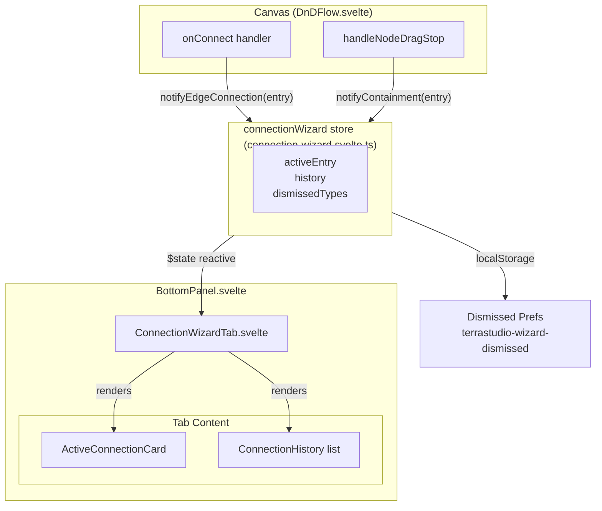

# Connection Wizard Specification

**Status**: Draft
**Created**: 2026-03-07
**Author**: AI Spec Writer
**Depends on**: [bottom-panel-system.md](bottom-panel-system.md)

## 1. Overview

The Connection Wizard is a guided UI panel that activates whenever a user creates a new edge between two resources on the canvas. It occupies a dedicated tab in the bottom panel system (described in `bottom-panel-system.md`) and explains the semantic meaning of each connection in Terraform terms — what resource argument is being set, what intermediate Terraform resource will be generated, and which properties were automatically filled as a result.

The goal is to make TerraStudio approachable to infrastructure engineers who are still learning Terraform, while remaining non-intrusive for experts who already understand the model. It achieves this through a "Don't show again per connection type" toggle that persists the user's dismissal preference, and a connection history log so users can always review past connections in the same session.

The wizard covers three categories of connection: **edge connections** (drawn via handles between resource nodes), **binding connections** (output-to-acceptor edges that generate intermediate Terraform resources such as `azurerm_key_vault_secret`), and **containment placements** (dragging a leaf node into a container, which sets `parentReference` properties).

## 2. Goals & Non-Goals

### Goals

- Immediately explain every new canvas connection in plain language before the user moves on
- Show the exact Terraform argument or resource type that the connection affects
- List which node properties were auto-filled and allow inline review
- For binding connections, show the intermediate Terraform resource that will be generated
- For containment drops, explain the parent-child relationship and which property was derived
- Provide a per-connection-type "Don't show again" toggle persisted to `localStorage`
- Maintain a scrollable history of all connections made in the current session
- Integrate into the bottom panel system without introducing a new panel primitive

### Non-Goals

- Editing resource properties from within the wizard (that stays in the Properties Panel)
- Suggesting connections that the user has not yet made
- Replacing the existing `isValidConnection` validation — the wizard is post-connection, not pre-connection
- Persisting connection history across sessions (history is in-memory only)
- Showing wizard content for reference edges (`showAsEdge: true` properties), which are generated automatically and not user-initiated

## 3. Background & Context

When a user draws a connection between two nodes, `onConnect` in `DnDFlow.svelte` fires synchronously. It already:

1. Calls `registry.edgeValidator.validate()` to find the matching `ConnectionRule`
2. Reads `rule.createsReference` to know which property to auto-fill on the source or target node
3. Reads `rule.outputBinding` to detect binding connections
4. Calls `diagram.addEdge()` with a `ruleMatch` payload on the edge data

The information needed to populate the wizard is therefore already computed at connection time — the wizard only needs to observe the new edge and render it. No new validation or rule-lookup logic is required.

For containment, `handleNodeDragStop` in `DnDFlow.svelte` reparents a node by setting `parentId` on the diagram node. The child schema's `parentReference.propertyKey` determines which Terraform argument is derived from the parent. Currently there is no event emitted when containment changes — the wizard will need a thin hook added to the reparenting path.

The bottom panel already has a planned `connection-wizard` tab slot (per `bottom-panel-system.md`). This spec defines exactly what `ConnectionWizardTab.svelte` renders and how the backing store is wired to the `onConnect` and reparent hooks.

## 4. Detailed Design

### 4.1 Architecture



**Data flow summary**: `DnDFlow.svelte` calls two new exported functions on the wizard store after each connection is established. The store updates reactive state. `ConnectionWizardTab.svelte` reads that state and renders. The bottom panel's `openBottomPanel('connection-wizard')` call is made by the store itself when a non-dismissed connection arrives.

### 4.2 Data Models / Interfaces

These interfaces live in `apps/desktop/src/lib/stores/connection-wizard.svelte.ts` (no types-package change needed — they are UI-only).

```typescript
import type { ResourceTypeId, ConnectionRule } from '@terrastudio/types';

/** Identifies a unique connection type for dismissal preferences. */
export type ConnectionTypeKey = string; // e.g. "azurerm/compute/app_service_plan->azurerm/compute/app_service"

export type ConnectionWizardEntryKind = 'edge' | 'binding' | 'containment';

/** A single wizard entry — one per connection event. */
export interface ConnectionWizardEntry {
  /** Unique entry id (edge id or generated uuid for containment). */
  readonly id: string;
  readonly kind: ConnectionWizardEntryKind;
  readonly timestamp: number;

  // Source resource
  readonly sourceNodeId: string;
  readonly sourceLabel: string;
  readonly sourceTypeId: ResourceTypeId;
  readonly sourceDisplayName: string; // from schema.displayName

  // Target resource
  readonly targetNodeId: string;
  readonly targetLabel: string;
  readonly targetTypeId: ResourceTypeId;
  readonly targetDisplayName: string;

  // Connection semantics
  readonly connectionLabel: string;        // rule.label, e.g. "Service Plan"
  readonly description: string;            // human-readable Terraform explanation
  readonly terraformSnippet?: string;      // relevant HCL argument or resource block snippet

  // Auto-filled properties (kind === 'edge' with createsReference)
  readonly autoFilledProperties: AutoFilledProperty[];

  // Binding resource info (kind === 'binding' only)
  readonly bindingResourceType?: string;   // e.g. "azurerm_key_vault_secret"

  // Containment info (kind === 'containment' only)
  readonly parentPropertyKey?: string;     // e.g. "virtual_network_name"
  readonly parentContainerLabel?: string;
}

export interface AutoFilledProperty {
  /** Which node received the auto-fill: 'source' or 'target' */
  readonly side: 'source' | 'target';
  /** Terraform argument name, e.g. "service_plan_id" */
  readonly propertyKey: string;
  /** Human-readable label, e.g. "Service Plan ID" */
  readonly propertyLabel: string;
  /** The value that was set (resource terraform name reference) */
  readonly value: string;
}
```

### 4.3 Component Breakdown

#### `apps/desktop/src/lib/stores/connection-wizard.svelte.ts` (new)

Central store. Owns all reactive state for the wizard.

```typescript
class ConnectionWizardStore {
  /** The most recently created connection, shown prominently at the top. */
  activeEntry = $state<ConnectionWizardEntry | null>(null);

  /** Full history for current session, newest first. Max 50 entries. */
  history = $state<ConnectionWizardEntry[]>([]);

  /** Set of ConnectionTypeKeys the user has dismissed "Don't show again". */
  dismissedTypes = $state<Set<ConnectionTypeKey>>(this._loadDismissed());

  /** Called by DnDFlow.onConnect after diagram.addEdge() */
  notifyEdgeConnection(entry: ConnectionWizardEntry): void { ... }

  /** Called by DnDFlow.handleNodeDragStop after a reparent occurs */
  notifyContainment(entry: ConnectionWizardEntry): void { ... }

  /** Build a ConnectionTypeKey from source+target typeIds */
  static typeKey(sourceTypeId: ResourceTypeId, targetTypeId: ResourceTypeId): ConnectionTypeKey {
    return `${sourceTypeId}->${targetTypeId}`;
  }

  isDismissed(key: ConnectionTypeKey): boolean { ... }

  dismiss(key: ConnectionTypeKey): void { ... }  // persists to localStorage

  undismiss(key: ConnectionTypeKey): void { ... } // for settings reset

  private _loadDismissed(): Set<ConnectionTypeKey> { ... }
  private _saveDismissed(): void { ... }
}

export const connectionWizard = new ConnectionWizardStore();
```

Key behaviors:

- `notifyEdgeConnection` and `notifyContainment` both: push to `history` (cap at 50), set `activeEntry`, and call `ui.openBottomPanel('connection-wizard')` — but only if the connection's `typeKey` is not dismissed.
- Even when dismissed, the entry is still appended to `history` (user can always review past connections via the history list).
- The `activeEntry` is cleared when the user navigates away from the wizard tab or explicitly dismisses the card.

#### `apps/desktop/src/lib/components/ConnectionWizardTab.svelte` (new)

Renders inside the bottom panel when `activeBottomTab === 'connection-wizard'`.

Layout:

```
+-----------------------------------------------------------+
| [Active Connection Card — appears only after a new conn]  |
+-----------------------------------------------------------+
| CONNECTION HISTORY                     [Clear History]    |
| > App Service Plan → App Service       13:42              |
| > Storage Account → Key Vault (secret) 13:38              |
| > Subnet dropped into VNet             13:35              |
+-----------------------------------------------------------+
```

The Active Connection Card is a highlighted block at the top of the tab. When no connection has been made yet, it shows placeholder text ("Make a connection on the canvas to see it explained here"). When history is empty and no active entry exists, show placeholder only.

#### `apps/desktop/src/lib/components/ConnectionWizardCard.svelte` (new)

Renders a single `ConnectionWizardEntry`. Used both for the active card and for expanded history items.

Sections:

1. **Header row**: Source icon + label → Target icon + label, with connection label badge (e.g., "Service Plan")
2. **Terraform explanation**: `description` field in a muted text block
3. **Terraform snippet** (if present): A monospaced code block with syntax highlighting, showing the relevant HCL argument or resource stub
4. **Auto-filled properties** (if `autoFilledProperties.length > 0`): A compact list — "service_plan_id was set on App Service → azurerm_app_service_plan.my_plan.id"
5. **Binding resource** (if `kind === 'binding'`): A distinct badge block — "Generates: azurerm_key_vault_secret" with a short explanation
6. **Containment details** (if `kind === 'containment'`): "virtual_network_name derived from parent VNet" in a muted annotation block
7. **Footer**: "Don't show again for this connection type" checkbox + [Select node] button (focuses the target node on canvas)

#### `apps/desktop/src/lib/components/ConnectionWizardHistoryItem.svelte` (new)

A collapsed single-line row for the history list. Shows:
- Connection type icon (edge / binding / containment)
- "{Source} → {Target}" label
- Connection label badge (small)
- Timestamp (time only, HH:MM)
- Expand/collapse chevron

Clicking expands to show the full `ConnectionWizardCard` inline.

### 4.4 API / Contract Changes

#### `DnDFlow.svelte` — `onConnect` modification

After `diagram.addEdge(...)` succeeds, build and dispatch a `ConnectionWizardEntry` to the store:

```typescript
// After diagram.addEdge(...)
import { connectionWizard } from '$lib/stores/connection-wizard.svelte';
import { buildEdgeWizardEntry } from '$lib/services/connection-wizard-builder';

const entry = buildEdgeWizardEntry({
  edgeId,
  connection,
  sourceNode,
  targetNode,
  rule: result.rule,   // ConnectionRule | undefined
  registry,
  diagram,
});
if (entry) connectionWizard.notifyEdgeConnection(entry);
```

#### `DnDFlow.svelte` — `handleNodeDragStop` modification

After the `diagram.nodes = diagram.nodes.map(...)` reparent block (lines ~839–859), emit a containment entry when `newParentId !== currentParentId && newParentId !== undefined`:

```typescript
import { buildContainmentWizardEntry } from '$lib/services/connection-wizard-builder';

const containmentEntry = buildContainmentWizardEntry({
  childNode: draggedNode,
  parentNodeId: newParentId,
  schema,
  registry,
  diagram,
});
if (containmentEntry) connectionWizard.notifyContainment(containmentEntry);
```

#### `UiStore` — no changes required

`ui.openBottomPanel('connection-wizard')` already exists per the bottom-panel-system spec. The wizard store calls it directly.

#### `BottomPanel.svelte` — wire in new tab

Add `ConnectionWizardTab` to the tab content switch block. Add tab button labelled "CONNECTION" (or "WIZARD") with a connection icon. Optionally show a dot badge when a new connection arrives while the user is on another tab (cleared when they switch to the wizard tab).

### 4.5 Entry Builder Service

`apps/desktop/src/lib/services/connection-wizard-builder.ts` (new)

Pure functions that construct `ConnectionWizardEntry` objects from raw diagram/registry data. Keeping this logic separate from both the store and `DnDFlow.svelte` keeps each file focused.

```typescript
export function buildEdgeWizardEntry(opts: {
  edgeId: string;
  connection: Connection;             // from @xyflow/svelte
  sourceNode: DiagramNode;
  targetNode: DiagramNode;
  rule: ConnectionRule | undefined;
  registry: PluginRegistry;
  diagram: DiagramStore;
}): ConnectionWizardEntry | null { ... }

export function buildContainmentWizardEntry(opts: {
  childNode: DiagramNode;
  parentNodeId: string;
  schema: ResourceSchema;
  registry: PluginRegistry;
  diagram: DiagramStore;
}): ConnectionWizardEntry | null { ... }
```

**`buildEdgeWizardEntry` logic**:

1. Look up `sourceSchema` and `targetSchema` via `registry.getResourceSchema`.
2. If no `rule`, return `null` (annotation / connection-point edges are not explained by the wizard).
3. Determine `kind`:
   - `rule.outputBinding` present → `'binding'`
   - otherwise → `'edge'`
4. Build `description` (see Section 4.6 — Description Generation).
5. Build `terraformSnippet` (see Section 4.6).
6. Build `autoFilledProperties` from `rule.createsReference`:
   - If `rule.createsReference.side === 'target'`, property was set on the target node. Value is `{sourceSchema.terraformType}.{sourceNode.data.terraformName}.id`.
   - If `rule.createsReference.side === 'source'`, property was set on the source node.
7. For binding: look up `bindingGenerator = registry.getBindingGenerator(sourceTypeId, targetTypeId)`. Set `bindingResourceType` from the generator's `generatedResourceType` field (see Section 9 — Open Questions regarding adding this field).
8. Return the assembled entry.

**`buildContainmentWizardEntry` logic**:

1. If `schema.visualContainment === true`, return `null` (visual-only containment has no Terraform implication to explain).
2. If `!schema.parentReference`, return `null` (no property derivation occurs).
3. Build description explaining that `{schema.parentReference.propertyKey}` will be derived from the parent container's Terraform name.
4. Return entry with `kind: 'containment'`.

### 4.6 Description and Snippet Generation

These are hardcoded string templates based on connection category. The builder selects the appropriate template:

**Edge — `createsReference` (structural)**:

- Description: `"Connecting {sourceDisplayName} to {targetDisplayName} sets the {propertyLabel} argument on {side === 'target' ? targetDisplayName : sourceDisplayName}. Terraform will reference {sourceSchema.terraformType}.{terraformName}.id."`
- Snippet:
  ```hcl
  resource "{targetSchema.terraformType}" "{targetNode.data.terraformName}" {
    {rule.createsReference.propertyKey} = {sourceSchema.terraformType}.{sourceNode.data.terraformName}.id
  }
  ```

**Edge — `outputBinding` (binding)**:

- Description: `"Connecting the {outputDef.label} output of {sourceDisplayName} to {targetDisplayName} will generate an intermediate Terraform resource that stores the value as a Key Vault secret."`
- Snippet (if binding generator is known):
  ```hcl
  resource "{bindingResourceType}" "..." {
    key_vault_id = {targetSchema.terraformType}.{targetNode.data.terraformName}.id
    value        = {sourceSchema.terraformType}.{sourceNode.data.terraformName}.{outputDef.terraformAttribute}
  }
  ```

**Containment**:

- Description: `"Placing {childSchema.displayName} inside {parentSchema.displayName} automatically sets {parentReference.propertyKey} in the generated Terraform. No manual wiring is needed."`
- Snippet:
  ```hcl
  resource "{childSchema.terraformType}" "{childNode.data.terraformName}" {
    {parentReference.propertyKey} = {parentSchema.terraformType}.{parentNode.data.terraformName}.name
  }
  ```

Snippets are approximate — they show only the relevant argument(s), not the full resource block. This is intentional: the full HCL is always visible in the Terraform file preview tab.

### 4.7 "Don't Show Again" Preference

- Key format: `ConnectionWizardStore.typeKey(sourceTypeId, targetTypeId)` → `"azurerm/compute/app_service_plan->azurerm/compute/app_service"`
- Stored in `localStorage` under key `terrastudio-wizard-dismissed` as a JSON array of keys
- Toggling the checkbox in the active card immediately calls `connectionWizard.dismiss(key)` or `connectionWizard.undismiss(key)`
- A dismissed connection type still generates a history entry (non-intrusive record), but does not open the bottom panel or set `activeEntry`
- A "Reset all dismissed types" button in `AppSettingsPanel.svelte` (existing settings UI) calls `connectionWizard.undismissAll()` and clears the localStorage entry

## 5. Implementation Plan

### 5.1 Phases

**Phase 1 — Store + Builder (no UI)**
Create the wizard store and builder service. Wire `notifyEdgeConnection` and `notifyContainment` calls into `DnDFlow.svelte`. Verify entries are created correctly via console logs or a temporary `$inspect` call. No visible UI change.

**Phase 2 — Bottom Panel Integration**
Implement `ConnectionWizardTab.svelte` with placeholder content. Wire it into `BottomPanel.svelte`. Confirm the tab opens automatically on a new connection.

**Phase 3 — Active Card**
Implement `ConnectionWizardCard.svelte`. Render it in `ConnectionWizardTab.svelte` for `activeEntry`. Cover all three kinds (edge, binding, containment). Add dismiss checkbox logic.

**Phase 4 — History List**
Implement `ConnectionWizardHistoryItem.svelte`. Render the history list below the active card. Add "Clear History" button.

**Phase 5 — Settings Integration**
Add "Reset dismissed connection types" to `AppSettingsPanel.svelte`. Add bottom-panel dot badge for new connections arriving while the wizard tab is not active.

### 5.2 File Changes

| Action | File |
|--------|------|
| Create | `apps/desktop/src/lib/stores/connection-wizard.svelte.ts` |
| Create | `apps/desktop/src/lib/services/connection-wizard-builder.ts` |
| Create | `apps/desktop/src/lib/components/ConnectionWizardTab.svelte` |
| Create | `apps/desktop/src/lib/components/ConnectionWizardCard.svelte` |
| Create | `apps/desktop/src/lib/components/ConnectionWizardHistoryItem.svelte` |
| Modify | `apps/desktop/src/lib/components/DnDFlow.svelte` — add wizard calls in `onConnect` and `handleNodeDragStop` |
| Modify | `apps/desktop/src/lib/components/BottomPanel.svelte` — add wizard tab button and tab content slot (created by bottom-panel-system spec) |
| Modify | `apps/desktop/src/lib/components/AppSettingsPanel.svelte` — add reset dismissed types button |

No changes to `packages/types/`, `packages/core/`, or any plugin package are required for Phase 1–4.

### 5.3 Dependencies

- **Bottom Panel System** (prerequisite): `BottomPanel.svelte`, `ui.openBottomPanel()`, and `BottomPanelTab` type must exist. The Connection Wizard tab is one of five planned bottom-panel tabs.
- No new npm packages. Syntax highlighting for the HCL snippet can use a `<pre>` block styled with the existing monospace CSS variables (`--color-text-code`, `--color-surface-code` or equivalents). Full tokenized highlighting is a future enhancement.

## 6. Edge Cases & Error Handling

| Scenario | Handling |
|----------|----------|
| `registry.getResourceSchema()` returns `undefined` for a node type | `buildEdgeWizardEntry` returns `null`; no wizard entry is created. This can happen during lazy-plugin loading races. |
| Connection made via keyboard (Tab + Enter on handle) | `onConnect` fires identically to mouse drag — no special handling needed. |
| User deletes the edge immediately after creation | The wizard entry remains in history (for reference). The "Select node" button in the card gracefully no-ops if the node no longer exists. |
| Binding generator not found for a binding edge | `bindingResourceType` is left `undefined`; the card shows the binding section without the resource type name. |
| Module collapsed — edge drawn between synthetic `_mod_` nodes | `_mod_` nodes have no real `type` or schema. The wizard call in `onConnect` receives `sourceNode`/`targetNode` for the actual underlying nodes (the redirect is display-only). No special case needed. |
| Containment of a `visualContainment: true` resource (e.g., App Service in Subnet) | `buildContainmentWizardEntry` returns `null` — no Terraform argument is affected, so no explanation is needed. |
| User drags node from one container to another | `handleNodeDragStop` fires with `newParentId !== currentParentId`. The wizard correctly shows the new containment relationship. |
| Node dragged out of container entirely (`newParentId === undefined`) | Not a containment event — the wizard is not triggered. The user removed containment; the property will be cleared by the existing reparent logic. |
| History exceeds 50 entries | Oldest entries are shifted out of the array (cap enforced in `notifyEdgeConnection`/`notifyContainment`). |
| Same edge attempted twice (duplicate) | `diagram.addEdge()` deduplicates by ID — `onConnect` may still fire. The wizard store checks `history[0].id === entry.id` and skips adding a duplicate. |

## 7. Testing Strategy

### Unit Tests — `connection-wizard-builder.ts`

Test the pure builder functions in isolation using mock `DiagramNode`, `ResourceSchema`, and `ConnectionRule` objects from `@terrastudio/core/testing/mock-helpers`.

| Test | Coverage |
|------|----------|
| `buildEdgeWizardEntry` with `createsReference: { side: 'target', ... }` | autoFilledProperties, description, snippet |
| `buildEdgeWizardEntry` with `outputBinding` | kind === 'binding', bindingResourceType |
| `buildEdgeWizardEntry` with no rule (annotation edge) | returns null |
| `buildContainmentWizardEntry` with `visualContainment: true` | returns null |
| `buildContainmentWizardEntry` with valid `parentReference` | containment entry fields |
| `buildContainmentWizardEntry` with no `parentReference` | returns null |

### Unit Tests — `connection-wizard.svelte.ts` store

Test the store class methods:
- `notifyEdgeConnection` pushes to history and sets `activeEntry`
- `notifyEdgeConnection` does NOT set `activeEntry` when type is dismissed
- `notifyEdgeConnection` still pushes to history even when type is dismissed
- History is capped at 50 entries
- Duplicate ID is not pushed to history twice
- `dismiss(key)` and `undismiss(key)` correctly maintain `dismissedTypes`

### Component Tests (manual smoke tests via `pnpm tauri dev`)

| Scenario | Expected |
|----------|----------|
| Draw App Service Plan → App Service edge | Bottom panel opens to wizard tab; card shows "service_plan_id" auto-filled |
| Draw Storage Account output → Key Vault binding | Card shows kind: binding, "azurerm_key_vault_secret" listed |
| Drop Subnet into VNet | Card shows containment, `virtual_network_name` derivation |
| Check "Don't show again", draw same connection type again | Bottom panel does not open; entry still appears in history |
| Reset dismissed types in Settings | Previously dismissed type opens wizard again on next connection |
| Delete edge immediately after creation | "Select node" button does nothing (no crash) |

## 8. Security & Performance Considerations

**Performance**: The wizard store is Svelte 5 `$state` reactive — updates are synchronous and lightweight. The history array is bounded at 50 entries. `buildEdgeWizardEntry` does only synchronous Map lookups against the already-loaded plugin registry; it adds no async work to the `onConnect` hot path. The `onConnect` handler already runs O(n) over nodes to look up source/target — the wizard builder adds only O(1) Map lookups on top.

**No Rust/IPC impact**: The wizard is entirely frontend-side. No Tauri commands are added. No filesystem or network access.

**localStorage key hygiene**: One new key — `terrastudio-wizard-dismissed` — storing a JSON array of string keys. The array should be pruned at load time: any key whose resource types are no longer registered (plugin not loaded for this project) is preserved but ignored until the plugin is present again. No deletion of "stale" keys at load, to avoid surprising users who re-open a project with a different active provider set.

**No sensitive data**: Connection wizard entries contain only resource labels and Terraform type names, no credentials or user-supplied property values.

## 9. Open Questions

| # | Question | Impact |
|---|----------|--------|
| 1 | `BindingHclGenerator` in `packages/types/src/hcl.ts` does not currently expose a `generatedResourceType: string` field. The wizard needs this to show "Generates: azurerm_key_vault_secret". Should we add this field to `BindingHclGenerator`, or derive it at display time by scanning the generator's output with a mock call? Adding the field is cleaner and adds no runtime cost; a mock call is fragile. **Recommended**: add `readonly generatedResourceType: string` to `BindingHclGenerator` and update all existing binding generators. This is a non-breaking additive change. | Affects Phase 3 card rendering for binding connections. |
| 2 | The "Select node" button in the wizard card should focus the target node on the canvas (pan + zoom to it). This requires calling `fitView` or `setCenter` on the SvelteFlow instance. Currently `ui.fitView` is a global function slot, but it only fits all nodes. Should we add a `ui.focusNode(nodeId: string)` slot populated by `DnDFlow.svelte`, mirroring the `fitView` pattern? | Low complexity; same pattern as existing `fitView` exposure. |
| 3 | Should dismissed connection types be scoped per-project (stored in project config) or globally per-installation (stored in `localStorage`)? Currently specified as `localStorage` (global), which means dismissing on one project dismisses on all. Most dismissals reflect "I know this connection type" — a user preference, not a project preference. **Recommendation**: keep as `localStorage` (global). | Affects `dismiss`/`undismiss` implementation. |
| 4 | The history list shows connections from the current session only. Should the wizard also show the last N connections from the previous session (persisted in `localStorage`)? This adds persistence complexity and marginal value; most users will remember their last session. **Recommendation**: in-memory only for initial release. | Deferred to follow-up if users request it. |

## 10. References

- [`docs/specs/bottom-panel-system.md`](bottom-panel-system.md) — prerequisite bottom panel infrastructure
- [`apps/desktop/src/lib/components/DnDFlow.svelte`](../../apps/desktop/src/lib/components/DnDFlow.svelte) — `onConnect` handler (line 678) and `handleNodeDragStop` (line 802)
- [`packages/core/src/lib/diagram/edge-rules.ts`](../../packages/core/src/lib/diagram/edge-rules.ts) — `EdgeRuleValidator`, `EdgeValidationResult`
- [`packages/types/src/connection.ts`](../../packages/types/src/connection.ts) — `ConnectionRule` interface
- [`packages/types/src/edge.ts`](../../packages/types/src/edge.ts) — `TerraStudioEdgeData`, `EdgeCategoryId`
- [`packages/types/src/resource-schema.ts`](../../packages/types/src/resource-schema.ts) — `ResourceSchema`, `HandleDefinition`, `OutputDefinition`, `parentReference`
- [`apps/desktop/src/lib/stores/ui.svelte.ts`](../../apps/desktop/src/lib/stores/ui.svelte.ts) — `UiStore`, `openBottomPanel`
- [`packages/plugin-azure-compute/src/connections/rules.ts`](../../packages/plugin-azure-compute/src/connections/rules.ts) — representative `ConnectionRule` examples
