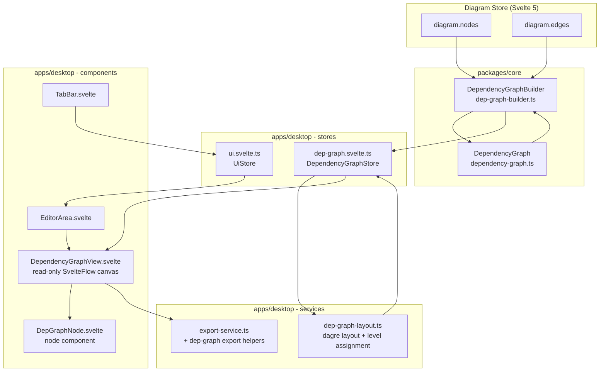

# Resource Dependency Graph View Specification

**Spec ID**: SPEC-003
**Status**: Draft
**Created**: 2026-03-07
**PRD Source**: Feature request — Resource Dependency Graph View (inline brief, March 2026)
**Author**: AI Spec Writer

## 1. Overview

This specification describes a dedicated **Dependency Graph View** — a new editor tab in TerraStudio that renders the Terraform dependency graph of the current diagram as a clean, read-only directed acyclic graph (DAG). Unlike the canvas, which mirrors the user's spatial layout decisions and supports editing, the dependency view is purely analytical: it answers "in what order will Terraform deploy these resources, and what depends on what?"

The view derives its graph from the same HCL pipeline that already drives code generation. The existing `DependencyGraph` class in `packages/core/src/lib/hcl/dependency-graph.ts` provides topological ordering via Kahn's algorithm; this spec extends that into a level-assignment algorithm so resources at the same deployment wave appear on the same horizontal row. Dagre (already a project dependency via `layout-service.ts`) handles the visual layout of the resulting DAG.

The tab integrates cleanly into the existing `EditorTab` / `EditorArea` / `UiStore` tab system with minimal surgery. It is ephemeral — not persisted — and regenerates automatically when the diagram changes, with a debounce to avoid redundant work during rapid edits.

## 2. Goals & Non-Goals

### Goals

- Add a "Dependency Graph" editor tab (permanent, non-closable, alongside Canvas) that is toggled via a toolbar button or keyboard shortcut.
- Render all real (non-synthetic, non-virtual) diagram resources as simplified DAG nodes — icon + resource label + Terraform type — using @xyflow/svelte in read-only mode.
- Draw directed edges from dependency to dependent: an edge A → B means "B depends on A" (B must be deployed after A).
- Compute Terraform dependencies from two sources: explicit `dependsOn` arrays on `HclBlock` records, and implicit references extracted from property `references` maps and output-binding edges on the canvas.
- Lay out the DAG top-to-bottom using dagre with topological level assignment so resources in the same deployment wave occupy the same rank row.
- Color nodes by resource category derived from the middle segment of `ResourceTypeId` (e.g., `networking`, `compute`, `storage`, `database`, `security`, `core`), with fallback to a neutral color.
- Support click-to-highlight: clicking a node highlights all its transitive upstream dependencies (ancestors) and downstream dependents (descendants) using distinct edge and node tints.
- Hover tooltip: Terraform address, display name, and the list of direct dependency addresses.
- Double-click a node to switch to the Canvas tab and select + fit-to-view that resource.
- Refresh automatically when `diagram.nodes` or `diagram.edges` changes (300 ms debounce).
- Export the dependency graph view as PNG or SVG, reusing the existing `write_export_file` Tauri command and `html-to-image` pipeline.
- Represent module boundaries as visual background clusters (labeled rectangles) behind the nodes they contain.
- Display a "No dependencies" empty state when the diagram has fewer than two resources, or all resources are independent.

### Non-Goals

- Editing resources or connections from within the dependency view.
- Persisting the dependency view's viewport pan/zoom between sessions.
- Supporting Terraform `module` block dependency chains (only resource-level dependencies within the root module are in scope for v1).
- Showing data sources, variables, or outputs as graph nodes.
- Real-time streaming updates during a running `terraform apply` (deployment status coloring is static, read from `diagram.nodes[].data.deploymentStatus`).
- Replacing or augmenting the Mermaid graph in the documentation export.
- A separate bottom panel variant (the bottom-panel-system.md spec covers that surface).

## 3. Background & Context

### Existing infrastructure reused

| Concern | Existing location | Reuse strategy |
|---|---|---|
| Topological sort | `packages/core/src/lib/hcl/dependency-graph.ts` (`DependencyGraph`) | Call `topologicalSort()` to get ordered blocks; assign levels from that order |
| HCL block generation | `packages/core/src/lib/hcl/pipeline.ts` (`HclPipeline`) | Run a partial pipeline pass to get `HclBlock[]` for the current diagram |
| Dagre layout | `@dagrejs/dagre` (already in deps, used in `layout-service.ts`) | Direct use in the new `dep-graph-layout.ts` service |
| Export (PNG/SVG) | `apps/desktop/src/lib/services/export-service.ts` | Extract the `getViewportElement` → `toPng`/`toSvg` → `write_export_file` pattern |
| Tab system | `apps/desktop/src/lib/stores/ui.svelte.ts` (`UiStore`, `EditorTab`) | Add a new `'dep-graph'` tab type; wire into `EditorArea.svelte` |
| Canvas selection + fit-view | `apps/desktop/src/lib/stores/diagram.svelte.ts` (`selectedNodeId`) + `UiStore.fitView` | Set `selectedNodeId` and call `ui.fitView?.()` after switching to Canvas tab |
| Resource icon resolution | `apps/desktop/src/lib/bootstrap.ts` (`registry`) | Call `registry.getResourceSchema(typeId)` to read icon/display name |

### Dependency source model

Terraform dependencies come from two sources that must be unified:

1. **Explicit `dependsOn`**: `HclBlock.dependsOn` is an array of Terraform addresses (`azurerm_resource_group.rg`). The `DependencyGraph` already processes these.

2. **Implicit via references**: When a resource's `references` map contains another resource's `instanceId`, the HCL generator emits `azurerm_something.foo.id` in the block content, which Terraform infers as a dependency. These are currently not expressed as `dependsOn` entries — they exist on the canvas nodes as `ResourceNodeData.references`. The dependency graph view must include both.

3. **Output bindings (structural edges)**: Canvas edges with `category: 'structural'` or `category: 'binding'` represent Terraform-level dependencies (e.g., Key Vault secret bindings). These should also appear as graph edges.

The spec introduces a `DependencyGraphBuilder` service in `packages/core` that runs the HCL pipeline, merges all three sources, and produces a normalized edge list keyed on `instanceId` pairs. This is the single source of truth for the view.

### Current tab types

`EditorTab.type` is currently `'canvas' | 'file'`. This spec adds `'dep-graph'`. The `EditorArea.svelte` switch statement gains a `dep-graph` branch that renders `<DependencyGraphView />`.

## 4. Detailed Design

### 4.1 Architecture



### 4.2 Data Models / Interfaces

#### New types in `packages/types/src/dep-graph.ts`

```typescript
import type { ResourceTypeId } from './resource-schema.js';

/**
 * A node in the dependency graph view.
 * Distinct from DiagramNode — simpler, read-only, no handles.
 */
export interface DepGraphNode {
  /** instanceId of the canvas resource */
  readonly instanceId: string;
  /** Fully qualified resource type: {provider}/{category}/{resource} */
  readonly typeId: ResourceTypeId;
  /** User-visible label from ResourceNodeData.label */
  readonly label: string;
  /** Terraform address: "{terraformType}.{terraformName}" */
  readonly terraformAddress: string;
  /** Display name from ResourceSchema.displayName */
  readonly displayName: string;
  /** Resource category (middle segment of typeId, e.g. "networking") */
  readonly category: string;
  /** Deployment status from ResourceNodeData.deploymentStatus, if any */
  readonly deploymentStatus?: string;
  /** Module ID this resource belongs to (from ResourceNodeData.moduleId) */
  readonly moduleId?: string;
  /**
   * Topological level (0 = no dependencies, higher = deployed later).
   * Resources at the same level are placed on the same dagre rank.
   */
  readonly level: number;
}

/**
 * A directed dependency edge: source must be deployed before target.
 * Source → Target means "target depends on source".
 */
export interface DepGraphEdge {
  /** instanceId of the upstream resource (dependency) */
  readonly sourceInstanceId: string;
  /** instanceId of the downstream resource (dependent) */
  readonly targetInstanceId: string;
  /** How this dependency was discovered */
  readonly kind: 'explicit' | 'reference' | 'binding';
}

/**
 * Module boundary cluster for visual grouping in the dependency view.
 */
export interface DepGraphCluster {
  readonly moduleId: string;
  readonly moduleName: string;
  readonly color?: string;
  /** instanceIds of member nodes */
  readonly memberInstanceIds: string[];
}

/**
 * Complete dependency graph data ready for rendering.
 */
export interface DepGraphData {
  readonly nodes: DepGraphNode[];
  readonly edges: DepGraphEdge[];
  readonly clusters: DepGraphCluster[];
  /** True if a cycle was detected (HCL pipeline threw) */
  readonly hasCycle: boolean;
  /** Error message when hasCycle is true */
  readonly cycleError?: string;
}
```

#### Extension to `packages/types/src/index.ts`

```typescript
export type {
  DepGraphNode,
  DepGraphEdge,
  DepGraphCluster,
  DepGraphData,
} from './dep-graph.js';
```

#### `EditorTab` type extension in `apps/desktop/src/lib/stores/ui.svelte.ts`

```typescript
export interface EditorTab {
  id: string;
  label: string;
  type: 'canvas' | 'file' | 'dep-graph';  // add 'dep-graph'
}
```

#### `DependencyGraphStore` in `apps/desktop/src/lib/stores/dep-graph.svelte.ts`

```typescript
import type { DepGraphData } from '@terrastudio/types';

class DependencyGraphStore {
  /** Current computed graph, or null before first computation */
  data = $state<DepGraphData | null>(null);
  /** True while the graph is being recomputed */
  computing = $state(false);
  /** The instanceId the user has clicked for highlight mode */
  focusedNodeId = $state<string | null>(null);
  /** Cached: all instanceIds that are upstream of focusedNodeId */
  upstreamIds = $derived.by((): Set<string> => { /* ... */ });
  /** Cached: all instanceIds that are downstream of focusedNodeId */
  downstreamIds = $derived.by((): Set<string> => { /* ... */ });
}

export const depGraph = new DependencyGraphStore();
```

#### Svelte Flow node data for the dependency view

The dep graph Svelte Flow instance uses its own node type. Node `data` is typed as:

```typescript
export interface DepGraphNodeData {
  instanceId: string;
  typeId: ResourceTypeId;
  label: string;
  terraformAddress: string;
  displayName: string;
  category: string;
  deploymentStatus?: string;
  level: number;
  /** Highlight state set by the store */
  highlight: 'none' | 'focused' | 'upstream' | 'downstream' | 'unrelated';
}
```

### 4.3 Component Breakdown

#### `packages/core/src/lib/hcl/dep-graph-builder.ts` (new)

Purpose: consume diagram state and produce a `DepGraphData` object without triggering side effects.

Key responsibilities:
- Accept `nodes: DiagramNode[]`, `edges: DiagramEdge[]`, `modules: ModuleDefinition[]`, and the `PluginRegistry`.
- Filter out synthetic nodes (`_mod_`, `_modinst_`, `_instmem_` prefixes) and virtual resource types (those whose `terraformType` starts with `_`).
- For each real resource, resolve its Terraform address as `{terraformType}.{terraformName}`.
- Build edges from three sources:
  1. **Reference edges**: iterate `node.data.references` entries; for each value that is a valid `instanceId` of another real resource, add a `kind: 'reference'` edge (dependency → dependent, where the referencing node is the dependent).
  2. **Canvas structural/binding edges**: iterate `diagram.edges` with `data.category === 'structural'` or `'binding'`; add `kind: 'binding'` edges.
  3. **HCL block `dependsOn`**: run a lightweight HCL generation pass (call `HclPipeline.generateBlocks()` — a new private-made-internal method, see below) to get `HclBlock[]`, then extract `dependsOn` arrays and resolve them back to `instanceId` pairs via the address map. Add as `kind: 'explicit'` edges.
- Deduplicate edges (same source+target pair, keep the highest-priority kind: explicit > reference > binding).
- Compute topological levels using a BFS from roots (nodes with in-degree 0), incrementing level per wave.
- Handle cycles by catching the error from `DependencyGraph.topologicalSort()` and returning `{ hasCycle: true, cycleError: msg }`.
- Build `DepGraphCluster[]` from `modules` + `node.data.moduleId` membership.

Signature:

```typescript
export function buildDependencyGraph(
  nodes: DiagramNode[],
  edges: DiagramEdge[],
  modules: ModuleDefinition[],
  registry: PluginRegistry,
): DepGraphData
```

> Note: To avoid needing a full `PipelineInput` (which requires `ProjectConfig`), the builder constructs a minimal context that only builds the address map and calls individual resource generators. This avoids provider config, variable collection, and file assembly steps. If complexity is prohibitive, the `kind: 'explicit'` source can be deferred to a later phase and the initial release can rely on reference + binding edges only. See Open Questions.

#### `apps/desktop/src/lib/services/dep-graph-layout.ts` (new)

Purpose: take a `DepGraphData` and produce Svelte Flow `Node[]` and `Edge[]` with dagre-computed positions.

```typescript
import dagre from '@dagrejs/dagre';
import type { Node, Edge } from '@xyflow/svelte';
import type { DepGraphData, DepGraphNodeData } from '@terrastudio/types';

export interface DepGraphLayout {
  nodes: Node<DepGraphNodeData>[];
  edges: Edge[];
}

export function layoutDepGraph(data: DepGraphData): DepGraphLayout
```

Implementation notes:
- Node dimensions: fixed at 200 × 64 px (compact, icon + label + terraform type). No measured sizes needed.
- Dagre graph options: `rankdir: 'TB'`, `nodesep: 48`, `ranksep: 72`, `marginx: 24`, `marginy: 24`.
- Assign each node to a dagre rank by setting `rank` property on the dagre node using the `level` field from `DepGraphData`. This forces same-level nodes onto the same horizontal band.
- Cluster background nodes: for each `DepGraphCluster`, compute the bounding box of member nodes after dagre layout runs, then prepend a background Svelte Flow node (using a plain `div` node type styled as a labeled rounded rectangle). Cluster background nodes get `zIndex: -1` and are not interactive.
- Edge style: straight arrows with `markerEnd: { type: MarkerType.ArrowClosed }`. Color by edge `kind`: explicit = `var(--color-accent)`, reference = `#6b7280` (muted), binding = `#f59e0b` (amber). All edges `animated: false`.
- Returns both the positioned nodes and edges arrays ready to pass directly to a Svelte Flow `<SvelteFlow>` instance.

#### `apps/desktop/src/lib/stores/dep-graph.svelte.ts` (new)

Full store definition:

```typescript
import { diagram } from './diagram.svelte';
import { ui } from './ui.svelte';
import { registry } from '$lib/bootstrap';
import { buildDependencyGraph } from '@terrastudio/core';
import { layoutDepGraph } from '$lib/services/dep-graph-layout';
import type { DepGraphData } from '@terrastudio/types';
import type { Node, Edge } from '@xyflow/svelte';

const DEBOUNCE_MS = 300;

class DependencyGraphStore {
  data = $state<DepGraphData | null>(null);
  computing = $state(false);
  flowNodes = $state<Node[]>([]);
  flowEdges = $state<Edge[]>([]);
  focusedNodeId = $state<string | null>(null);

  upstreamIds = $derived.by((): Set<string> => {
    if (!this.focusedNodeId || !this.data) return new Set();
    return collectAncestors(this.focusedNodeId, this.data.edges);
  });

  downstreamIds = $derived.by((): Set<string> => {
    if (!this.focusedNodeId || !this.data) return new Set();
    return collectDescendants(this.focusedNodeId, this.data.edges);
  });

  private debounceTimer: ReturnType<typeof setTimeout> | null = null;

  /** Called by DependencyGraphView on mount and on diagram change. */
  scheduleRefresh(): void {
    if (this.debounceTimer) clearTimeout(this.debounceTimer);
    this.debounceTimer = setTimeout(() => this.refresh(), DEBOUNCE_MS);
  }

  private refresh(): void {
    this.computing = true;
    try {
      const data = buildDependencyGraph(
        diagram.nodes,
        diagram.edges,
        diagram.modules,
        registry,
      );
      this.data = data;
      const layout = layoutDepGraph(data);
      this.flowNodes = layout.nodes;
      this.flowEdges = layout.edges;
    } finally {
      this.computing = false;
    }
  }

  setFocus(instanceId: string | null): void {
    this.focusedNodeId = instanceId === this.focusedNodeId ? null : instanceId;
  }

  /** Switch to canvas tab and select the given resource. */
  navigateToCanvas(instanceId: string): void {
    diagram.selectedNodeId = instanceId;
    ui.activeTabId = 'canvas';
    // fitView is called by Canvas.svelte on selectedNodeId change (or manually scheduled)
  }
}

function collectAncestors(instanceId: string, edges: DepGraphEdge[]): Set<string> {
  // BFS upstream (follow edges where targetInstanceId === current, walk to sourceInstanceId)
}

function collectDescendants(instanceId: string, edges: DepGraphEdge[]): Set<string> {
  // BFS downstream (follow edges where sourceInstanceId === current, walk to targetInstanceId)
}

export const depGraph = new DependencyGraphStore();
```

#### `apps/desktop/src/lib/components/DependencyGraphView.svelte` (new)

The main view component rendered by `EditorArea.svelte` when `activeTab.type === 'dep-graph'`.

Structure:
- A read-only `<SvelteFlow>` instance with `nodesDraggable={false}`, `nodesConnectable={false}`, `elementsSelectable={true}` (to allow click events to propagate).
- `nodeTypes` map: `{ 'dep-graph-node': DepGraphNode }` (the simplified node component).
- `nodes` and `edges` come from `depGraph.flowNodes` / `depGraph.flowEdges`, with highlight state injected reactively.
- An `<svelte:effect>` or `$effect` watches `diagram.nodes` and `diagram.edges` (by length + a content hash) and calls `depGraph.scheduleRefresh()`.
- A toolbar strip above the flow with: a "Refresh" button (manual), an "Export PNG" button, an "Export SVG" button, and a legend showing the category color swatches.
- An empty-state overlay shown when `depGraph.data?.nodes.length === 0`.
- A cycle-error banner shown when `depGraph.data?.hasCycle === true`.

Highlight synchronization: a `$effect` watches `depGraph.focusedNodeId`, `depGraph.upstreamIds`, `depGraph.downstreamIds` and updates `depGraph.flowNodes` by mapping over them to set each node's `data.highlight` field, which `DepGraphNode.svelte` reads for styling.

#### `apps/desktop/src/lib/components/DepGraphNode.svelte` (new)

A compact Svelte Flow custom node:

```
┌─────────────────────────────────────────┐
│  [icon 24×24]  Storage Account          │  ← data.label
│                azurerm_storage_account  │  ← data.terraformAddress (truncated)
└─────────────────────────────────────────┘
```

- Width: 200 px, height: 64 px (fixed, no handles).
- Left color bar: 4 px wide, color derived from `data.category` via a `CATEGORY_COLORS` map.
- Icon: resolved from `registry.getResourceSchema(data.typeId)?.icon` via a helper that renders the SVG string inline. Fallback to a generic cloud icon if no icon is registered.
- `data.highlight` drives opacity and border:
  - `'focused'`: full opacity, `var(--color-accent)` border 2 px.
  - `'upstream'`: full opacity, `#22c55e` (green) border.
  - `'downstream'`: full opacity, `#f59e0b` (amber) border.
  - `'unrelated'`: `opacity: 0.25`.
  - `'none'`: default opacity 1, `var(--color-border)` border.
- `onclick`: calls `depGraph.setFocus(data.instanceId)`.
- `ondblclick`: calls `depGraph.navigateToCanvas(data.instanceId)`.
- Tooltip (on hover via `title` attribute or a `NodeTooltip`-inspired popover): Terraform address, display name, direct dependency list.

#### `apps/desktop/src/lib/components/EditorArea.svelte` (modify)

Add a `dep-graph` branch:

```svelte
{#if activeTab?.type === 'canvas'}
  <Canvas />
{:else if activeTab?.type === 'file'}
  <FilePreview filename={activeTab.id} />
{:else if activeTab?.type === 'dep-graph'}
  <DependencyGraphView />
{/if}
```

#### `apps/desktop/src/lib/stores/ui.svelte.ts` (modify)

1. Update `EditorTab.type` union to include `'dep-graph'`.
2. Add a permanent dep-graph tab to `tabs` initial state alongside `canvas`:

```typescript
tabs = $state<EditorTab[]>([
  { id: 'canvas', label: 'Canvas', type: 'canvas' },
  { id: 'dep-graph', label: 'Dependencies', type: 'dep-graph' },
]);
```

3. Update `closeTab` guard to protect `'dep-graph'` from being closed (same as `'canvas'`):

```typescript
closeTab(tabId: string) {
  if (tabId === 'canvas' || tabId === 'dep-graph') return;
  // ...
}
```

4. Update `closeAllFileTabs` to preserve both permanent tabs:

```typescript
closeAllFileTabs() {
  this.tabs = [
    { id: 'canvas', label: 'Canvas', type: 'canvas' as const },
    { id: 'dep-graph', label: 'Dependencies', type: 'dep-graph' as const },
  ];
  this.activeTabId = 'canvas';
}
```

#### `apps/desktop/src/lib/components/TabBar.svelte` (modify)

Add a network/graph SVG icon for the `dep-graph` tab type in the tab render loop. Tabs with type `'dep-graph'` show no close button (permanent tab, same treatment as `'canvas'`).

#### `apps/desktop/src/lib/services/export-service.ts` (modify)

Add two exported functions that capture the dependency graph viewport:

```typescript
/**
 * Export the dependency graph view as a PNG file.
 * The dep graph SvelteFlow instance uses a separate container element
 * identified by the class 'dep-graph-viewport'.
 */
export async function exportDepGraphPNG(): Promise<void>
export async function exportDepGraphSVG(): Promise<void>
```

These mirror `exportPNG` / `exportSVG` but query `.dep-graph-viewport` instead of `.svelte-flow__viewport`. The `DependencyGraphView.svelte` wraps its `<SvelteFlow>` in a `<div class="dep-graph-viewport">`.

### 4.4 API / Contract Changes

#### `packages/core` public exports

`packages/core/src/index.ts` gains:

```typescript
export { buildDependencyGraph } from './lib/hcl/dep-graph-builder.js';
```

#### `packages/types` public exports

`packages/types/src/index.ts` gains:

```typescript
export type { DepGraphNode, DepGraphEdge, DepGraphCluster, DepGraphData } from './dep-graph.js';
```

#### No Tauri command changes

The dependency graph is computed entirely in the frontend. Export reuses the existing `write_export_file` Tauri command.

## 5. Implementation Plan

### 5.1 Phases

**Phase 1 — Types and builder (packages/types + packages/core)**

Deliverables:
- `packages/types/src/dep-graph.ts` — all four interfaces.
- `packages/types/src/index.ts` — add exports.
- `packages/core/src/lib/hcl/dep-graph-builder.ts` — `buildDependencyGraph` using reference edges and canvas structural/binding edges only (skip HCL block `dependsOn` for now).
- Unit tests for `buildDependencyGraph` covering: basic dependency chain, shared dependency (diamond), module membership, synthetic node filtering, cycle detection.

**Phase 2 — Layout service**

Deliverables:
- `apps/desktop/src/lib/services/dep-graph-layout.ts` — `layoutDepGraph`.
- Tests: verify node count, edge count, position is non-null, cluster backgrounds are injected.

**Phase 3 — Store and tab registration**

Deliverables:
- `apps/desktop/src/lib/stores/dep-graph.svelte.ts` — `DependencyGraphStore` with `scheduleRefresh`, `setFocus`, `navigateToCanvas`, ancestor/descendant derivations.
- `apps/desktop/src/lib/stores/ui.svelte.ts` — add `'dep-graph'` to `EditorTab.type`, add permanent dep-graph tab to initial state, update `closeTab`/`closeAllFileTabs`.

**Phase 4 — Components**

Deliverables:
- `apps/desktop/src/lib/components/DepGraphNode.svelte` — compact node with icon, label, highlight states, click/dblclick handlers, tooltip.
- `apps/desktop/src/lib/components/DependencyGraphView.svelte` — read-only SvelteFlow canvas, toolbar, empty state, cycle error banner, effect-based refresh trigger.
- `apps/desktop/src/lib/components/EditorArea.svelte` — add `dep-graph` branch.
- `apps/desktop/src/lib/components/TabBar.svelte` — add dep-graph icon.

**Phase 5 — Export and HCL-based dependencies**

Deliverables:
- `apps/desktop/src/lib/services/export-service.ts` — `exportDepGraphPNG` and `exportDepGraphSVG`.
- `packages/core/src/lib/hcl/dep-graph-builder.ts` — extend to incorporate `HclBlock.dependsOn` edges by running a minimal HCL generation pass (requires creating a bare-minimum `ProjectConfig` with empty provider configs).
- Manual verification: open a multi-resource diagram, switch to Dependencies tab, verify correct ordering.

### 5.2 File Changes

| Action | File |
|---|---|
| Create | `packages/types/src/dep-graph.ts` |
| Modify | `packages/types/src/index.ts` |
| Create | `packages/core/src/lib/hcl/dep-graph-builder.ts` |
| Modify | `packages/core/src/index.ts` |
| Create | `apps/desktop/src/lib/services/dep-graph-layout.ts` |
| Create | `apps/desktop/src/lib/stores/dep-graph.svelte.ts` |
| Modify | `apps/desktop/src/lib/stores/ui.svelte.ts` |
| Create | `apps/desktop/src/lib/components/DepGraphNode.svelte` |
| Create | `apps/desktop/src/lib/components/DependencyGraphView.svelte` |
| Modify | `apps/desktop/src/lib/components/EditorArea.svelte` |
| Modify | `apps/desktop/src/lib/components/TabBar.svelte` |
| Modify | `apps/desktop/src/lib/services/export-service.ts` |

### 5.3 Dependencies

No new npm packages required. All dependencies are already in the project:

| Package | Already used in | Usage here |
|---|---|---|
| `@dagrejs/dagre` | `layout-service.ts` | DAG layout in `dep-graph-layout.ts` |
| `@xyflow/svelte` | `Canvas.svelte`, `DnDFlow.svelte` | Read-only SvelteFlow instance in `DependencyGraphView.svelte` |
| `html-to-image` | `export-service.ts` | PNG/SVG export of dep graph viewport |
| `@terrastudio/core` | `bootstrap.ts`, all services | `buildDependencyGraph` export |
| `@terrastudio/types` | everywhere | New dep-graph types |

## 6. Edge Cases & Error Handling

**Cycle detection**: `DependencyGraph.topologicalSort()` throws `Error('Circular dependency detected...')`. `buildDependencyGraph` catches this, sets `hasCycle: true` and `cycleError: error.message`, and returns a partial graph (nodes without level assignments, no edges). `DependencyGraphView.svelte` renders a red banner: "Circular dependency detected. Terraform will fail to plan. Check resource references." The graph still renders nodes (without edges) so the user can identify the offending resources.

**Empty diagram**: When `diagram.nodes` has zero real resources, `depGraph.data.nodes` is empty. The view renders an empty-state illustration: "Open a project and add resources to see the dependency graph."

**Single resource**: When only one resource exists (no edges possible), the view shows a single node with the empty-state message: "Add more resources and connect them to see dependencies."

**All resources independent** (no edges): The graph renders all nodes at level 0 in a single row with no edges. A subtle note says "No dependencies found — all resources deploy independently."

**Synthetic nodes leaking**: The builder filters nodes by ID prefix (`_mod_`, `_modinst_`, `_instmem_`) before processing. This matches the pattern used in `export-service.ts` (`isSyntheticNode`).

**Reference to a non-existent instanceId**: Stale `references` entries pointing to deleted nodes are silently skipped (the `instanceId` won't be in the real-node map).

**Very large diagrams (50+ resources)**: dagre handles up to ~200 nodes comfortably. Above that, layout time may become noticeable. The `computing` flag shows a spinner overlay. If layout time exceeds 2 seconds (measured via `performance.now()`), log a warning. No hard limit is enforced in v1.

**Tab switching during refresh**: The debounce timer continues even if the user navigates away. If `depGraph.data` updates while the tab is not active, `flowNodes`/`flowEdges` are updated in the store — the SvelteFlow instance will reflect the new state when the tab is next shown (SvelteFlow re-renders on prop change).

**Module with no matching nodes**: If a `ModuleDefinition` exists but all its member nodes are synthetic or filtered out, the cluster is omitted from `DepGraphData.clusters`.

## 7. Testing Strategy

### Unit tests (`packages/core`)

File: `packages/core/src/lib/hcl/dep-graph-builder.test.ts`

Test cases:
- Basic chain: RG → VNet → Subnet: verify 3 nodes, 2 edges, levels [0, 1, 2].
- Diamond: RG referenced by both VM and NSG: verify 3 nodes, 2 edges, VM and NSG at level 1.
- Module membership: `node.data.moduleId` populated; verify cluster in output.
- Synthetic node filtering: nodes with `_mod_`, `_modinst_`, `_instmem_` prefixes excluded from output.
- Cycle: two nodes each referencing the other; verify `hasCycle: true`.
- Empty input: zero nodes → `{ nodes: [], edges: [], clusters: [], hasCycle: false }`.
- Canvas structural edge: edge with `category: 'structural'` between two real nodes produces a `kind: 'binding'` dep edge.

### Unit tests (`dep-graph-layout.ts`)

File: `apps/desktop/src/lib/services/dep-graph-layout.test.ts`

Test cases:
- Layout produces `nodes.length === data.nodes.length` Svelte Flow nodes.
- Each node has a non-null `position.x` and `position.y`.
- Cluster background nodes are prepended (count = `data.clusters.length`).
- Nodes at the same `level` have the same `position.y` (within a tolerance of ±2 px), confirming dagre rank assignment.

### Manual / exploratory testing

1. Open a project with Resource Group > VNet > Subnet > VM hierarchy.
2. Switch to Dependencies tab — confirm 4 nodes, 3 edges, correct levels (RG=0, VNet=1, Subnet=2, VM=3).
3. Click VM node — confirm VM is `focused`, Subnet/VNet/RG are `upstream`, nothing is `downstream`.
4. Double-click RG node — confirm Canvas tab activates and RG is selected.
5. Add a new resource on Canvas — switch back to Dependencies; confirm graph refreshes within 300 ms.
6. Export PNG from the dep graph toolbar — confirm file is saved and contains the graph.
7. Create a module grouping — confirm cluster background appears around module members.
8. Introduce a circular reference (manually edit a resource's `references`) — confirm cycle banner appears.

## 8. Security & Performance Considerations

**Performance**:
- `buildDependencyGraph` runs synchronously on the main thread. For typical TerraStudio diagrams (10–80 resources) this is well under 10 ms and does not require a Web Worker.
- Dagre layout for 80 nodes takes ~5–20 ms. The `computing` spinner covers this gap.
- The 300 ms debounce prevents layout thrashing during rapid canvas edits (e.g., dragging a node triggers many `diagram.nodes` updates).
- The store only recomputes when the Dependencies tab is visible, or schedules a lazy refresh for when it becomes visible. To implement this: `scheduleRefresh()` checks `ui.activeTabId === 'dep-graph'`; if not active, it sets a `needsRefresh` flag and the `DependencyGraphView` triggers an immediate refresh on mount via `$effect`.

**Memory**:
- The Svelte Flow instance for the dep graph is only mounted when the dep-graph tab is active. Svelte's `{#if}` in `EditorArea.svelte` destroys and recreates the component. The store (`dep-graph.svelte.ts`) persists across tab switches to avoid recomputation; the SvelteFlow canvas is recreated but receives pre-computed `flowNodes`/`flowEdges` from the store.

**Security**:
- No new Tauri commands or IPC surface. Export uses the existing `write_export_file` command which already validates the path via Tauri's capability system.
- No user input is eval'd or injected into DOM as raw HTML. Node labels are rendered as text content.

## 9. Open Questions

1. **HCL block `dependsOn` source (Phase 5 scope)**: Running even a partial HCL pipeline pass requires a `ProjectConfig` (provider configs, naming convention, etc.). Should Phase 5 pass a minimal empty `ProjectConfig`, or expose a new `extractDependsOnEdges(blocks: HclBlock[])` utility that callers invoke after the main terraform generation completes? The latter avoids duplicating generation work. Requires a stakeholder decision on acceptable complexity for Phase 5.

2. **Lazy vs. eager refresh**: The current design refreshes eagerly when `diagram.nodes`/`diagram.edges` change (debounced), even if the dep-graph tab is not visible. This wastes ~5–20 ms per edit. The alternative — only refresh when the tab is opened — causes a visible loading delay on tab switch. Which UX is preferred?

3. **Permanent tab placement**: The Dependencies tab is permanently added to `ui.tabs` alongside Canvas. This means it always appears in the tab bar even for users who never use it. An alternative is to add it only on first user invocation (via a toolbar button or View menu) and allow it to be closed (but re-openable). Which persistence model is preferred?

4. **`navigateToCanvas` fit-to-view**: `ui.fitView` is a nullable function reference populated by `DnDFlow.svelte`. After switching to Canvas tab, Svelte needs one tick before the Canvas is mounted and `fitView` is available. The implementation needs a `tick()` + `requestAnimationFrame` dance to reliably invoke `fitView`. Confirm this approach is acceptable or whether a Tauri event-based approach is preferred.

5. **Canvas selection on navigate**: When double-clicking a dep-graph node, we set `diagram.selectedNodeId`. However, `diagram.selectedNodeId` is not currently wired to Svelte Flow's `selected` node prop — selection state flows from Svelte Flow into the store, not the other way. A bidirectional sync mechanism may be needed. This should be scoped and confirmed before implementing `navigateToCanvas`.

## 10. References

- `packages/core/src/lib/hcl/dependency-graph.ts` — existing `DependencyGraph` (Kahn's algorithm)
- `packages/core/src/lib/hcl/pipeline.ts` — `HclPipeline` and `PipelineInput`
- `apps/desktop/src/lib/stores/ui.svelte.ts` — `EditorTab`, `UiStore`, tab management
- `apps/desktop/src/lib/components/EditorArea.svelte` — tab-to-component routing
- `apps/desktop/src/lib/services/layout-service.ts` — dagre usage pattern, node size helpers
- `apps/desktop/src/lib/services/export-service.ts` — `toPng`/`toSvg` + `write_export_file` pattern
- `packages/types/src/node.ts` — `ResourceNodeData`, `DeploymentStatus`
- `packages/types/src/module.ts` — `ModuleDefinition`, `ModuleInstance`
- `docs/specs/bottom-panel-system.md` — related UI surface spec (separate feature)
- [@dagrejs/dagre docs](https://github.com/dagrejs/dagre/wiki) — rank assignment options
- [@xyflow/svelte docs](https://svelteflow.dev) — read-only canvas configuration
