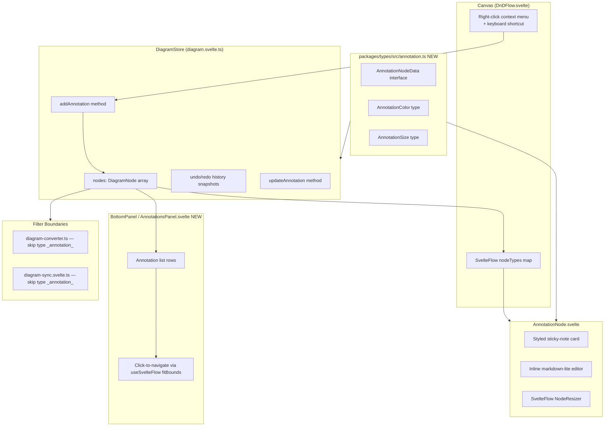

# Diagram Annotations Specification

**Spec ID**: SPEC-002
**Status**: Draft
**Created**: 2026-03-07
**PRD Source**: Inline feature description — sticky notes / text annotations on the canvas
**Author**: AI Spec Writer

## 1. Overview

Diagram Annotations adds a "sticky note" node type to the TerraStudio canvas. Users can place freeform text notes alongside infrastructure resources to capture architecture decision records, TODO items, reviewer comments, team explanations, and anything else that belongs on the diagram but has no Terraform output.

Annotations are first-class canvas nodes stored in the project file and fully integrated into undo/redo, copy/paste, PNG/SVG export, and project save/load. They are explicitly excluded from HCL generation, Terraform operations, documentation export, and MCP diagram sync. They carry a special node type `_annotation_` so every filter boundary in the codebase can identify and skip them with the same prefix check pattern already used for `_mod_`, `_modinst_`, and `_instmem_` nodes.

The feature also introduces a tabbed bottom panel as a host for an Annotations list view, building on the design already sketched in `docs/specs/bottom-panel-system.md`. The list gives a birds-eye view of all annotations, with click-to-navigate, and serves as a future anchor point for the full bottom panel system.

## 2. Goals & Non-Goals

### Goals

- Add an `AnnotationNode` Svelte component rendered as a styled sticky-note card with a colored header bar and semi-transparent background
- Support creating annotations via right-click context menu ("Add Annotation") and via `Ctrl+Shift+A` keyboard shortcut
- Support text content with markdown-lite formatting (bold `**text**`, italic `_text_`, unordered lists `- item`)
- Support 8 preset color themes (yellow, blue, green, red, purple, orange, teal, grey)
- Support 3 size presets (small 200×160, medium 280×220, large 380×280) and free resize via Svelte Flow resize handles
- Double-click to enter inline edit mode; click outside (or `Escape`) to commit
- Z-index ordering: annotations render behind resource nodes by default
- Annotations list panel tab in the bottom panel, showing truncated preview text and color swatch, clicking navigates the viewport to that annotation
- Persist annotations in the project's `diagrams/main.json` alongside resource nodes
- Include annotations in PNG/SVG export (they live on the canvas viewport, no extra work)
- Filter annotations from: HCL generation, diagram-to-resource-instance conversion, documentation export, and MCP diagram sync
- Full undo/redo support via the existing `DiagramStore` snapshot mechanism
- Copy/paste support using the existing `copyNodes` / `pasteNodes` mechanism

### Non-Goals

- Rich text / WYSIWYG editor (markdown-lite only; no tables, headings, code blocks)
- Anchoring/attaching annotations to specific resource nodes (floating-only in v1)
- Annotations as connection endpoints (no handles; annotations cannot be edge sources or targets)
- Collaborative real-time annotation (out of scope)
- Annotation export in the documentation Markdown generator (excluded by design)
- Per-annotation font size controls (size preset controls card dimensions, not font size)

## 3. Background & Context

### Existing filtering pattern

The codebase already maintains a synthetic node prefix convention. Nodes whose IDs begin with `_mod_`, `_modinst_`, or `_instmem_` are filtered at every boundary:

| Boundary | File |
|---|---|
| HCL resource conversion | `apps/desktop/src/lib/services/diagram-converter.ts` line 23 |
| Project save (serialization) | `apps/desktop/src/lib/services/project-service.ts` line 231 (only `_instmem_` filtered; `_mod_`/`_modinst_` are kept) |
| MCP diagram sync | `apps/desktop/src/lib/mcp/diagram-sync.svelte.ts` line 40 |
| Canvas node rendering | `apps/desktop/src/lib/components/DnDFlow.svelte` `findContainerAtPosition` line 421 |

Annotations follow this convention by using the type string `_annotation_` as their Svelte Flow `node.type`. Filtering is done by checking `node.type === '_annotation_'` (or `node.data?.typeId === '_annotation_'`) rather than by node ID prefix, because annotation node IDs use a plain `annotation-{timestamp}-{random}` format (they need globally unique IDs but don't need to be filtered by ID prefix — they're always identifiable by type).

### Bottom panel

`docs/specs/bottom-panel-system.md` describes a planned multi-tab bottom panel replacing the current single-purpose `TerminalPanel`. This spec assumes that design will be implemented (or implemented as part of this feature). The Annotations tab is one of the planned tabs. If the full bottom panel refactor is not yet in place, the Annotations panel can launch as a standalone collapsible panel directly below the canvas, with the tab bar added later.

### Node type registration

`buildNodeTypes()` in `apps/desktop/src/lib/bootstrap.ts` builds the Svelte Flow `nodeTypes` map from all plugin-registered resource types. The `AnnotationNode` component is not a plugin resource, so it is registered directly in `buildNodeTypes()` alongside `ModuleNode` and `ModuleInstanceNode`:

```typescript
map['_annotation_'] = AnnotationNode;
```

### Undo/redo and copy/paste

`DiagramStore.addNode()` and `DiagramStore.removeNode()` already handle the full undo/redo lifecycle. Annotation creation and deletion go through these same methods. The existing `copyNodes` / `pasteNodes` mechanism operates on `DiagramNode[]` without inspecting node type, so annotations copy/paste for free.

## 4. Detailed Design

### 4.1 Architecture



### 4.2 Data Models / Interfaces

#### New file: `packages/types/src/annotation.ts`

```typescript
/**
 * Preset color themes for annotation nodes.
 * Each value maps to a CSS class applied to the card.
 */
export type AnnotationColor =
  | 'yellow'
  | 'blue'
  | 'green'
  | 'red'
  | 'purple'
  | 'orange'
  | 'teal'
  | 'grey';

/**
 * Logical size presets. The actual pixel dimensions are defined in AnnotationNode.svelte.
 * Users can override dimensions by dragging the resize handles; the preset is only
 * applied on creation and via the "Reset size" action.
 */
export type AnnotationSize = 'small' | 'medium' | 'large';

/**
 * Data payload stored in DiagramNode.data for annotation nodes.
 * Node type is always '_annotation_'; this is NOT a ResourceNodeData — it has
 * its own interface to avoid the ResourceNodeData overhead (typeId, terraformName, etc.).
 */
export interface AnnotationNodeData {
  /** Discriminator — always '_annotation_' to match node.type */
  readonly kind: '_annotation_';
  /** Markdown-lite text content */
  text: string;
  /** Color theme preset */
  color: AnnotationColor;
  /** Size preset — reflects intended dimensions but may differ from actual if resized */
  size: AnnotationSize;
  /**
   * User-assigned label shown in the Annotations list panel.
   * If empty, the list shows the first line of `text`.
   */
  label?: string;
}

/** Default dimensions per size preset (width x height in pixels) */
export const ANNOTATION_SIZE_DEFAULTS: Record<AnnotationSize, { width: number; height: number }> = {
  small:  { width: 200, height: 160 },
  medium: { width: 280, height: 220 },
  large:  { width: 380, height: 280 },
};

/** CSS custom property values for each color theme (header bg, body bg, border color) */
export const ANNOTATION_COLOR_THEMES: Record<
  AnnotationColor,
  { header: string; body: string; border: string; text: string }
> = {
  yellow: { header: '#f5c842', body: 'rgba(255, 245, 180, 0.88)', border: '#d4a800', text: '#3d2e00' },
  blue:   { header: '#4a9eff', body: 'rgba(210, 235, 255, 0.88)', border: '#1a6fcc', text: '#0a2a50' },
  green:  { header: '#4caf6e', body: 'rgba(210, 245, 220, 0.88)', border: '#2e7d4f', text: '#0e3020' },
  red:    { header: '#e05555', body: 'rgba(255, 220, 220, 0.88)', border: '#b83030', text: '#3d0a0a' },
  purple: { header: '#9b59b6', body: 'rgba(235, 215, 255, 0.88)', border: '#6c3483', text: '#2a0a40' },
  orange: { header: '#f39c12', body: 'rgba(255, 235, 200, 0.88)', border: '#b5740a', text: '#3d2000' },
  teal:   { header: '#26a69a', body: 'rgba(200, 245, 240, 0.88)', border: '#00796b', text: '#00332e' },
  grey:   { header: '#78909c', body: 'rgba(230, 235, 238, 0.88)', border: '#546e7a', text: '#1c2a30' },
};
```

#### Update: `packages/types/src/index.ts`

Add export:
```typescript
export type { AnnotationNodeData, AnnotationColor, AnnotationSize } from './annotation.js';
export { ANNOTATION_SIZE_DEFAULTS, ANNOTATION_COLOR_THEMES } from './annotation.js';
```

#### `DiagramNode` compatibility

`DiagramNode` is `Node<ResourceNodeData>` from `@xyflow/svelte`. The `data` field is typed as `ResourceNodeData`, but `ResourceNodeData` uses an index signature (`[key: string]: unknown`) meaning `AnnotationNodeData` is structurally assignable. In practice, annotation nodes have `data.kind === '_annotation_'` as a runtime discriminator and `node.type === '_annotation_'` at the Svelte Flow level.

For type-safe access, define a helper type alias in `diagram.svelte.ts`:

```typescript
import type { Node } from '@xyflow/svelte';
import type { AnnotationNodeData } from '@terrastudio/types';

export type AnnotationNode = Node<AnnotationNodeData & Record<string, unknown>>;
```

To distinguish at runtime:
```typescript
function isAnnotation(node: DiagramNode): boolean {
  return node.type === '_annotation_';
}
```

### 4.3 Component Breakdown

#### `apps/desktop/src/lib/components/AnnotationNode.svelte` — NEW

The Svelte Flow node component for annotation nodes. Receives standard `NodeProps` from Svelte Flow.

Responsibilities:
- Render colored header bar (8px height, full width, background from `ANNOTATION_COLOR_THEMES[color].header`)
- Render semi-transparent body area with markdown-lite rendered content
- Toggle between **view mode** (rendered markdown) and **edit mode** (plain textarea) on double-click
- Commit on click-outside (using Svelte's `use:clickOutside` action or `onblur` on the textarea) or `Escape` key press
- Render a `NodeResizer` from `@xyflow/svelte` with min constraints (120×100)
- Render a color picker toolbar and size reset button visible only when the node is `selected`
- Call `useUpdateNodeInternals()` after resize (matches the pattern in `DefaultResourceNode.svelte`)
- Annotation nodes have no handles (no source/target connection points)
- Apply `zIndex: 0` so annotations render behind resource nodes (default Svelte Flow node zIndex is 0; resource nodes will be left at default, but annotation nodes explicitly set a lower stacking position — see section 4.3 Z-ordering note)

Props interface:
```typescript
// Standard Svelte Flow NodeProps — data field is AnnotationNodeData
let { data, id, selected }: { data: AnnotationNodeData; id: string; selected?: boolean } = $props();
```

Markdown-lite rendering: implement a pure function `renderMarkdownLite(text: string): string` in a co-located `markdown-lite.ts` module. Supported syntax:
- `**text**` → `<strong>text</strong>`
- `_text_` → `<em>text</em>`
- Lines starting with `- ` → wrapped in `<ul><li>...</li></ul>`
- Newlines → `<br>` (outside list items)
- No HTML pass-through (sanitize by escaping `<` and `>` before processing)

Edit mode: a `<textarea>` fills the body area, bound to a local `draftText` variable. On commit, call `diagram.updateAnnotation(id, { text: draftText })`.

Color picker: renders 8 color swatches in a small floating toolbar anchored below the header. Clicking a swatch calls `diagram.updateAnnotation(id, { color: swatchColor })`.

**Z-ordering note**: Svelte Flow assigns `zIndex` to nodes via a CSS variable `--xy-node-z-index`. Resource nodes do not currently set an explicit `zIndex`. Annotation nodes set `zIndex: 0` in their node data at creation time (stored in the Svelte Flow `Node` wrapper, not in `data`). Since resource nodes render at Svelte Flow's default (which is also 0 but ordered by DOM position), place annotation nodes at the front of the `nodes` array during creation — Svelte Flow renders later array entries on top. This is the simplest z-ordering approach with zero API changes.

Alternatively, annotate the node with `{ ..., zIndex: -1 }` at the Svelte Flow node level so it always renders beneath. Either approach is acceptable; the implementation should document which is chosen.

#### `apps/desktop/src/lib/components/AnnotationsPanel.svelte` — NEW

The bottom panel tab content for the annotations list.

Responsibilities:
- Derive the list of annotation nodes from `diagram.nodes.filter(n => n.type === '_annotation_')`, sorted by creation order (array order)
- For each annotation, render: color swatch dot, label (or first line of text), truncated preview (max 60 chars), timestamp is not shown (not stored)
- "Add Annotation" button at top of panel — creates a new annotation at viewport center
- Clicking a row: call `fitBounds` (from `useSvelteFlow()`) on the annotation node's bounds to navigate the viewport to it, then set `diagram.selectedNodeId` to that annotation's ID
- Empty state: "No annotations yet. Right-click the canvas or press Ctrl+Shift+A to add one."
- Each row has a delete button (trash icon) that calls `diagram.removeNode(id)`

Note: `AnnotationsPanel` must be inside the `SvelteFlowProvider` context to access `useSvelteFlow()`. Since `EditorArea.svelte` wraps everything under `SvelteFlowProvider` via `Canvas.svelte`, the bottom panel (rendered inside `EditorArea`) has access to the flow context.

#### `apps/desktop/src/lib/components/AnnotationNode.svelte` — Inline toolbar

When the annotation node is selected, render a compact inline toolbar overlaid above the card:
- 8 color swatch buttons (circle, 14×14px)
- Size buttons: S / M / L
- Delete button (trash icon)

This toolbar uses `position: absolute; top: -36px; left: 0` so it floats above the node without disturbing Svelte Flow layout.

### 4.4 API / Contract Changes

#### `DiagramStore` additions (`apps/desktop/src/lib/stores/diagram.svelte.ts`)

```typescript
import type { AnnotationNodeData, AnnotationColor, AnnotationSize, ANNOTATION_SIZE_DEFAULTS } from '@terrastudio/types';

/**
 * Create and add an annotation node at the given canvas position.
 * Inserts at index 0 so it renders behind resource nodes.
 */
addAnnotation(
  position: { x: number; y: number },
  options?: { color?: AnnotationColor; size?: AnnotationSize; text?: string }
): string; // returns new node ID

/**
 * Update annotation data fields. Merges partial data into existing annotation.
 * Uses the debounced snapshot path (same as updateNodeData) to coalesce typing.
 */
updateAnnotation(id: string, patch: Partial<Omit<AnnotationNodeData, 'kind'>>): void;
```

`addAnnotation` implementation:
1. Determine `color` (default `'yellow'`) and `size` (default `'medium'`)
2. Look up dimensions from `ANNOTATION_SIZE_DEFAULTS[size]`
3. Build a `DiagramNode` with `type: '_annotation_'`, `zIndex: -1`, and `data: { kind: '_annotation_', text: '', color, size }`
4. Generate node ID: `annotation-${Date.now()}-${Math.random().toString(36).slice(2, 8)}`
5. Call `this.nodes = [node, ...this.nodes]` (prepend so it renders behind)
6. Call `pushSnapshot()`
7. Return the node ID so the caller can immediately set `selectedNodeId` and trigger edit mode

`updateAnnotation` implementation: same as `updateNodeData` but typed to `AnnotationNodeData` patch. Can delegate to `updateNodeData` after casting.

#### `buildNodeTypes()` addition (`apps/desktop/src/lib/bootstrap.ts`)

```typescript
import AnnotationNode from '$lib/components/AnnotationNode.svelte';

// Inside buildNodeTypes():
map['_annotation_'] = AnnotationNode;
```

#### Filter additions

**`apps/desktop/src/lib/services/diagram-converter.ts`** — `convertToResourceInstances` already skips `_mod_`, `_modinst_`, `_instmem_` prefixes on line 23. Add annotation type check:

```typescript
// Existing line 23:
if (node.id.startsWith('_mod_') || node.id.startsWith('_modinst_') || node.id.startsWith('_instmem_')) continue;
// Add after:
if (node.type === '_annotation_') continue;
```

**`apps/desktop/src/lib/mcp/diagram-sync.svelte.ts`** — Add to the node filter on line 40:

```typescript
const nodes = diagram.nodes.filter((n) => !n.id.startsWith('_instmem_') && n.type !== '_annotation_');
```

**`apps/desktop/src/lib/services/export-service.ts` (documentation export)** — The documentation generator (if it iterates `diagram.nodes`) should skip annotation nodes. Check whether `@terrastudio/core` has a doc generator; if so, the `convertToResourceInstances` filter already covers it since docs are generated from `ResourceInstance[]`. No additional change needed as long as the doc generator feeds through `convertToResourceInstances`.

#### Keyboard shortcut addition (`apps/desktop/src/lib/components/Canvas.svelte`)

```typescript
// Inside the svelte:window onkeydown handler:
if ((event.ctrlKey || event.metaKey) && event.shiftKey && event.key === 'A') {
  event.preventDefault();
  const center = ui.fitView ? diagram.getViewportCenter() : { x: 100, y: 100 };
  const id = diagram.addAnnotation(center);
  diagram.selectedNodeId = id;
  return;
}
```

`diagram.getViewportCenter()` needs to be added — or alternatively, the shortcut handler uses `useSvelteFlow().screenToFlowPosition({ x: window.innerWidth / 2, y: window.innerHeight / 2 })`. Since `Canvas.svelte` does not have direct access to `useSvelteFlow()` (that lives inside `DnDFlow.svelte`), expose a `ui.flowCenter` getter set by `DnDFlow.svelte` alongside `ui.fitView`, or pass the creation position as `{ x: 0, y: 0 }` and let the user move it.

The simpler implementation: create the annotation at `{ x: 50, y: 50 }` offset from viewport origin (acceptable for v1). The keyboard shortcut can be wired inside `DnDFlow.svelte` instead of `Canvas.svelte` since `DnDFlow` has `useSvelteFlow()` context.

#### Context menu addition (`apps/desktop/src/lib/components/DnDFlow.svelte`)

In the context menu markup (the section that renders on canvas right-click when `!contextMenu.nodeId && !contextMenu.edgeId`), add:

```svelte
<button onclick={handleAddAnnotation}>Add Annotation</button>
```

```typescript
function handleAddAnnotation() {
  if (!contextMenu) return;
  const flowPos = screenToFlowPosition({ x: contextMenu.x, y: contextMenu.y });
  const id = diagram.addAnnotation(flowPos);
  diagram.selectedNodeId = id;
  closeContextMenu();
}
```

## 5. Implementation Plan

### 5.1 Phases

**Phase 1 — Core type and node component** (can be developed independently)

Deliverables: annotation renders on canvas, can be created, moved, resized, deleted.

1. Create `packages/types/src/annotation.ts` with `AnnotationNodeData`, `AnnotationColor`, `AnnotationSize`, `ANNOTATION_SIZE_DEFAULTS`, `ANNOTATION_COLOR_THEMES`
2. Export from `packages/types/src/index.ts`
3. Add `addAnnotation()` and `updateAnnotation()` to `DiagramStore`
4. Add `AnnotationNode.svelte` with view/edit modes, color themes, resize handles, inline toolbar
5. Register `'_annotation_'` in `buildNodeTypes()` in `bootstrap.ts`
6. Wire context menu "Add Annotation" in `DnDFlow.svelte`
7. Wire `Ctrl+Shift+A` keyboard shortcut in `DnDFlow.svelte`

**Phase 2 — Filter boundaries**

Deliverables: annotations are invisible to HCL pipeline, Terraform ops, and MCP sync.

1. Add `node.type === '_annotation_'` guard in `diagram-converter.ts` (`convertToResourceInstances`)
2. Add `n.type !== '_annotation_'` to MCP sync filter in `diagram-sync.svelte.ts`
3. Add annotation skip to any other node iterator that feeds Terraform/doc generation (audit `terraform-service.ts`)

**Phase 3 — Persistence**

Deliverables: annotations survive save/load.

1. Verify `saveDiagram()` in `project-service.ts` — annotations are regular `DiagramNode` entries, so they are saved automatically in `diagramData.nodes`. Confirm no existing filter accidentally strips them. The only save-time filter is `!n.id.startsWith('_instmem_')`, which annotations pass.
2. Verify `loadProjectByPath()` correctly deserializes annotation nodes — they have no schema in the plugin registry, so any code that calls `registry.getResourceSchema(node.type)` must not crash on `null` return. Audit `diagram-sync.svelte.ts` and `DnDFlow.svelte` `findContainerAtPosition`.
3. Add `node.type === '_annotation_'` guard in `findContainerAtPosition` in `DnDFlow.svelte` (skip annotation nodes as potential drop targets)
4. Add `node.type === '_annotation_'` guard in `referenceEdges` derived in `diagram.svelte.ts` (skip schema lookup for annotation nodes)

**Phase 4 — Annotations panel**

Deliverables: bottom panel Annotations tab with list view and navigation.

1. Implement the bottom panel infrastructure from `docs/specs/bottom-panel-system.md` (or a minimal version: add an "Annotations" collapsible panel to `TerminalPanel.svelte`)
2. Create `AnnotationsPanel.svelte` with list, empty state, add button, delete button, click-to-navigate
3. Wire `ui.openBottomPanel('annotations')` call from context menu "Add Annotation" action after node creation
4. Add keyboard shortcut `Ctrl+Shift+A` documentation to `ShortcutsModal.svelte`

### 5.2 File Changes

**Create (new files):**

| File | Purpose |
|---|---|
| `packages/types/src/annotation.ts` | `AnnotationNodeData`, color/size types and constants |
| `apps/desktop/src/lib/components/AnnotationNode.svelte` | Canvas node component |
| `apps/desktop/src/lib/components/AnnotationsPanel.svelte` | Bottom panel list tab |
| `apps/desktop/src/lib/components/markdown-lite.ts` | Pure text-to-HTML renderer |

**Modify (existing files):**

| File | Change |
|---|---|
| `packages/types/src/index.ts` | Export annotation types and constants |
| `apps/desktop/src/lib/stores/diagram.svelte.ts` | Add `addAnnotation()`, `updateAnnotation()`, guard `referenceEdges` derived |
| `apps/desktop/src/lib/bootstrap.ts` | Register `'_annotation_'` → `AnnotationNode` in `buildNodeTypes()` |
| `apps/desktop/src/lib/components/DnDFlow.svelte` | Add context menu item, keyboard shortcut, guard `findContainerAtPosition` |
| `apps/desktop/src/lib/services/diagram-converter.ts` | Skip `node.type === '_annotation_'` in `convertToResourceInstances` |
| `apps/desktop/src/lib/mcp/diagram-sync.svelte.ts` | Skip annotation nodes in sync filter |
| `apps/desktop/src/lib/components/Canvas.svelte` | Add `Ctrl+Shift+A` to keyboard shortcut handler (or move to DnDFlow — see section 4.4) |
| `apps/desktop/src/lib/components/ShortcutsModal.svelte` | Document new shortcut |
| `apps/desktop/src/lib/components/TerminalPanel.svelte` | Extend into bottom panel with Annotations tab (or create `BottomPanel.svelte`) |
| `apps/desktop/src/lib/components/EditorArea.svelte` | Replace `TerminalPanel` with `BottomPanel` if refactored |

### 5.3 Dependencies

No new npm packages required. All rendering uses:
- `@xyflow/svelte` — `NodeResizer`, `useUpdateNodeInternals`, `useSvelteFlow` (already installed)
- Tailwind CSS 4 — styling (already installed)
- `@terrastudio/types` — annotation interfaces (new file in existing package)

## 6. Edge Cases & Error Handling

**Schema lookup on annotation nodes**: Several places call `registry.getResourceSchema(node.type as ResourceTypeId)` and may receive `undefined`. Existing code already handles `undefined` returns with optional chaining (`schema?.handles`, `schema?.isContainer`). No crashes expected, but the `referenceEdges` derived in `diagram.svelte.ts` iterates all nodes and calls `getResourceSchema` — it must skip annotation nodes to avoid a schema lookup returning `null` and polluting the derived result. Guard:

```typescript
for (const node of this.nodes) {
  if (node.type === '_annotation_') continue; // no schema, no reference edges
  const schema = registry.getResourceSchema(node.type as ResourceTypeId);
  // ...
}
```

**Copy/paste of annotations**: `copyNodes` / `pasteNodes` operate on `DiagramNode[]` without type inspection. Pasted annotations get new IDs and positions (standard paste offset). `pasteNodes` must not call `createNodeData` on annotation nodes — verify that `pasteNodes` in `diagram.svelte.ts` copies `node.data` as-is (it should, since it clones the node object). If `pasteNodes` calls any schema-dependent logic, add an annotation guard.

**Delete key on selected annotation**: The existing `Delete`/`Backspace` handler in `Canvas.svelte` calls `diagram.confirmAndRemoveSelectedNodes()` or `diagram.confirmAndRemoveNode()`. Annotations should delete without a confirmation dialog (they have no Terraform impact). The confirmation dialog is triggered by `confirmAndRemoveNode` — which shows a dialog for resource nodes. Either: (a) bypass the confirm for annotation nodes in `confirmAndRemoveNode`, or (b) call `diagram.removeNode(id)` directly from the annotation's delete button and the `Delete` key handler when only annotations are selected. Option (a) is cleaner:

```typescript
confirmAndRemoveNode(id: string) {
  const node = this.nodes.find(n => n.id === id);
  if (node?.type === '_annotation_') {
    this.removeNode(id); // no dialog needed
    return;
  }
  // existing confirm dialog logic
}
```

**Resize below minimum**: `NodeResizer` accepts `minWidth` and `minHeight` props. Set `minWidth={120}` `minHeight={80}` to prevent collapsing.

**Empty text annotation**: An annotation with no text is valid (the user may intend to type later). Show a placeholder text "Click to edit..." in view mode when `text` is empty.

**Annotation dragged into a container node**: Container nodes (Resource Group, VNet) accept children via `parentId`. Annotation nodes must not be reparented into containers. Guard in `DnDFlow.svelte`'s `onNodeDragStop` handler — if the dropped node is an annotation, skip the container assignment logic.

**MCP tool operations**: MCP tools that list or modify diagram nodes (e.g., `add_resource`, `list_resources`) should not see annotation nodes. The `diagram-sync.svelte.ts` filter already handles sync; Rust-side MCP tool implementations that read `diagram.nodes` from the store snapshot must also receive the filtered list. Verify that `mcp_get_diagram` (or equivalent) in the Rust MCP server reads from the filtered snapshot, not the raw store.

**Project load with legacy data**: Projects saved before this feature have no annotation nodes; this is a no-op. Projects saved after this feature and loaded in an older version will encounter unknown `type: '_annotation_'` nodes — Svelte Flow will log a warning but render a fallback empty node. This is acceptable for forward-compatibility.

## 7. Testing Strategy

### Unit tests

- `markdown-lite.ts`: test bold, italic, list, newline rendering; test HTML injection is escaped
- `annotation.ts`: sanity-check that `ANNOTATION_SIZE_DEFAULTS` has all 3 size keys and `ANNOTATION_COLOR_THEMES` has all 8 color keys
- `diagram-converter.ts`: add a test case with a mixed nodes array (resource + annotation) and assert annotation nodes are not in the returned `ResourceInstance[]`

### Component tests (Svelte Testing Library or Playwright component tests)

- `AnnotationNode.svelte` view mode: renders text content, applies correct color theme CSS variables
- `AnnotationNode.svelte` edit mode: double-click enters textarea, Escape commits, click-outside commits
- `AnnotationNode.svelte` inline toolbar: visible when selected, color change updates data via `diagram.updateAnnotation`

### Integration / manual tests

| Scenario | Expected |
|---|---|
| Right-click canvas → Add Annotation | Annotation node appears at cursor position, immediately in edit mode |
| `Ctrl+Shift+A` | Annotation appears at viewport center in edit mode |
| Type text, click outside | Text persists, view mode renders markdown-lite |
| Resize annotation | Node dimensions change, Svelte Flow re-measures, content reflows |
| Select annotation → change color | Header color updates immediately |
| Delete key on selected annotation | Annotation removed, no confirmation dialog |
| Copy annotation (`Ctrl+C`) + Paste (`Ctrl+V`) | Duplicate annotation at offset position |
| Save project + reload | Annotation survives serialization; text, color, size, position preserved |
| Run `terraform plan` with annotations on canvas | Plan succeeds; annotation is not included in generated HCL |
| Export PNG | Annotation appears in exported image |
| Annotations panel: click row | Viewport navigates to annotation, node is selected |
| Annotations panel: delete button | Annotation removed from canvas and list |
| Drop annotation onto Resource Group container | Annotation does not become a child of the container |

## 8. Security & Performance Considerations

**XSS in markdown-lite rendering**: The `renderMarkdownLite` function must HTML-escape raw text before applying markdown substitutions. Never use `innerHTML` with unescaped user content. The rendering pipeline is: `text → escapeHtml(text) → apply markdown substitutions → set innerHTML`. This eliminates XSS risk since the input is user-authored notes, not untrusted external content, but defense-in-depth is still correct practice.

**Performance — large annotation counts**: Annotations are regular Svelte Flow nodes. Svelte Flow already virtualizes the canvas viewport; off-screen nodes are not re-rendered. The Annotations panel list is a simple `$derived` filter over `diagram.nodes` — O(n) where n is total node count. For typical diagrams (< 200 nodes), this is negligible.

**Snapshot size**: Each annotation adds a small object to each undo/redo history snapshot. `MAX_HISTORY = 50` snapshots × (annotation nodes + resource nodes) is not a concern at typical diagram sizes.

**Markdown rendering on every keystroke in edit mode**: In edit mode, the textarea drives `draftText` (local reactive state). The markdown preview is only re-rendered on commit (exit edit mode), not on every keystroke. No performance issue.

## 9. Open Questions

1. **Bottom panel refactor timing**: Should the Annotations list panel block on the full bottom panel system refactor (from `docs/specs/bottom-panel-system.md`), or ship as a minimal collapsible section appended to the current `TerminalPanel`? The full bottom panel is the correct long-term design, but it may be out of scope for the initial annotation feature release.

2. **Z-ordering approach**: Section 4.3 proposes two approaches for rendering annotations behind resource nodes — array prepend vs. explicit `zIndex: -1` on the Svelte Flow node wrapper. Svelte Flow's behavior with `zIndex: -1` and selected node elevation needs verification against the current `@xyflow/svelte` version. Confirm which approach works correctly before implementation.

3. **Annotation node ID format**: The proposed format `annotation-{timestamp}-{random}` does not use the synthetic `_prefix_` convention. This is intentional (annotations are not synthetic nodes; they are first-class persisted content). However, it means filtering must use `node.type === '_annotation_'` rather than an ID prefix check. The implementation should confirm this is consistently applied at all filter sites and not accidentally missed.

4. **Confirmation dialog for annotation deletion**: Section 6 proposes skipping the confirmation dialog for annotation-only deletions. If `confirmAndRemoveSelectedNodes` handles mixed selections (resources + annotations), it should still show the confirmation for the resource portion while silently deleting annotations. The exact UX for mixed-selection delete needs a decision.

5. **Annotation visibility toggle**: Should annotations be toggleable (show/hide all) via the edge category visibility toggle area or a dedicated canvas toolbar toggle? Not included in this spec but may be requested post-launch.

## 10. References

- `apps/desktop/src/lib/stores/diagram.svelte.ts` — DiagramStore, `addNode`, `updateNodeData`, undo/redo
- `apps/desktop/src/lib/services/diagram-converter.ts` — `convertToResourceInstances`, existing synthetic node filter (line 23)
- `apps/desktop/src/lib/services/project-service.ts` — `saveDiagram`, `loadProjectByPath`, serialization filters (line 231)
- `apps/desktop/src/lib/mcp/diagram-sync.svelte.ts` — MCP node sync filter (line 40)
- `apps/desktop/src/lib/bootstrap.ts` — `buildNodeTypes()`, node type registration pattern
- `apps/desktop/src/lib/components/DnDFlow.svelte` — context menu, `findContainerAtPosition`, `onNodeDragStop`
- `apps/desktop/src/lib/components/DefaultResourceNode.svelte` — `useUpdateNodeInternals` pattern, inline toolbar reference
- `apps/desktop/src/lib/components/Canvas.svelte` — keyboard shortcut handler pattern
- `packages/types/src/node.ts` — `ResourceNodeData` index signature (structural compatibility with `AnnotationNodeData`)
- `packages/types/src/module.ts` — `ModuleDefinition` / `ModuleInstance` pattern (comparable first-class canvas object)
- `docs/specs/bottom-panel-system.md` — planned bottom panel with Annotations tab
- `@xyflow/svelte` docs — `NodeResizer`, `useSvelteFlow`, `getNodesBounds`, `fitBounds`
