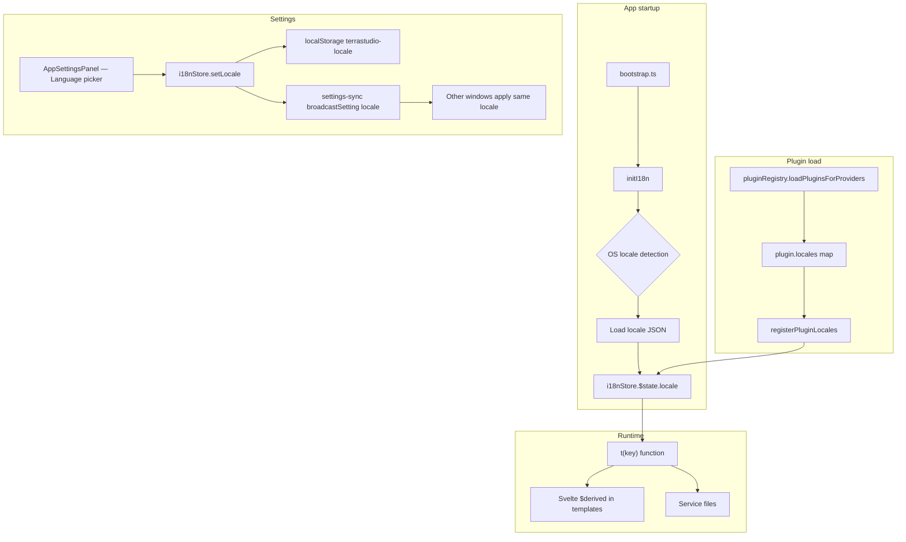

# Localization / i18n Specification

**Spec ID**: SPEC-005
**Status**: Draft
**Created**: 2026-03-07
**PRD Source**: Product requirement — "Internationalization (i18n) support for TerraStudio"
**Author**: AI Spec Writer

---

## 1. Overview

TerraStudio currently has all UI strings, resource schema labels, menu items, dialog text, and status messages hardcoded in English across Svelte components, TypeScript service files, and plugin schema definitions. This specification defines a complete internationalization (i18n) architecture that allows the application to be translated into multiple languages without code changes.

The approach centers on a lightweight, **Svelte-native translation store** — backed by flat JSON locale files — that integrates with Svelte 5's `$state` / `$derived` reactivity. Translations are loaded lazily per-locale at runtime, and language changes apply immediately without an app restart. Plugins contribute their own locale bundles through a registration API that merges into the shared translation namespace at plugin-load time.

The initial release targets six locales: English (`en`), Spanish (`es`), French (`fr`), German (`de`), Japanese (`ja`), and Chinese Simplified (`zh-CN`). English remains the authoritative source of truth and the fallback for any missing key in other locales.

---

## 2. Goals & Non-Goals

### Goals

- Translate all user-visible strings: menu items, toolbar buttons, modal dialogs, sidebar labels, status bar messages, validation error messages, cost panel labels, settings panel labels, palette category names, and resource `displayName` / `description` / property `label` / `description` / `placeholder` fields.
- Provide a reactive `t(key)` translation function usable in Svelte templates and TypeScript service files without boilerplate.
- Support language detection from the OS locale (via Tauri's `tauri-plugin-os` or `navigator.language`) with a user override stored in `localStorage`.
- Hot-swap language without restarting the app — all `$derived` expressions that call `t()` recompute automatically.
- Allow plugins to register their own locale bundles using a typed `registerPluginLocales()` API.
- Fall back to English for any key missing in the active locale.
- Expose a language picker dropdown in `AppSettingsPanel.svelte`.
- Use the `Intl` API for locale-aware date, number, and currency formatting throughout the cost panel and status bar.
- Define a clear contributor workflow and translation file conventions so community translators can add new locales with zero TypeScript changes.

### Non-Goals

- RTL layout support (Arabic, Hebrew). The design must not structurally block it, but no RTL CSS or layout changes are included in this spec.
- Translating Terraform keywords, resource type IDs (`ResourceTypeId`), HCL output, or generated Terraform code — these must remain in English as Terraform requires them.
- Translating the documentation generator's Markdown output (architecture docs) — a future concern.
- Server-side rendering or SSR-compatible i18n (the app runs as a Tauri SPA).
- Plural rules beyond simple count-based interpolation (complex CLDR plural categories can be added in a later iteration).
- Translation management platform integration (Crowdin, Transifex, etc.) — out of scope for the initial implementation.
- Translating template names and descriptions defined in `apps/desktop/src/lib/templates/builtin/`.

---

## 3. Background & Context

### Current state

All strings are hardcoded throughout the codebase:

- **Svelte components** (`MenuBar.svelte`, `AppSettingsPanel.svelte`, `WelcomeScreen.svelte`, `StatusBar.svelte`, ~50 components) contain literal English strings in template markup.
- **Plugin schemas** (`packages/plugin-azure-*/src/resources/*/schema.ts`, `packages/plugin-aws-*/`) define `displayName`, `description`, `properties[].label`, `properties[].description`, `properties[].placeholder`, and `outputs[].label` as English string literals baked into the TypeScript source.
- **Service files** (`terraform-service.ts`, `project-service.ts`, `export-service.ts`) produce English error and status strings passed to the UI.
- **Status bar** (`StatusBar.svelte`) contains a `switch` over `terraform.status` that emits hardcoded English phrases like `'Generating HCL...'`.
- **Settings persistence** uses `localStorage` keys like `terrastudio-theme`, and `settings-sync.ts` already handles cross-window broadcasting for settings — this pattern will be reused for language preference.

### Why now

TerraStudio is approaching a GA release cycle. Adding i18n post-GA with hardcoded strings scattered across the codebase becomes exponentially harder as the component count grows. Laying the infrastructure now ensures all new components and schemas are authored against the translation API from the start.

### Library evaluation

| Option | Pros | Cons | Verdict |
|---|---|---|---|
| **`svelte-i18n`** | Svelte-first, store-based, handles plurals, widely adopted | Adds ~14 kB runtime, Svelte 4 stores (writable), requires adapter for Svelte 5 runes | Viable but carries legacy store API |
| **`typesafe-i18n`** | Full TypeScript type safety, code-gen for key exhaustiveness, tiny runtime | Code-gen step complicates CI, generated types don't play well with dynamic plugin keys | Poor fit — plugin keys are dynamic, not statically known |
| **Custom lightweight store** | Zero dependencies added, pure Svelte 5 runes, full control over plugin key merging and fallback logic, fits monorepo patterns | We own the maintenance | **Selected** |

The custom store is ~120 lines of TypeScript. It is not a significant maintenance burden and avoids the Svelte 4 store interop friction that `svelte-i18n` currently has with Svelte 5 runes. `typesafe-i18n`'s code-gen is incompatible with runtime plugin locale registration.

---

## 4. Detailed Design

### 4.1 Architecture



**Key invariant**: `t(key)` is a plain function derived from reactive state. Because it reads from a `$state` variable, any Svelte expression that calls it is automatically invalidated when the locale changes. No explicit subscriptions or reactive declarations are required at the call site.

### 4.2 Data Models / Interfaces

#### 4.2.1 Core i18n types — `packages/types/src/i18n.ts`

```typescript
/**
 * BCP 47 locale tag. Extend the union as new locales are added.
 */
export type LocaleCode =
  | 'en'
  | 'es'
  | 'fr'
  | 'de'
  | 'ja'
  | 'zh-CN';

/**
 * Flat or nested translation dictionary.
 * Keys use dot-notation at access time: "menu.file.save"
 * but the JSON files use nested objects for readability.
 */
export type TranslationDict = Record<string, string | TranslationDict>;

/**
 * A plugin's locale contribution: maps LocaleCode to a flat/nested dict
 * that will be merged under a plugin-specific namespace key.
 */
export interface PluginLocaleBundle {
  /** Namespace prefix, e.g. "plugin.azurerm" — auto-derived from plugin.id */
  readonly namespace: string;
  /** Map of locale code → translations for that namespace */
  readonly locales: Partial<Record<LocaleCode, TranslationDict>>;
}

/**
 * Interpolation variables passed to t() for dynamic string segments.
 * e.g. t('status.running', { command: 'plan' }) → "Running terraform plan..."
 */
export type InterpolationVars = Record<string, string | number>;
```

#### 4.2.2 i18n store — `apps/desktop/src/lib/i18n/store.svelte.ts`

```typescript
import type { LocaleCode, TranslationDict, PluginLocaleBundle, InterpolationVars } from '@terrastudio/types';

class I18nStore {
  locale = $state<LocaleCode>('en');

  /**
   * Merged flat translation table for the active locale.
   * Keys are dot-separated, e.g. "menu.file.save".
   * Rebuilt whenever locale changes or plugin bundles are added.
   */
  private _translations = $state<Record<string, string>>({});

  /** English fallback — always loaded; never evicted */
  private _fallback: Record<string, string> = {};

  /** Accumulated plugin locale bundles (registered at plugin load time) */
  private _pluginBundles: PluginLocaleBundle[] = [];

  /** True once the first locale load completes */
  ready = $state(false);

  /**
   * Initialize: detect locale, load base JSON, apply.
   * Called once from bootstrap.ts.
   */
  async init(): Promise<void> {
    const saved = localStorage.getItem('terrastudio-locale') as LocaleCode | null;
    const detected = this.detectOsLocale();
    const locale: LocaleCode = saved ?? detected ?? 'en';

    await this.loadBaseLocale('en');
    this._fallback = { ...this._translations };

    if (locale !== 'en') {
      await this.loadBaseLocale(locale);
    }

    this.locale = locale;
    this.ready = true;
  }

  /** Set locale, persist, reload translations, broadcast to other windows */
  async setLocale(code: LocaleCode): Promise<void> {
    await this.loadBaseLocale(code);
    this.locale = code;
    localStorage.setItem('terrastudio-locale', code);
    // Cross-window sync handled by settings-sync.ts
    broadcastSetting('locale', code);
  }

  /** Called by pluginRegistry after each plugin loads */
  registerPluginLocales(bundle: PluginLocaleBundle): void {
    this._pluginBundles.push(bundle);
    this.applyPluginBundle(bundle);
  }

  /** Main translation function — reactive because it reads _translations ($state) */
  t(key: string, vars?: InterpolationVars): string {
    const raw = this._translations[key] ?? this._fallback[key] ?? key;
    if (!vars) return raw;
    return raw.replace(/\{(\w+)\}/g, (_, k) => String(vars[k] ?? `{${k}}`));
  }

  /** Locale-aware number formatting */
  formatNumber(value: number, options?: Intl.NumberFormatOptions): string {
    return new Intl.NumberFormat(this.locale, options).format(value);
  }

  /** Locale-aware currency formatting */
  formatCurrency(value: number, currency = 'USD'): string {
    return new Intl.NumberFormat(this.locale, {
      style: 'currency',
      currency,
      maximumFractionDigits: 2,
    }).format(value);
  }

  /** Locale-aware relative time (e.g. "3 days ago") */
  formatRelativeTime(ms: number): string {
    const rtf = new Intl.RelativeTimeFormat(this.locale, { numeric: 'auto' });
    const diff = ms - Date.now();
    const seconds = Math.round(diff / 1000);
    const minutes = Math.round(seconds / 60);
    const hours = Math.round(minutes / 60);
    const days = Math.round(hours / 24);
    if (Math.abs(days) >= 1) return rtf.format(days, 'day');
    if (Math.abs(hours) >= 1) return rtf.format(hours, 'hour');
    if (Math.abs(minutes) >= 1) return rtf.format(minutes, 'minute');
    return rtf.format(seconds, 'second');
  }

  private async loadBaseLocale(code: LocaleCode): Promise<void> {
    const module = await import(`./locales/${code}.json`);
    const flat = flattenDict(module.default as TranslationDict);
    // Merge: plugin bundle keys persist; base keys update
    this._translations = { ...flat, ...this.buildPluginTranslations(code) };
  }

  private applyPluginBundle(bundle: PluginLocaleBundle): void {
    const dict = bundle.locales[this.locale] ?? bundle.locales['en'] ?? {};
    const flat = flattenDict(dict, bundle.namespace);
    this._translations = { ...this._translations, ...flat };
  }

  private buildPluginTranslations(code: LocaleCode): Record<string, string> {
    const result: Record<string, string> = {};
    for (const bundle of this._pluginBundles) {
      const dict = bundle.locales[code] ?? bundle.locales['en'] ?? {};
      Object.assign(result, flattenDict(dict, bundle.namespace));
    }
    return result;
  }

  private detectOsLocale(): LocaleCode | null {
    // navigator.language is available in Tauri WebView
    const lang = navigator.language ?? '';
    const supported: LocaleCode[] = ['en', 'es', 'fr', 'de', 'ja', 'zh-CN'];
    // Exact match first
    if (supported.includes(lang as LocaleCode)) return lang as LocaleCode;
    // Prefix match (e.g. 'en-GB' → 'en', 'zh-TW' → 'zh-CN' falls through to null)
    const prefix = lang.split('-')[0];
    return supported.find((l) => l.startsWith(prefix)) ?? null;
  }
}

/** Flatten nested dict to dot-notation keys with optional prefix */
function flattenDict(
  obj: TranslationDict,
  prefix = '',
  result: Record<string, string> = {},
): Record<string, string> {
  for (const [key, value] of Object.entries(obj)) {
    const fullKey = prefix ? `${prefix}.${key}` : key;
    if (typeof value === 'string') {
      result[fullKey] = value;
    } else {
      flattenDict(value, fullKey, result);
    }
  }
  return result;
}

export const i18n = new I18nStore();

/** Convenience shorthand — import { t } from '$lib/i18n' */
export const t = (key: string, vars?: InterpolationVars) => i18n.t(key, vars);
```

#### 4.2.3 Plugin locale contribution — `packages/types/src/plugin.ts` (addition)

```typescript
// Added to the existing InfraPlugin interface:
export interface InfraPlugin {
  // ... existing fields ...

  /**
   * Optional locale bundles contributed by this plugin.
   * Keys live under the plugin-specific namespace "plugin.{plugin.id}".
   * Resources keys follow: plugin.{id}.resources.{typeId_safe}.{field}
   */
  readonly locales?: Partial<Record<LocaleCode, TranslationDict>>;
}
```

The plugin registry will call `i18n.registerPluginLocales()` when each plugin loads, passing `{ namespace: 'plugin.' + plugin.id, locales: plugin.locales }`.

#### 4.2.4 Locale JSON file structure

`apps/desktop/src/lib/i18n/locales/en.json` (abbreviated):

```json
{
  "app": {
    "name": "TerraStudio"
  },
  "menu": {
    "file": {
      "label": "File",
      "new": "New Project...",
      "open": "Open Project...",
      "save": "Save",
      "close": "Close Project",
      "export": "Export"
    },
    "edit": {
      "label": "Edit",
      "undo": "Undo",
      "redo": "Redo",
      "selectAll": "Select All",
      "delete": "Delete Selected"
    },
    "view": {
      "label": "View",
      "layout": "Auto Layout",
      "minimap": "Minimap",
      "snapToGrid": "Snap to Grid",
      "edgeStyle": "Edge Style"
    },
    "tools": {
      "label": "Tools",
      "terraform": "Terraform",
      "exportDocs": "Export Documentation",
      "exportPng": "Export as PNG",
      "exportSvg": "Export as SVG",
      "copyClipboard": "Copy to Clipboard"
    },
    "help": {
      "label": "Help",
      "shortcuts": "Keyboard Shortcuts",
      "about": "About TerraStudio"
    }
  },
  "status": {
    "ready": "Ready",
    "generatingHcl": "Generating HCL...",
    "writingFiles": "Writing files...",
    "running": "Running terraform {command}...",
    "success": "Success",
    "error": "Error",
    "terraformMissing": "Terraform not found",
    "terraformFound": "Terraform {version}"
  },
  "settings": {
    "title": "Settings",
    "search": "Search settings...",
    "appearance": {
      "label": "Appearance",
      "mode": "Mode",
      "dark": "Dark",
      "light": "Light",
      "colorPalette": "Color Palette",
      "importCustomTheme": "Import custom theme..."
    },
    "canvas": {
      "label": "Canvas",
      "snapToGrid": "Snap to Grid",
      "gridSize": "Grid Size",
      "edgeStyle": "Edge Style"
    },
    "cost": {
      "label": "Cost Estimates",
      "showBadges": "Show cost badges on nodes"
    },
    "logging": {
      "label": "Logging",
      "logLevel": "Log Level",
      "logFiles": "Log files",
      "openFolder": "Open folder",
      "hint": "Logs are written to date-stamped files. Higher levels include less detail."
    },
    "language": {
      "label": "Language",
      "description": "Choose the display language for TerraStudio",
      "requiresRestart": ""
    },
    "mcp": {
      "label": "MCP Server",
      "status": "Status",
      "ipcPort": "IPC Port",
      "httpPort": "HTTP Port",
      "hint": "The MCP server allows AI assistants (Claude Desktop, VS Code Cline, Cursor) to interact with TerraStudio programmatically."
    }
  },
  "sidebar": {
    "explorer": "Explorer",
    "terraform": "Terraform",
    "settings": "Project Settings",
    "cost": "Cost",
    "appSettings": "App Settings"
  },
  "palette": {
    "searchPlaceholder": "Search resources...",
    "noResults": "No resources found"
  },
  "canvas": {
    "toolbar": {
      "zoomIn": "Zoom In",
      "zoomOut": "Zoom Out",
      "fitView": "Fit View",
      "undo": "Undo",
      "redo": "Redo",
      "createModule": "Create Module"
    },
    "selectionToolbar": {
      "createModule": "Create Module",
      "delete": "Delete",
      "align": "Align"
    }
  },
  "dialog": {
    "confirm": {
      "yes": "Yes",
      "no": "No",
      "cancel": "Cancel",
      "save": "Save",
      "discard": "Discard"
    },
    "unsavedChanges": {
      "title": "Unsaved Changes",
      "message": "You have unsaved changes. What would you like to do?"
    },
    "newProject": {
      "title": "New Project",
      "nameLabel": "Project Name",
      "namePlaceholder": "my-infrastructure",
      "create": "Create"
    },
    "about": {
      "title": "About TerraStudio",
      "version": "Version {version}",
      "description": "Visual infrastructure diagram builder that generates Terraform"
    },
    "shortcuts": {
      "title": "Keyboard Shortcuts"
    },
    "saveTemplate": {
      "title": "Save as Template",
      "nameLabel": "Template Name",
      "save": "Save"
    }
  },
  "validation": {
    "required": "{field} is required",
    "minLength": "{field} must be at least {min} characters",
    "maxLength": "{field} must be at most {max} characters",
    "pattern": "{field} does not match the required format",
    "invalidCidr": "Invalid CIDR notation",
    "namingConflict": "A resource named \"{name}\" already exists"
  },
  "terraform": {
    "panel": {
      "title": "Terraform",
      "generate": "Generate HCL",
      "init": "Init",
      "validate": "Validate",
      "plan": "Plan",
      "apply": "Apply",
      "destroy": "Destroy",
      "autoRegenerate": "Auto-regenerate on change"
    },
    "output": {
      "noOutput": "No output yet. Run a Terraform command above."
    }
  },
  "cost": {
    "panel": {
      "title": "Cost Estimate",
      "totalMonthly": "Total Monthly",
      "perResource": "Per Resource",
      "region": "Region",
      "currency": "Currency",
      "disclaimer": "Estimates based on Azure Retail Prices. Actual costs may vary."
    }
  },
  "welcome": {
    "title": "Welcome to TerraStudio",
    "subtitle": "Visual infrastructure diagram builder",
    "newProject": "New Project",
    "openProject": "Open Project",
    "recentProjects": "Recent Projects",
    "noRecentProjects": "No recent projects",
    "openRecent": "Open",
    "removeRecent": "Remove from list"
  },
  "properties": {
    "title": "Properties",
    "noSelection": "Select a resource to view its properties",
    "tags": "Tags",
    "addTag": "Add tag",
    "outputs": "Outputs",
    "costEstimation": "Cost Estimation",
    "variableMode": "Use as variable"
  },
  "module": {
    "new": "New Module",
    "namePlaceholder": "my-module",
    "members": "{count} resources",
    "expand": "Expand",
    "collapse": "Collapse",
    "convertToTemplate": "Convert to Template",
    "createInstance": "Create Instance"
  },
  "edgeStyle": {
    "bezier": "Bezier",
    "smoothStep": "Smooth Step",
    "step": "Step",
    "straight": "Straight"
  }
}
```

Plugin locale files follow the same nested structure but are scoped to the plugin namespace. For example `packages/plugin-azure-networking/src/i18n/es.json`:

```json
{
  "resources": {
    "azurerm_networking_virtual_network": {
      "displayName": "Red Virtual",
      "description": "Red Virtual de Azure (VNet) para aislar recursos en la nube",
      "properties": {
        "name": { "label": "Nombre", "placeholder": "mi-vnet" },
        "address_space": { "label": "Espacio de Direcciones", "description": "Bloques CIDR para la red virtual" }
      },
      "outputs": {
        "id": { "label": "ID de Recurso" }
      }
    }
  },
  "categories": {
    "networking": "Redes",
    "compute": "Cómputo"
  }
}
```

Note: The resource key inside a plugin locale file uses underscores in place of `/` from the `ResourceTypeId` (e.g., `azurerm/networking/virtual_network` → `azurerm_networking_virtual_network`) to remain a valid JSON key. The resolver function handles this mapping.

### 4.3 Component Breakdown

#### 4.3.1 `apps/desktop/src/lib/i18n/` — new directory

| File | Purpose |
|---|---|
| `store.svelte.ts` | Reactive `I18nStore` class + singleton `i18n` export + `t` shorthand |
| `index.ts` | Re-exports: `{ i18n, t }` for clean `$lib/i18n` imports |
| `locales/en.json` | English source strings (full JSON) |
| `locales/es.json` | Spanish translations |
| `locales/fr.json` | French translations |
| `locales/de.json` | German translations |
| `locales/ja.json` | Japanese translations |
| `locales/zh-CN.json` | Chinese Simplified translations |

#### 4.3.2 Language picker — modification to `AppSettingsPanel.svelte`

Add a new "Language" collapsible section using the existing `CollapsibleSection` pattern:

```svelte
<script lang="ts">
  import { i18n, t } from '$lib/i18n';
  import type { LocaleCode } from '@terrastudio/types';

  const LOCALE_LABELS: Record<LocaleCode, string> = {
    'en': 'English',
    'es': 'Español',
    'fr': 'Français',
    'de': 'Deutsch',
    'ja': '日本語',
    'zh-CN': '中文（简体）',
  };

  const locales = Object.entries(LOCALE_LABELS) as [LocaleCode, string][];

  async function handleLocaleChange(code: LocaleCode) {
    await i18n.setLocale(code);
  }
</script>

{#if sectionVisible(t('settings.language.label'))}
<CollapsibleSection id="app-language" label={t('settings.language.label')} forceExpand={!!searchQuery}>
  <div class="setting-row">
    <span class="setting-label">{t('settings.language.description')}</span>
  </div>
  <div class="select-group" style="flex-direction: column; align-items: stretch;">
    {#each locales as [code, label] (code)}
      <button
        class="select-btn"
        class:active={i18n.locale === code}
        onclick={() => handleLocaleChange(code)}
        style="text-align: left;"
      >
        {label}
      </button>
    {/each}
  </div>
</CollapsibleSection>
{/if}
```

#### 4.3.3 Settings sync extension — `stores/settings-sync.ts`

Add `locale` to the `applySettingLocally` switch:

```typescript
case 'locale':
  i18n.setLocale(value as LocaleCode).catch(console.warn);
  break;
```

#### 4.3.4 Bootstrap integration — `bootstrap.ts`

Add i18n initialization before plugin loading:

```typescript
import { i18n } from '$lib/i18n';

// In declarePlugins() or a new initApp() call:
await i18n.init();

// After each plugin load inside pluginRegistry, call:
// pluginRegistry hooks need to call:
//   i18n.registerPluginLocales({ namespace: 'plugin.' + plugin.id, locales: plugin.locales ?? {} })
```

The `PluginRegistry` class in `packages/core/` must gain a hook to fire after each plugin module resolves, passing the `InfraPlugin` object to i18n.

#### 4.3.5 Plugin schema translation — runtime resolution

In `PropertyRenderer.svelte` and other components that render `PropertySchema` fields, replace direct `schema.label` accesses with a resolver:

```typescript
// apps/desktop/src/lib/i18n/schema-resolver.ts
import { i18n } from '$lib/i18n';
import type { ResourceSchema, PropertySchema } from '@terrastudio/types';

/** Resolve the localized display name for a resource schema */
export function getResourceDisplayName(schema: ResourceSchema): string {
  const key = `plugin.${schema.provider}.resources.${schema.typeId.replace(/\//g, '_')}.displayName`;
  const translated = i18n.t(key);
  // Falls back to key if not found, but we want schema.displayName as fallback
  return translated === key ? schema.displayName : translated;
}

/** Resolve the localized description for a resource schema */
export function getResourceDescription(schema: ResourceSchema): string {
  const key = `plugin.${schema.provider}.resources.${schema.typeId.replace(/\//g, '_')}.description`;
  const translated = i18n.t(key);
  return translated === key ? schema.description : translated;
}

/** Resolve the localized label for a property schema */
export function getPropertyLabel(schema: ResourceSchema, prop: PropertySchema): string {
  const typeKey = schema.typeId.replace(/\//g, '_');
  const key = `plugin.${schema.provider}.resources.${typeKey}.properties.${prop.key}.label`;
  const translated = i18n.t(key);
  return translated === key ? prop.label : translated;
}

/** Resolve the localized placeholder for a property schema */
export function getPropertyPlaceholder(schema: ResourceSchema, prop: PropertySchema): string | undefined {
  if (!prop.placeholder) return undefined;
  const typeKey = schema.typeId.replace(/\//g, '_');
  const key = `plugin.${schema.provider}.resources.${typeKey}.properties.${prop.key}.placeholder`;
  const translated = i18n.t(key);
  return translated === key ? prop.placeholder : translated;
}

/** Resolve a palette category label contributed by a plugin */
export function getCategoryLabel(pluginId: string, categoryId: string, fallback: string): string {
  const key = `plugin.${pluginId}.categories.${categoryId}`;
  const translated = i18n.t(key);
  return translated === key ? fallback : translated;
}
```

`$derived` expressions in affected components will call these helpers; they are automatically reactive because `i18n.t()` reads from `_translations` which is `$state`.

#### 4.3.6 Svelte component migration pattern

Every hardcoded string in Svelte templates becomes a `t()` call:

**Before:**
```svelte
<span class="setting-label">Snap to Grid</span>
```

**After:**
```svelte
<script lang="ts">
  import { t } from '$lib/i18n';
</script>
<span class="setting-label">{t('settings.canvas.snapToGrid')}</span>
```

For reactive strings that depend on state, use `$derived`:

**Before:**
```typescript
const statusLabel = $derived.by(() => {
  switch (terraform.status) {
    case 'running': return `Running terraform ${terraform.currentCommand ?? ''}...`;
    // ...
  }
});
```

**After:**
```typescript
const statusLabel = $derived.by(() => {
  switch (terraform.status) {
    case 'running': return t('status.running', { command: terraform.currentCommand ?? '' });
    // ...
  }
});
```

### 4.4 API / Contract Changes

#### `packages/types/src/i18n.ts` — new file

Exports: `LocaleCode`, `TranslationDict`, `PluginLocaleBundle`, `InterpolationVars`

#### `packages/types/src/plugin.ts` — modified

`InfraPlugin` gains an optional `locales` field:
```typescript
readonly locales?: Partial<Record<LocaleCode, TranslationDict>>;
```
This is backward-compatible — all existing plugins that omit `locales` continue to work with English-only labels rendered directly from the schema.

#### `packages/types/src/index.ts` — modified

Re-export from the new `i18n.ts` module:
```typescript
export type { LocaleCode, TranslationDict, PluginLocaleBundle, InterpolationVars } from './i18n.js';
```

#### `packages/core/` — plugin registry hook

The `PluginRegistry.registerLazyPlugin` or the internal `_loadPlugin` method must, after resolving the plugin module, call back into a registered i18n handler. To avoid a circular dependency (core must not import from the desktop app), the core registry will accept an optional `onPluginLoaded` callback:

```typescript
// packages/core/src/plugin-registry.ts (addition)
type PluginLoadedCallback = (plugin: InfraPlugin) => void;

class PluginRegistry {
  private _onPluginLoaded: PluginLoadedCallback | null = null;

  /** Register a callback to be invoked after each plugin fully loads */
  setPluginLoadedCallback(cb: PluginLoadedCallback): void {
    this._onPluginLoaded = cb;
  }
}
```

In `bootstrap.ts`:
```typescript
pluginRegistry.inner.setPluginLoadedCallback((plugin) => {
  if (plugin.locales) {
    i18n.registerPluginLocales({
      namespace: `plugin.${plugin.id}`,
      locales: plugin.locales,
    });
  }
});
```

This keeps core free of i18n knowledge.

---

## 5. Implementation Plan

### 5.1 Phases

#### Phase 1 — Core i18n infrastructure (no visible UI change)

Deliverables:
- `packages/types/src/i18n.ts` with `LocaleCode`, `TranslationDict`, `PluginLocaleBundle`, `InterpolationVars`
- `packages/types/src/index.ts` updated with re-exports
- `apps/desktop/src/lib/i18n/store.svelte.ts` — `I18nStore` class + `i18n` singleton + `t` shorthand
- `apps/desktop/src/lib/i18n/index.ts` — re-exports
- `apps/desktop/src/lib/i18n/locales/en.json` — full English key set (all keys enumerated, values are the current hardcoded English strings)
- `apps/desktop/src/lib/i18n/schema-resolver.ts` — `getResourceDisplayName`, `getPropertyLabel`, etc.
- Update `bootstrap.ts` to call `await i18n.init()` on app startup
- Add `locale` case to `settings-sync.ts`
- Update `InfraPlugin` type with optional `locales` field
- Add `setPluginLoadedCallback` hook to `PluginRegistry` in `packages/core/`

Verification: App continues to work identically in English. No visual change.

#### Phase 2 — UI component translation (English locked in, keys wired)

Deliverables:
- All Svelte components in `apps/desktop/src/lib/components/` migrated to use `t()` for UI strings
- Components to migrate (priority order):
  1. `MenuBar.svelte` — menus and submenu items
  2. `AppSettingsPanel.svelte` — settings labels + new Language section
  3. `StatusBar.svelte` — status messages using `t()` with interpolation
  4. `WelcomeScreen.svelte` — welcome page text and buttons
  5. `TerraformSidebar.svelte` — panel labels, button labels
  6. `PropertiesPanel.svelte` — section headers, common labels
  7. `PropertyRenderer.svelte` — uses `getPropertyLabel`, `getPropertyPlaceholder`
  8. `ResourcePalette.svelte` — search placeholder, no-results message, category labels (via `getCategoryLabel`)
  9. Remaining dialogs: `ConfirmDialog.svelte`, `UnsavedChangesDialog.svelte`, `AboutModal.svelte`, `ShortcutsModal.svelte`, `NewProjectDialog.svelte`, `SaveTemplateDialog.svelte`
  10. `CostPanel.svelte`, `DeploymentBadge.svelte`, `NodeTooltip.svelte`
- Replace `formatRelativeTime` in `WelcomeScreen.svelte` with `i18n.formatRelativeTime()`
- Replace cost number formatting in `CostPanel.svelte` with `i18n.formatCurrency()`

Verification: App shows English text sourced from JSON. Swap `i18n.locale` in browser devtools to a nonexistent code → falls back to English.

#### Phase 3 — Stub translations for all 5 non-English locales

Deliverables:
- `locales/es.json`, `locales/fr.json`, `locales/de.json`, `locales/ja.json`, `locales/zh-CN.json` — all keys present, values are machine-translated stubs (clearly marked with a `//` comment convention in a companion `.md` status file, not in JSON itself)
- Language picker dropdown fully functional in `AppSettingsPanel.svelte`
- Settings sync broadcasts `locale` change across windows
- `CONTRIBUTING-translations.md` in `apps/desktop/src/lib/i18n/locales/` describing translation workflow

Verification: Switch language → UI immediately reflects new language. Missing keys fall back to English.

#### Phase 4 — Plugin locale contributions

Deliverables:
- `plugin.locales` field wired in `PluginRegistry` via `setPluginLoadedCallback`
- Example: `packages/plugin-azure-networking/src/i18n/` directory with `es.json`, `fr.json`, `de.json`, `ja.json`, `zh-CN.json` for a representative subset of resource types (VNet, Subnet, NSG)
- `plugin-azure-networking/src/index.ts` updated to export `locales` in the `InfraPlugin` object
- `schema-resolver.ts` functions used in `PropertyRenderer.svelte` and `ResourcePalette.svelte`

Verification: Switch to Spanish → Resource Palette shows "Red Virtual" for Virtual Network.

#### Phase 5 — Translation quality and community handoff

Deliverables:
- All 5 locale files reviewed and corrected by native speakers (tracked separately outside this spec)
- `CONTRIBUTING-translations.md` finalized with key extraction script, format rules, and review process
- CI lint rule: all keys present in `en.json` must also exist in all other locale files (warn, not fail, for new keys added mid-cycle)

### 5.2 File Changes

**New files:**
```
packages/types/src/i18n.ts
apps/desktop/src/lib/i18n/store.svelte.ts
apps/desktop/src/lib/i18n/index.ts
apps/desktop/src/lib/i18n/schema-resolver.ts
apps/desktop/src/lib/i18n/locales/en.json
apps/desktop/src/lib/i18n/locales/es.json
apps/desktop/src/lib/i18n/locales/fr.json
apps/desktop/src/lib/i18n/locales/de.json
apps/desktop/src/lib/i18n/locales/ja.json
apps/desktop/src/lib/i18n/locales/zh-CN.json
apps/desktop/src/lib/i18n/locales/CONTRIBUTING-translations.md
packages/plugin-azure-networking/src/i18n/es.json
packages/plugin-azure-networking/src/i18n/fr.json
packages/plugin-azure-networking/src/i18n/de.json
packages/plugin-azure-networking/src/i18n/ja.json
packages/plugin-azure-networking/src/i18n/zh-CN.json
```

**Modified files:**
```
packages/types/src/index.ts                                  — re-export i18n types
packages/types/src/plugin.ts                                 — add optional locales field to InfraPlugin
packages/core/src/plugin-registry.ts                         — add setPluginLoadedCallback hook
apps/desktop/src/lib/bootstrap.ts                            — init i18n, register plugin callback
apps/desktop/src/lib/stores/settings-sync.ts                 — add locale case
apps/desktop/src/lib/components/AppSettingsPanel.svelte      — add Language section, migrate strings
apps/desktop/src/lib/components/MenuBar.svelte               — migrate all menu strings
apps/desktop/src/lib/components/StatusBar.svelte             — migrate status strings
apps/desktop/src/lib/components/WelcomeScreen.svelte         — migrate welcome strings
apps/desktop/src/lib/components/TerraformSidebar.svelte      — migrate panel strings
apps/desktop/src/lib/components/PropertiesPanel.svelte       — migrate panel strings
apps/desktop/src/lib/components/PropertyRenderer.svelte      — use schema-resolver helpers
apps/desktop/src/lib/components/ResourcePalette.svelte       — migrate + category label resolution
apps/desktop/src/lib/components/ConfirmDialog.svelte         — migrate button labels
apps/desktop/src/lib/components/UnsavedChangesDialog.svelte  — migrate dialog strings
apps/desktop/src/lib/components/AboutModal.svelte            — migrate dialog strings
apps/desktop/src/lib/components/ShortcutsModal.svelte        — migrate modal title
apps/desktop/src/lib/components/NewProjectDialog.svelte      — migrate dialog strings
apps/desktop/src/lib/components/SaveTemplateDialog.svelte    — migrate dialog strings
apps/desktop/src/lib/components/CostPanel.svelte             — migrate labels + formatCurrency
apps/desktop/src/lib/components/NodeTooltip.svelte           — migrate tooltip strings
apps/desktop/src/lib/components/DeploymentBadge.svelte       — migrate badge labels
packages/plugin-azure-networking/src/index.ts                — add locales export
```

All other `plugin-azure-*` and `plugin-aws-*` plugins follow the same pattern as `plugin-azure-networking`; their locale file additions are not listed exhaustively above.

### 5.3 Dependencies

**No new npm packages are required.** The implementation uses:
- Svelte 5 `$state` / `$derived` (already a dependency)
- The `Intl` API (built into all modern browsers / Tauri WebView — no polyfill needed)
- Dynamic `import()` for lazy locale JSON loading (Vite handles JSON imports natively)

Vite's JSON import support is built-in. The pattern `import('./locales/es.json')` resolves at build time and splits the locale JSON into separate chunks — no runtime HTTP fetch is needed. Each locale file is bundled as a separate JS chunk (Vite treats JSON imports as ES module chunks when using dynamic import).

---

## 6. Edge Cases & Error Handling

| Scenario | Handling |
|---|---|
| JSON locale file fails to load (corrupt, missing chunk) | `loadBaseLocale` wraps the dynamic import in try/catch; on failure, log a warning and retain the previous translations (or fall back to English) |
| Key exists in `en.json` but not in active locale | `t(key)` returns `_fallback[key]` (English) — never shows a raw key to the user unless the key is also missing from English |
| Key is completely missing from all locales | `t(key)` returns `key` unchanged — logged to console as a warning in development builds |
| Interpolation variable missing | `{varName}` placeholder is preserved literally in the output string — visually obvious during development without crashing |
| Plugin loads after locale is already set | `registerPluginLocales` calls `applyPluginBundle` immediately using the currently active locale — plugin strings appear correctly without reload |
| OS locale is unsupported (e.g., Arabic `ar`) | `detectOsLocale()` returns `null`, falls back to `'en'` — no crash |
| `localStorage` unavailable (privacy mode) | All `localStorage.getItem` calls are guarded with `typeof localStorage !== 'undefined'` — already the pattern in `ui.svelte.ts` |
| Switching locale mid-Terraform run | `t()` updates immediately; status messages mid-run may switch language between lines — acceptable given the status messages are short-lived |
| Plugin `locales` contains keys that overlap with base locale keys | Plugin keys are namespaced under `plugin.{id}.*` — no collision possible with base keys |
| `zh-CN` locale code contains a hyphen | `LocaleCode` type includes `'zh-CN'` as a literal; localStorage key and filename both use the exact string `zh-CN` — consistent throughout |

---

## 7. Testing Strategy

### Unit tests

- `i18n/store.svelte.ts` — test `t()` fallback behavior (key missing in locale falls back to English; key missing in both returns key string), interpolation replacement, `flattenDict` correctness for nested objects, `detectOsLocale` logic for BCP 47 prefix matching
- `i18n/schema-resolver.ts` — test that resolver returns `schema.displayName` when no translation key is registered, and returns translated value when key is present

### Integration tests

- Plugin locale registration: mock a plugin with `locales: { es: { resources: { ... } } }`, call `registerPluginLocales`, assert `t('plugin.azurerm.resources.azurerm_networking_virtual_network.displayName')` returns Spanish string in `es` locale
- Settings sync: assert that `broadcastSetting('locale', 'fr')` triggers `i18n.setLocale('fr')` in the receiving window handler

### Manual verification checklist

- [ ] Switch language in App Settings → all visible strings change immediately without restart
- [ ] Open a new window (from menu) → new window inherits same locale as main window (via cross-window sync)
- [ ] Resource Palette shows localized resource display names when a plugin locale is registered
- [ ] Properties Panel shows localized property labels
- [ ] Status bar messages are localized (including interpolated `terraform plan` in running state)
- [ ] Cost panel shows currency formatted per locale (e.g., `¥1,234` in Japanese, `1.234,00 €` in German with `de-DE` Intl formatting)
- [ ] Welcome screen relative timestamps use locale-aware formatting
- [ ] Closing and reopening the app restores the previously selected language
- [ ] Selecting an unsupported OS locale (simulate by overriding `navigator.language`) falls back to English

### CI locale completeness lint

Add a script `scripts/check-locales.ts` that:
1. Loads `en.json` and collects all dot-notation keys
2. Loads each non-English locale JSON
3. Reports missing keys as warnings
4. Exits non-zero if any locale is missing more than 10% of keys (threshold to be adjusted)

---

## 8. Security & Performance Considerations

### Performance

- **Locale JSON size**: The full English locale JSON is estimated at ~8–12 kB minified. Each non-English locale is similar. Vite's dynamic import splits these into separate chunks; only the active locale's chunk is loaded at runtime.
- **Reactivity cost**: `t(key)` reads a `$state` record. In Svelte 5, fine-grained reactivity means only components that call `t()` for a changed key re-render — not the entire tree. There is no additional cost compared to a direct string read.
- **Plugin locale registration**: Each plugin bundle is small (resource labels only). Merging into `_translations` is a shallow `Object.assign` — O(n) in the number of keys, negligible.
- **`Intl` formatters**: `Intl.NumberFormat` and `Intl.RelativeTimeFormat` instances are created fresh on each call in the spec above. For the cost panel (which renders a list), consider memoizing the formatter per locale using a `$derived` in `I18nStore`.

### Security

- Locale JSON files are bundled by Vite at build time — they are not fetched from an external URL at runtime. There is no risk of locale injection via network.
- Interpolation in `t()` uses a simple regex replace on `{key}` placeholders — it does not use `eval` or template literals with user-controlled input. XSS is not a concern as Svelte automatically escapes `{expression}` interpolations in templates.
- Plugin locale bundles are registered from statically imported plugin modules, not from user-supplied files. A future "install plugin from URL" feature would need to sanitize locale strings before registering them.

---

## 9. Open Questions

1. **Machine translation quality for initial stubs**: Should the stub locale files (Phase 3) use a translation API (DeepL, Google Translate) or leave values as English with a `[NEEDS TRANSLATION]` prefix so the app degrades gracefully to English (via fallback) rather than showing broken machine-translated text? **Recommendation**: English fallback is already handled by the store; stub files can be empty (zero keys) and the app shows English everywhere for that locale. This avoids shipping low-quality machine translations. Locale files grow as translations are contributed.

2. **Plugin locale file location**: Should plugin locale files live inside the plugin package (`packages/plugin-azure-networking/src/i18n/`) and be imported by the plugin's `index.ts`, or should all locale files (including plugin contributions) be centralized in `apps/desktop/src/lib/i18n/locales/`? The per-plugin approach is more maintainable for contributors and keeps translations co-located with the code they describe. **This spec assumes per-plugin.** Confirm before Phase 4 starts.

3. **`Intl.RelativeTimeFormat` replacement**: `WelcomeScreen.svelte` currently has a custom `formatRelativeTime` function that handles "just now", "Xm ago", etc. `Intl.RelativeTimeFormat` with `numeric: 'auto'` produces "yesterday", "2 hours ago" etc., which may differ in feel. Confirm whether to replace fully or keep the custom logic and only format the numeric portions with `Intl`.

4. **RTL preparation**: Should the Svelte layout components receive `dir="rtl"` via a locale metadata map now (as a no-op for current locales), so that adding Arabic later requires only CSS changes? Or defer entirely? Recommend adding `const isRtl = $derived(['ar', 'he', 'fa'].includes(i18n.locale))` and a root `<div dir={isRtl ? 'rtl' : 'ltr'}>` wrapper — no RTL CSS needed, just the hook. Low cost now, high cost to retrofit later.

5. **Translation key naming authority**: Who approves new keys added to `en.json`? If a component author adds a key with a non-standard path (e.g., `button.save` vs `dialog.confirm.save`), inconsistency accumulates. Recommend a short key-naming guide in `CONTRIBUTING-translations.md` + a CI check that warns on keys not matching the established path structure.

---

## 10. References

- [Svelte 5 Runes — `$state` and `$derived` docs](https://svelte.dev/docs/svelte/$state)
- [MDN — `Intl.NumberFormat`](https://developer.mozilla.org/en-US/docs/Web/JavaScript/Reference/Global_Objects/Intl/NumberFormat)
- [MDN — `Intl.RelativeTimeFormat`](https://developer.mozilla.org/en-US/docs/Web/JavaScript/Reference/Global_Objects/Intl/RelativeTimeFormat)
- [BCP 47 Language Tags (RFC 5646)](https://www.rfc-editor.org/rfc/rfc5646)
- [`typesafe-i18n` — evaluated and rejected](https://github.com/ivanhofer/typesafe-i18n)
- [`svelte-i18n` — evaluated](https://github.com/kaisermann/svelte-i18n)
- `apps/desktop/src/lib/stores/settings-sync.ts` — cross-window settings broadcast pattern
- `apps/desktop/src/lib/stores/ui.svelte.ts` — localStorage persistence pattern
- `packages/types/src/plugin.ts` — `InfraPlugin` interface
- `apps/desktop/src/lib/bootstrap.ts` — plugin registration and lazy loading
- `docs/specs/SPEC-001-mcp-server.md` — prior spec for MCP server (Phase 24)
