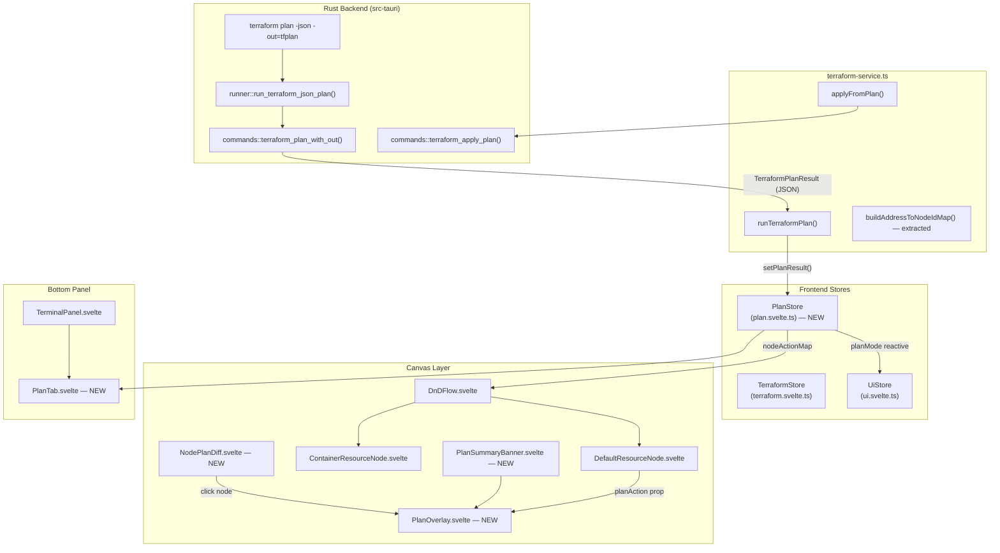
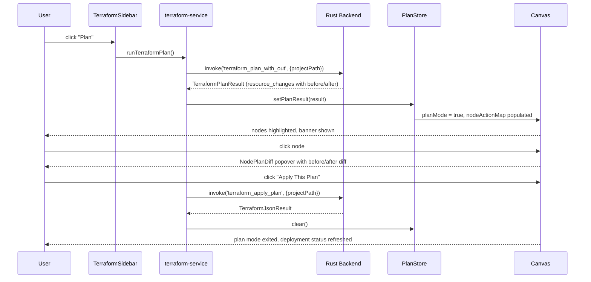

# Terraform Plan Visualization Specification

**Spec ID**: SPEC-002
**Status**: Draft
**Created**: 2026-03-07
**PRD Source**: Inline feature description — "Plan Review Mode" overlay for TerraStudio canvas
**Author**: AI Spec Writer

---

## 1. Overview

When a user runs `terraform plan`, the output contains a structured list of resource changes —
what will be created, updated, or destroyed. Today TerraStudio shows this output only as raw
text lines in the terminal panel. Engineers must mentally map Terraform resource addresses back
to diagram nodes while reading dense JSON log output. This makes the plan hard to review and
easy to miss critical changes.

This spec introduces **Plan Review Mode**: a temporary canvas overlay that becomes active after
`terraform plan` completes. Every diagram node that appears in the plan is highlighted with a
colour-coded glow and border — green for creates, yellow/amber for updates, red for destroys,
grey for no-ops. A summary banner counts the changes, a diff panel lists full property-level
changes sourced from `resource_changes[].change.before/after`, and an "Apply This Plan" button
runs `terraform apply -auto-approve` using the saved plan file.

The mode is ephemeral — it is dismissed by pressing Escape, clicking "Dismiss", or when the
canvas detects that the diagram has changed since the plan ran. It does not modify diagram state,
does not write to undo history, and is never persisted.

---

## 2. Goals & Non-Goals

### Goals

- After `terraform plan` succeeds, automatically enter Plan Review Mode on the canvas
- Highlight each matched diagram node with a colour indicating its planned action (create /
  update / delete / no-op / read)
- Show a non-intrusive summary banner at the top of the canvas area: "+N to create, ~N to change,
  -N to destroy"
- Provide a node-level diff popover: click any highlighted node to see `before` vs `after`
  property values sourced from the plan JSON
- Add a "Plan" tab to the terminal panel (bottom panel) showing the full resource-change list
  with inline diffs — usable as a standalone alternative to the canvas overlay
- Save the plan to a file on disk (`-out=tfplan`) so the exact plan can be applied without
  re-running
- Provide an "Apply This Plan" button that invokes `terraform apply tfplan`
- Exit Plan Review Mode cleanly via Escape key, Dismiss button, or any diagram mutation
- Animate changed nodes with a subtle pulse to draw initial attention, then settle to a static glow
- Work in both compact (icon-only) and detailed card node views

### Non-Goals

- Inline editing of planned values from the diff view (read-only review only)
- Plan visualization for module-level or provider-level changes (root resource blocks only in v1)
- Diff rendering for resources not matched to a diagram node (unmanaged or external resources)
- Persisting plan results across app restarts
- Streaming plan visualization during plan execution (visualization activates only after plan
  completes)
- Partial plan application (applying only selected resources) — Terraform does not support this

---

## 3. Background & Context

### Current plan execution path

`runTerraformCommand('plan')` in `apps/desktop/src/lib/services/terraform-service.ts` calls the
Rust command `terraform_plan`, which in turn calls `runner::run_terraform_json`. This runs
`terraform plan -json` and streams each output line as both a raw `terraform:stdout` event
(captured by the terminal panel) and a parsed `terraform:json` event. When the process exits,
the Rust side returns a `TerraformJsonResult` (success flag, diagnostics, resource_changes)
back to the frontend as the `invoke` return value.

### Current `TerraformJsonResult` limitations

The existing `ResourceChangeInfo` struct captures only `address`, `action`, `success`, and
`error`. It does **not** capture the `before`/`after` property diffs or the action reasons
available in the JSON plan output. The `resource_changes` array in `terraform plan -json` output
contains much richer data: each entry has `change.before` (JSON object), `change.after` (JSON
object), `change.actions` (array of action strings), and `change.action_reasons`.

### Plan file workflow

Terraform supports saving a binary plan with `-out=tfplan` and then applying it exactly with
`terraform apply tfplan`. This ensures the apply matches precisely what was reviewed. The plan
file is written to the project's `terraform/` directory alongside the `.tf` files.

### Node-to-address mapping

`buildAddressToNodeIdMap()` (private to `terraform-service.ts`) already constructs the
`"terraform_type.terraform_name" → nodeId` lookup used by `refreshDeploymentStatus` and
`updateNodeErrorStatus`. This logic needs to be extracted into a shared utility and reused by the
plan visualization feature.

### Rust runner gaps

`run_terraform_json` currently processes `plan` and `apply` identically. For plan, we need:
1. The `-out=tfplan` flag added to the plan invocation
2. The full `resource_change` objects (with `change.before` / `change.after`) to be forwarded

### Bottom panel

The existing `TerminalPanel.svelte` + `UiStore.showTerminal` / `terminalPanelHeight` is the
current bottom panel. The `bottom-panel-system.md` design doc describes upgrading this to a
multi-tab panel. This spec introduces a "Plan" tab whose existence depends on a completed plan
run — it can be implemented ahead of the full bottom panel migration by adding a simple tab bar
to the existing terminal panel.

---

## 4. Detailed Design

### 4.1 Architecture





### 4.2 Data Models / Interfaces

#### New: `PlanResourceChange` (frontend type, `terraform.svelte.ts` or new `plan.svelte.ts`)

```typescript
/** A single resource's planned action with before/after property values */
export interface PlanResourceChange {
  /** Full Terraform address, e.g. "azurerm_resource_group.my_rg" */
  address: string;
  /** Module address, empty string for root, e.g. "module.networking" */
  moduleAddress: string;
  /** Primary action — the first element of change.actions */
  action: PlanAction;
  /** All actions when replace is split into delete + create */
  actions: PlanAction[];
  /** Property values before the change; null for creates */
  before: Record<string, unknown> | null;
  /** Property values after the change; null for destroys */
  after: Record<string, unknown> | null;
  /** Property keys that are changing (computed as diff keys) */
  changedKeys: string[];
}

export type PlanAction = 'create' | 'update' | 'delete' | 'no-op' | 'read' | 'replace';
```

#### New: `TerraformPlanResult` (frontend type, replaces `TerraformJsonResult` for plan)

```typescript
/** Extended result from terraform plan that includes full resource change diffs */
export interface TerraformPlanResult {
  success: boolean;
  code: number;
  diagnostics: TerraformDiagnostic[];
  /** Full resource change list with before/after, sourced from plan JSON */
  planChanges: PlanResourceChange[];
  /** Path to the saved plan file relative to project terraform/ dir */
  planFilePath: string;
  /** ISO timestamp when the plan was captured */
  capturedAt: string;
}
```

#### New: `PlanStore` (`apps/desktop/src/lib/stores/plan.svelte.ts`)

```typescript
import type { PlanResourceChange, PlanAction } from './terraform.svelte';

class PlanStore {
  /** Whether plan review mode is active */
  active = $state(false);

  /** Full plan result from the last successful plan run */
  planResult = $state<TerraformPlanResult | null>(null);

  /**
   * Lookup from diagram node ID -> planned action.
   * Populated by setPlanResult() using buildAddressToNodeIdMap().
   */
  nodeActionMap = $state<Map<string, PlanAction>>(new Map());

  /**
   * Lookup from diagram node ID -> full change record.
   * Used by NodePlanDiff popover.
   */
  nodeChangeMap = $state<Map<string, PlanResourceChange>>(new Map());

  /** Aggregate counts for the summary banner */
  summary = $derived.by(() => {
    let toCreate = 0, toUpdate = 0, toDelete = 0, noOp = 0;
    for (const change of this.planResult?.planChanges ?? []) {
      if (change.action === 'create') toCreate++;
      else if (change.action === 'update') toUpdate++;
      else if (change.action === 'delete') toDelete++;
      else if (change.action === 'replace') { toDelete++; toCreate++; }
      else noOp++;
    }
    return { toCreate, toUpdate, toDelete, noOp };
  });

  /** Node ID of the currently selected node in the diff popover, or null */
  diffNodeId = $state<string | null>(null);

  /** Activate plan mode with the given result and node-id mappings */
  setPlanResult(
    result: TerraformPlanResult,
    nodeActionMap: Map<string, PlanAction>,
    nodeChangeMap: Map<string, PlanResourceChange>,
  ) {
    this.planResult = result;
    this.nodeActionMap = nodeActionMap;
    this.nodeChangeMap = nodeChangeMap;
    this.active = true;
    this.diffNodeId = null;
  }

  /** Exit plan review mode without applying */
  dismiss() {
    this.active = false;
    this.diffNodeId = null;
  }

  /** Full clear — called after apply or project close */
  clear() {
    this.active = false;
    this.planResult = null;
    this.nodeActionMap = new Map();
    this.nodeChangeMap = new Map();
    this.diffNodeId = null;
  }

  /** Return the planned action for a node, or undefined if not in plan */
  getNodeAction(nodeId: string): PlanAction | undefined {
    return this.nodeActionMap.get(nodeId);
  }

  /** Return the full change record for a node, or undefined */
  getNodeChange(nodeId: string): PlanResourceChange | undefined {
    return this.nodeChangeMap.get(nodeId);
  }
}

export const plan = new PlanStore();
```

#### Rust: Extended `ResourceChangeInfo` struct

```rust
// In runner.rs — new extended struct for plan output
#[derive(Clone, Serialize, Deserialize)]
pub struct PlanResourceChange {
    pub address: String,
    pub module_address: String,
    pub actions: Vec<String>,
    // Serialised as JSON strings (serde_json::Value) to avoid fat generics
    pub before: Option<serde_json::Value>,
    pub after: Option<serde_json::Value>,
}

#[derive(Clone, Serialize)]
pub struct TerraformPlanResult {
    pub success: bool,
    pub code: i32,
    pub diagnostics: Vec<TerraformDiagnostic>,
    pub plan_changes: Vec<PlanResourceChange>,
    pub plan_file_path: String,  // absolute path to tfplan
}
```

#### Rust: Plan JSON line types (additional message parsing)

The `terraform plan -json` stream emits a `planned_change` message type with a `change` field
that contains `resource.addr`, `action`, `before`, and `after`. These need to be parsed
separately from the apply-time `change_summary` messages that the current runner already handles.

```rust
// Extended TerraformJsonMessage — add to runner.rs
#[derive(Clone, Debug, Deserialize, Serialize)]
pub struct TerraformPlannedChange {
    #[serde(default)]
    pub resource: Option<TerraformResourceRef>,
    #[serde(default)]
    pub action: Option<String>,
    #[serde(default)]
    pub actions: Option<Vec<String>>,
    #[serde(default)]
    pub before: Option<serde_json::Value>,
    #[serde(default)]
    pub after: Option<serde_json::Value>,
    #[serde(default)]
    pub action_reasons: Option<Vec<serde_json::Value>>,
}

#[derive(Clone, Debug, Deserialize, Serialize)]
pub struct TerraformResourceRef {
    pub addr: String,
    #[serde(default)]
    pub module: String,
    #[serde(default)]
    pub resource_type: String,
    #[serde(default)]
    pub resource_name: String,
}
```

### 4.3 Component Breakdown

#### `PlanStore` (`apps/desktop/src/lib/stores/plan.svelte.ts`)

Central reactive state for plan review mode. Holds the full plan result, computed node maps,
summary counts, and the currently selected diff node. Exported as singleton `plan`.

#### `PlanSummaryBanner.svelte` (`apps/desktop/src/lib/components/PlanSummaryBanner.svelte`)

A fixed-position bar that renders above the canvas (inside the `canvas-wrapper` div, positioned
absolutely at the top). Rendered by `Canvas.svelte` when `plan.active` is true.

Contents:
- Coloured pill badges: `+N create` (green), `~N change` (amber), `-N destroy` (red)
- "Apply This Plan" button — triggers `applyFromPlan()` in terraform-service
- "Dismiss" button (X icon) — calls `plan.dismiss()`
- Plan captured timestamp: `Plan captured at HH:MM:SS`
- Warning if diagram has changed since plan ran (diagram hash mismatch)

```svelte
<!-- Rendered inside canvas-wrapper, not in the flow -->
<div class="plan-banner" role="status">
  <span class="plan-label">Plan Review</span>
  <span class="badge create">+{plan.summary.toCreate} to create</span>
  <span class="badge update">~{plan.summary.toUpdate} to change</span>
  <span class="badge destroy">-{plan.summary.toDelete} to destroy</span>
  {#if stale}
    <span class="stale-warning">Diagram changed since plan ran</span>
  {/if}
  <button class="apply-btn" onclick={handleApply}>Apply This Plan</button>
  <button class="dismiss-btn" onclick={() => plan.dismiss()}>Dismiss</button>
</div>
```

#### `NodePlanDiff.svelte` (`apps/desktop/src/lib/components/NodePlanDiff.svelte`)

A floating popover panel anchored to the clicked node. Displayed when `plan.diffNodeId` is set.
Shows a two-column diff table (`before` | `after`) for the changed properties only. Unchanged
properties are collapsed behind an expandable "N unchanged" row.

Visual design:
- Appears as a card below/beside the node (same pattern as `NodeTooltip.svelte`)
- Coloured action header bar (green / amber / red)
- Property rows: changed rows are highlighted, values shown as formatted JSON primitives
- Sensitive values (`"(sensitive)"`) shown in muted italic
- "Close" button or click-away to close (sets `plan.diffNodeId = null`)

#### `DefaultResourceNode.svelte` — modifications

Add plan-action visual state driven by `plan.getNodeAction(id)`:

```svelte
<script>
  import { plan } from '$lib/stores/plan.svelte';
  let planAction = $derived(plan.active ? plan.getNodeAction(id) : undefined);
</script>

<div
  class="resource-node"
  class:plan-create={planAction === 'create'}
  class:plan-update={planAction === 'update'}
  class:plan-delete={planAction === 'delete'}
  class:plan-replace={planAction === 'replace'}
  class:plan-noop={planAction === 'no-op'}
  onclick={planAction ? () => { plan.diffNodeId = id; } : undefined}
>
```

CSS additions to `DefaultResourceNode.svelte`:

```css
/* Plan review mode highlights */
.resource-node.plan-create {
  border-color: #22c55e;
  box-shadow: 0 0 0 2px rgba(34, 197, 94, 0.3), 0 0 12px rgba(34, 197, 94, 0.15);
  animation: plan-pulse 2s ease-in-out 3; /* pulse 3 times then stop */
}
.resource-node.plan-update {
  border-color: #f59e0b;
  box-shadow: 0 0 0 2px rgba(245, 158, 11, 0.3), 0 0 12px rgba(245, 158, 11, 0.15);
  animation: plan-pulse 2s ease-in-out 3;
}
.resource-node.plan-delete {
  border-color: #ef4444;
  box-shadow: 0 0 0 2px rgba(239, 68, 68, 0.3), 0 0 12px rgba(239, 68, 68, 0.15);
  animation: plan-pulse 2s ease-in-out 3;
}
.resource-node.plan-replace {
  border-color: #f97316;
  box-shadow: 0 0 0 2px rgba(249, 115, 22, 0.3), 0 0 12px rgba(249, 115, 22, 0.15);
  animation: plan-pulse 2s ease-in-out 3;
}
.resource-node.plan-noop {
  border-color: #6b7280;
  opacity: 0.6;
}
@keyframes plan-pulse {
  0%, 100% { box-shadow: 0 0 0 2px rgba(var(--plan-color-rgb), 0.3), 0 0 12px rgba(var(--plan-color-rgb), 0.15); }
  50% { box-shadow: 0 0 0 4px rgba(var(--plan-color-rgb), 0.5), 0 0 24px rgba(var(--plan-color-rgb), 0.3); }
}
```

Note: Because `animation` cannot reference a CSS custom property for the colour in the keyframe
rule itself, use four separate `@keyframes plan-pulse-{create|update|delete|replace}` with
hard-coded RGBA values for each action colour. This avoids the CSS variable limitation.

The `ContainerResourceNode.svelte` must receive the same plan-action class treatment — apply
the identical pattern to its root element.

#### `PlanTab.svelte` (`apps/desktop/src/lib/components/PlanTab.svelte`)

A new tab in the terminal panel (or a tab bar added to the existing `TerminalPanel.svelte`).
Visible only when `plan.planResult` is not null.

Contents:
- Resource change list, grouped by action (creates first, then updates, destroys, no-ops)
- Each row: action badge icon, resource address, resource type, change count
- Click a row to expand inline diff table (same before/after data as `NodePlanDiff`)
- "Jump to node" button: calls `ui.fitView()` and selects the node (sets `diagram.selectedNodeId`)
- Total count line at the top

#### `Canvas.svelte` — modifications

- Import `plan` store
- Render `<PlanSummaryBanner />` inside `canvas-wrapper` when `plan.active`
- Render `<NodePlanDiff />` when `plan.diffNodeId !== null`
- Register Escape key handler: `if (plan.active) plan.dismiss()`

#### `TerminalPanel.svelte` — modifications

- Add a simple two-tab bar (`Terminal` / `Plan`) when `plan.planResult !== null`
- Render `PlanTab` when the "Plan" tab is active

### 4.4 API / Contract Changes

#### New Tauri commands (Rust)

```rust
// commands.rs — two new commands

/// Run terraform plan with JSON output and save plan to file.
/// Returns extended result with full before/after diffs.
#[command]
pub async fn terraform_plan_with_out(
    app: AppHandle,
    window: WebviewWindow,
    project_path: String,
) -> Result<TerraformPlanResult, String>;

/// Apply a previously saved plan file.
/// Uses `terraform apply tfplan` (no -auto-approve needed when applying a plan file).
#[command]
pub async fn terraform_apply_plan(
    app: AppHandle,
    window: WebviewWindow,
    project_path: String,
) -> Result<TerraformJsonResult, String>;
```

The existing `terraform_plan` command remains unchanged for backward compatibility. The new
`terraform_plan_with_out` command is what the Plan Review feature calls.

#### New / changed frontend service exports

```typescript
// terraform-service.ts — new exports

/** Run terraform plan, save plan file, activate plan review mode. */
export async function runTerraformPlan(): Promise<boolean>;

/** Apply the saved plan file. Exits plan mode on success. */
export async function applyFromPlan(): Promise<boolean>;

/**
 * Build address->nodeId map. Extracted from private scope so PlanStore
 * population can use it. Export and reuse in refreshDeploymentStatus too.
 */
export function buildAddressToNodeIdMap(): Map<string, string>;
```

#### `UiStore` additions

```typescript
// ui.svelte.ts — additions
/** Active bottom panel tab */
activePanelTab = $state<'terminal' | 'plan'>('terminal');

/** Switch to plan tab when plan completes */
showPlanTab() {
  this.activePanelTab = 'plan';
  this.showTerminal = true;
}
```

#### `TerraformStore` additions

```typescript
// terraform.svelte.ts — additions to TerraformCommand union
export type TerraformCommand = 'init' | 'validate' | 'plan' | 'apply' | 'destroy' | 'apply-plan';
```

---

## 5. Implementation Plan

### 5.1 Phases

#### Phase 1 — Rust backend: plan file + extended diffs (2–3 days)

Extend the Rust backend to capture full `planned_change` JSON messages and save the plan file.

Deliverables:
- Add `PlanResourceChange` and `TerraformPlanResult` structs to `runner.rs`
- Extend `TerraformJsonMessage` deserialization to handle `planned_change` message type
- Implement `run_terraform_json_plan()` in `runner.rs` — adds `-out=tfplan` flag, collects
  `planned_change` records with before/after values
- Add `terraform_plan_with_out` command to `commands.rs`
- Add `terraform_apply_plan` command to `commands.rs`
- Register both new commands in `lib.rs`

#### Phase 2 — Frontend types + PlanStore (1 day)

Introduce the `PlanStore` and supporting types.

Deliverables:
- Add `PlanResourceChange`, `PlanAction`, `TerraformPlanResult` interfaces to
  `apps/desktop/src/lib/stores/terraform.svelte.ts` (or a co-located `plan-types.ts`)
- Create `apps/desktop/src/lib/stores/plan.svelte.ts` with `PlanStore` class and `plan` singleton
- Write unit tests for `summary` derived values and `setPlanResult` / `dismiss` / `clear`
  transitions

#### Phase 3 — Service layer (1 day)

Wire the new Rust commands into the frontend service.

Deliverables:
- Extract `buildAddressToNodeIdMap()` out of `terraform-service.ts` private scope, export it
- Implement `runTerraformPlan()`: invoke `terraform_plan_with_out`, build node maps, call
  `plan.setPlanResult()`, switch to plan tab via `ui.showPlanTab()`
- Implement `applyFromPlan()`: invoke `terraform_apply_plan`, on success call
  `refreshDeploymentStatus()` and `plan.clear()`, on failure set error status
- Update `TerraformSidebar.svelte`'s `handleCommand('plan')` to call `runTerraformPlan()` instead
  of the existing path for plan-only mode; keep existing path for non-visualized plan if needed

#### Phase 4 — Node highlighting (1–2 days)

Apply plan-action CSS classes to resource nodes.

Deliverables:
- Add `planAction` derived prop to `DefaultResourceNode.svelte`
- Add CSS classes `plan-create`, `plan-update`, `plan-delete`, `plan-replace`, `plan-noop`
  with glow border and pulse animation to `DefaultResourceNode.svelte`
- Apply the same changes to `ContainerResourceNode.svelte`
- Add `onclick` handler on plan-highlighted nodes that sets `plan.diffNodeId = id`

#### Phase 5 — Summary banner (1 day)

Build the `PlanSummaryBanner.svelte` component.

Deliverables:
- Create `apps/desktop/src/lib/components/PlanSummaryBanner.svelte`
- Render conditionally inside `Canvas.svelte` when `plan.active`
- Implement stale-diagram detection: compute diagram hash on plan capture, compare with current
  hash on render; show warning if mismatch
- Wire "Apply This Plan" to `applyFromPlan()`
- Wire "Dismiss" to `plan.dismiss()`
- Add Escape key handler in `Canvas.svelte` that calls `plan.dismiss()`
- Clear plan mode on project close (call `plan.clear()` in `project-service.ts` alongside
  existing `terraform.clear()` calls)

#### Phase 6 — Node diff popover (1–2 days)

Build the `NodePlanDiff.svelte` popover.

Deliverables:
- Create `apps/desktop/src/lib/components/NodePlanDiff.svelte`
- Render when `plan.diffNodeId !== null` via `Canvas.svelte`
- Compute diff: keys where `before[key] !== after[key]`, plus keys only in before (deleted),
  keys only in after (added)
- Render diff table: key column, before value column, after value column; style changed rows
- Truncate long values (strings > 80 chars show first 80 + "…"), click to expand
- Close on outside click or "Close" button (set `plan.diffNodeId = null`)
- Position relative to the selected node's canvas coordinates using `diagram.nodes.find(n => n.id === plan.diffNodeId)?.position`

#### Phase 7 — Plan tab in terminal panel (1–2 days)

Add the "Plan" tab to the bottom panel.

Deliverables:
- Add minimal two-tab bar to `TerminalPanel.svelte` controlled by `ui.activePanelTab`
  (shown only when `plan.planResult !== null`)
- Create `apps/desktop/src/lib/components/PlanTab.svelte`
- Render grouped change list (creates, updates, destroys, no-ops)
- Implement inline row expansion with before/after diff table (reuse diff logic from Phase 6,
  extracted into a shared `PlanDiffTable.svelte` helper)
- "Jump to node" button per row: select the node and call `ui.fitView()`

#### Phase 8 — Polish & edge cases (1 day)

Deliverables:
- Ensure `plan.clear()` is called everywhere needed: project close, `terraform destroy`,
  switching projects
- Handle plan mode when Terraform files are stale (show warning in banner, disable Apply)
- Apply plan button confirmation dialog: "This will apply the exact changes from the plan.
  Infrastructure will be modified. Continue?"
- Verify compact node mode (`ui.compactNodes`) shows plan highlights correctly (the compact node
  uses a borderless transparent wrapper — may need the pulse on the icon wrap element instead)
- Handle the case where a plan change `address` contains a module prefix
  (e.g., `module.networking.azurerm_virtual_network.vnet`) — strip module prefix for lookup

### 5.2 File Changes

**Create:**
- `apps/desktop/src/lib/stores/plan.svelte.ts`
- `apps/desktop/src/lib/components/PlanSummaryBanner.svelte`
- `apps/desktop/src/lib/components/NodePlanDiff.svelte`
- `apps/desktop/src/lib/components/PlanDiffTable.svelte`
- `apps/desktop/src/lib/components/PlanTab.svelte`

**Modify:**
- `apps/desktop/src-tauri/src/terraform/runner.rs` — add `PlanResourceChange`,
  `TerraformPlanResult`, `TerraformPlannedChange` structs; add `run_terraform_json_plan()` fn
- `apps/desktop/src-tauri/src/terraform/commands.rs` — add `terraform_plan_with_out()` and
  `terraform_apply_plan()` commands
- `apps/desktop/src-tauri/src/lib.rs` — register new commands in `.invoke_handler()`
- `apps/desktop/src/lib/stores/terraform.svelte.ts` — add `PlanResourceChange`, `PlanAction`,
  `TerraformPlanResult` types; add `'apply-plan'` to `TerraformCommand`
- `apps/desktop/src/lib/stores/ui.svelte.ts` — add `activePanelTab`, `showPlanTab()`
- `apps/desktop/src/lib/services/terraform-service.ts` — export `buildAddressToNodeIdMap()`,
  add `runTerraformPlan()`, add `applyFromPlan()`
- `apps/desktop/src/lib/components/Canvas.svelte` — render `PlanSummaryBanner`, `NodePlanDiff`,
  add Escape handler
- `apps/desktop/src/lib/components/DefaultResourceNode.svelte` — plan-action CSS + click handler
- `apps/desktop/src/lib/components/ContainerResourceNode.svelte` — same plan-action CSS
- `apps/desktop/src/lib/components/TerminalPanel.svelte` — add Plan tab bar
- `apps/desktop/src/lib/components/TerraformSidebar.svelte` — route Plan button through
  `runTerraformPlan()` instead of generic `runTerraformCommand('plan')`
- `apps/desktop/src/lib/services/project-service.ts` — call `plan.clear()` on project close

**No change required:**
- `packages/types/` — plan types are frontend-only, not part of the shared contract
- Plugin packages — no changes needed

### 5.3 Dependencies

No new npm packages or Rust crates are required. All data structures use existing `serde_json`,
`serde`, `tokio`, and Tauri primitives. The diff computation is pure TypeScript using `Object.keys`.

---

## 6. Edge Cases & Error Handling

### Resources not in the diagram

The plan may include resources that have no corresponding diagram node (e.g., resources managed
by binding generators such as `azurerm_key_vault_secret`, or resources from external modules).
These are listed in the Plan tab but do not highlight any node. They should be shown in a
separate "Unmatched resources" section in the Plan tab with a note explaining they are not
represented on the canvas.

### Module-prefixed addresses

`terraform plan -json` emits addresses like `module.networking.azurerm_virtual_network.main`.
The `buildAddressToNodeIdMap()` function currently constructs addresses without module prefixes.
Phase 8 handles this: attempt to match by stripping the module prefix (`address.split('.').slice(-2).join('.')`) as a fallback. If no match, treat as unmatched.

### Replace actions (`delete` + `create`)

Terraform represents a replace as `"actions": ["delete", "create"]`. The `PlanAction` type has
a synthetic `'replace'` value. When parsing: if `actions` array contains both `delete` and
`create`, set `action = 'replace'`. The summary counts this as one destroy and one create.
The node highlight uses the amber-orange `plan-replace` class.

### Plan file gone or stale

If the user dismisses plan mode, edits the diagram, and then tries to apply via the Plan tab
(which persists until explicitly cleared), the plan file on disk may no longer match the
diagram. The "Apply This Plan" button must detect diagram staleness (hash mismatch) and show a
blocking confirmation: "The diagram has changed since this plan was captured. Applying this plan
may produce unexpected results. Apply anyway?"

### Plan exits non-zero (expected changes blocked)

`terraform plan` exits with code 2 when there are changes (success = infrastructure differs from
desired state) and code 0 when no changes. Code non-zero other than 2 is a real error. The Rust
runner must treat exit code 2 as `success = true` for plan specifically. The frontend should
show a badge "No changes" in the banner when the plan has zero resource changes.

### Concurrent terraform operations

If the user has another terraform operation running, `plan.active` blocks running a new plan
(the existing `terraform.isRunning` guard). The "Apply This Plan" button must also be disabled
while `terraform.isRunning`.

### Compact node mode

In compact mode, nodes have `background: transparent; border: none`. The plan pulse animation
must attach to the `compact-icon-wrap` inner element rather than the root node element, using a
conditional CSS class: `class:plan-compact-create={ui.compactNodes && planAction === 'create'}`.
This element does have a visible background and dimensions.

### Project switched or closed

`plan.clear()` must be called in any code path that closes or replaces the current project.
Check: `project-service.ts`'s `closeProject()` equivalent, and the close handler in
`+page.svelte`.

---

## 7. Testing Strategy

### Unit tests

- `PlanStore`: test `setPlanResult` with a mock result, verify `nodeActionMap`, `summary`
  computed values for all action types, `dismiss()` resets `active` without clearing result,
  `clear()` resets everything
- `buildAddressToNodeIdMap()`: test with nodes that have `resolveTerraformType` generators and
  without; test synthetic node filtering
- Diff computation in `PlanDiffTable`: test keys present in `before` but not `after` (deleted),
  keys in `after` but not `before` (added), same keys with different values (changed), same keys
  with same values (unchanged/excluded)

### Integration tests (Tauri test harness or manual)

- Run `terraform_plan_with_out` against a real minimal terraform config; verify plan file is
  created at `{project_path}/terraform/tfplan`
- Verify `TerraformPlanResult.plan_changes` contains before/after for a known resource
- Verify `terraform_apply_plan` uses the saved plan file (not a fresh plan)

### Manual test scenarios

| Scenario | Expected result |
|---|---|
| Plan with 1 create, 1 update, 1 delete | Banner shows "+1 to create, ~1 to change, -1 to destroy"; three nodes highlighted correctly |
| Plan with no changes (exit code 0) | Banner shows "No changes"; no nodes highlighted |
| Click create-highlighted node | Diff popover shows null before, after properties |
| Click update-highlighted node | Diff popover shows before and after with changed keys highlighted |
| Click delete-highlighted node | Diff popover shows before properties, null after |
| Press Escape | Plan mode exits, all highlights removed |
| Edit diagram while plan is active | Stale warning appears in banner |
| Apply This Plan | Confirmation dialog shown; on confirm, `terraform apply tfplan` runs; plan mode exits; deployment status refreshes |
| Apply This Plan while stale | Additional staleness warning in confirmation |
| Switch projects | Plan mode cleared |
| Compact node mode | Highlights appear on icon wrap element |

---

## 8. Security & Performance Considerations

### Plan file security

The `tfplan` binary file is written to `{project_path}/terraform/tfplan`. It may contain
sensitive values (secrets, API keys) from the Terraform state. The existing file-write path
already applies `security::sanitize_filepath` to all terraform file operations — ensure the
`tfplan` filename is also validated. Do not expose the plan file path to any network or MCP
tool unless the user explicitly requests it.

### Before/after value size

Some Terraform resources have very large `before`/`after` blobs (e.g., IAM policy JSON,
VM custom data). The diff computation should not stringify or render more than ~50 top-level
keys per resource in the UI. If a resource has more, show the first 50 and a "Show all N keys"
toggle. The full JSON is always available in the terminal output.

### Performance of `nodeActionMap` lookup

The `plan.getNodeAction(id)` call is made on every node render in `DefaultResourceNode` and
`ContainerResourceNode`. Because `nodeActionMap` is a reactive `Map<string, PlanAction>` stored
in `$state`, Svelte 5's fine-grained reactivity will not track individual Map key lookups —
the entire `nodeActionMap` reference must be replaced on update to trigger re-renders. The
`setPlanResult` method does this correctly by assigning a new `Map(...)` instance.

For large diagrams (100+ nodes), the per-node `plan.getNodeAction(id)` call is O(1) hash lookup
and adds negligible overhead during re-renders.

### Animation performance

CSS `animation: plan-pulse 2s ease-in-out 3` runs entirely on the GPU compositor thread and
does not block the JavaScript main thread. Using `animation-iteration-count: 3` (finite) means
the animation stops automatically after the initial attention phase — nodes settle to static
glow only. This is preferable to `infinite` which would cause continuous repaints.

---

## 9. Open Questions

1. **Plan tab vs. bottom panel migration**: The `bottom-panel-system.md` design doc describes a
   full multi-tab bottom panel migration. Should the Plan tab be built inside the future
   `BottomPanel.svelte` abstraction, or added to the current `TerminalPanel.svelte` as a
   minimal two-tab bar? Building against the current terminal panel is faster but may require
   refactoring when the bottom panel spec is implemented. Decision needed from the team.

2. **Plan file naming**: Using a fixed filename `tfplan` means a new plan always overwrites the
   previous one. Should we timestamp plan files (`tfplan-20260307-143022`) and keep a history?
   This adds complexity but allows comparing plans over time. v1 spec assumes fixed `tfplan`.

3. **Sensitive value display**: Terraform marks some `after` values as
   `"(sensitive)"` in plan JSON. Should the diff popover show these at all, or replace them with
   a redacted indicator? Currently the spec says show `"(sensitive)"` as muted italic text.
   Confirm this is acceptable from a security/UX standpoint.

4. **Unmatched resources in banner counts**: Resources in the plan that have no diagram node
   (e.g., binding-generator resources like `azurerm_key_vault_secret`) are currently counted in
   the summary totals. Should they be excluded from counts (showing only what's visible on
   canvas) or included? Including them is more accurate; excluding is less confusing.

5. **Compact node plan highlight placement**: The CSS solution for compact mode described in
   section 6 attaches the pulse to `compact-icon-wrap`. Review with design to confirm this is
   visually acceptable — the icon glow may be subtle given the transparent node background.

---

## 10. References

- [Terraform plan JSON output format](https://developer.hashicorp.com/terraform/internals/json-format#plan-representation) — official spec for `planned_change` messages and `change.before`/`change.after` structure
- `apps/desktop/src-tauri/src/terraform/runner.rs` — existing `run_terraform_json` and `TerraformJsonMessage` parsing
- `apps/desktop/src-tauri/src/terraform/commands.rs` — existing `terraform_plan` command
- `apps/desktop/src/lib/services/terraform-service.ts` — `buildAddressToNodeIdMap()`, `runTerraformCommand()`, `refreshDeploymentStatus()`
- `apps/desktop/src/lib/stores/terraform.svelte.ts` — `TerraformStore`, `ResourceChangeInfo`, `TerraformJsonResult`
- `apps/desktop/src/lib/stores/ui.svelte.ts` — `UiStore`, `showTerminal`, `terminalPanelHeight`
- `apps/desktop/src/lib/components/DefaultResourceNode.svelte` — existing node highlight patterns (`has-validation-errors`, `selected`)
- `apps/desktop/src/lib/components/DeploymentBadge.svelte` — existing pulse animation pattern
- `docs/specs/bottom-panel-system.md` — planned multi-tab bottom panel (dependency for Open Question 1)
- `docs/specs/SPEC-001-mcp-server.md` — MCP server spec (SPEC-001 for reference numbering)
